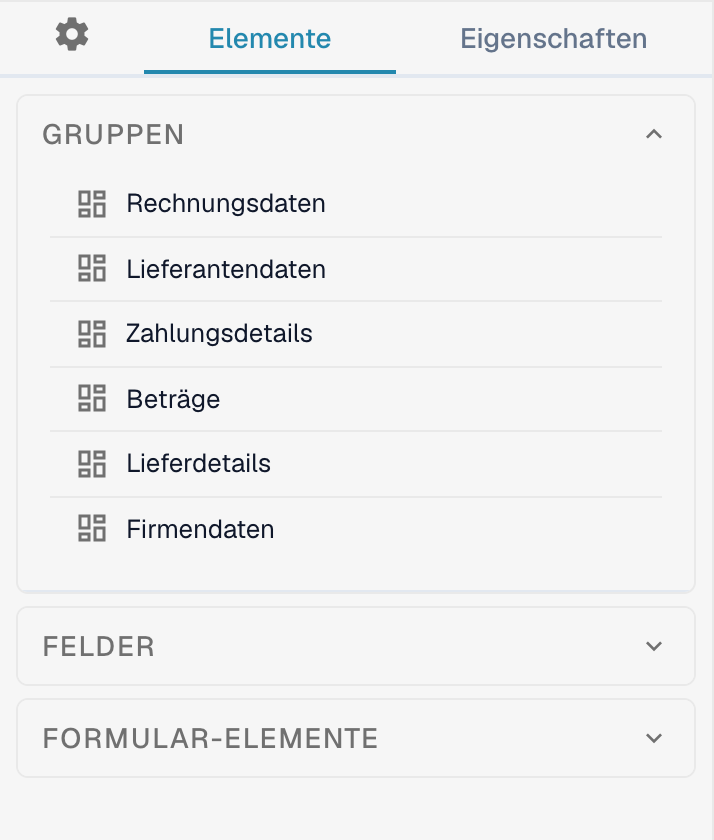
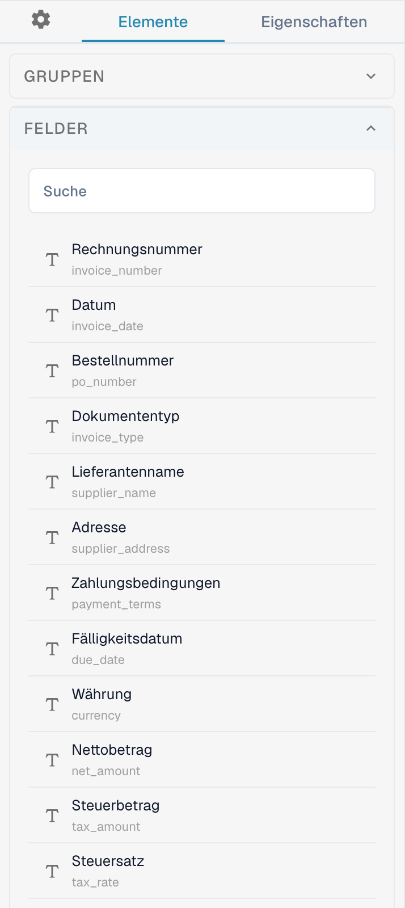
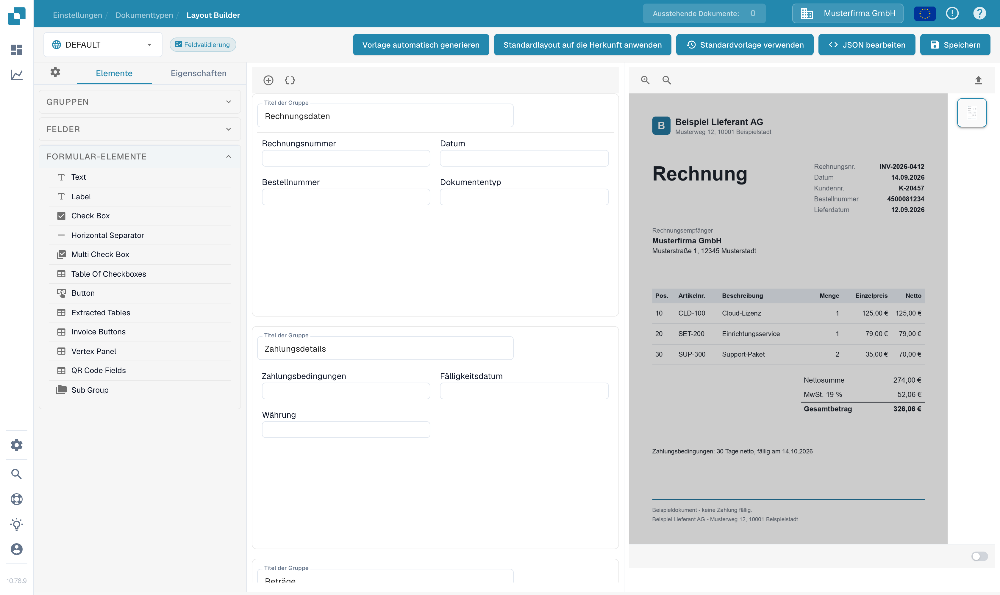

# Navigieren im Layout-Builder

Mit dem **Layout-Builder** ordnen Sie die Felder und Gruppen, die Personen in einem Dokument sehen. Diese Anleitung verwendet das deutsche Layout **Rechnung** in einer Sandbox-Organisation.

## Das Rechnung-Layout öffnen

1. Gehen Sie zu **Einstellungen → Dokumenttypen**.
2. Suchen Sie **Rechnung** und wählen Sie **Layouts** auf der Karte. Der Layout-Builder öffnet sich für diesen Dokumenttyp.
3. Prüfen Sie die Layout-Auswahl oben links. Das Beispiel unten zeigt **DEFAULT**.

<figure><figcaption>Öffnen Sie **Layouts** über die Rechnung-Karte.</figcaption></figure>

## Gruppen und Felder finden

Das linke Panel **Elemente** hat drei Bereiche. **Gruppen** listet die Dokumentabschnitte; die mittlere Arbeitsfläche zeigt ihre aktuelle Anordnung. Wählen Sie ein Feld in der Arbeitsfläche und öffnen Sie **Eigenschaften**, um seine Anzeigeoptionen zu ändern. Die verfügbaren Optionen beschreibt [Konfigurieren von Feldeigenschaften](configuring-field-properties.md).

<figure><figcaption>Die Gruppenliste und die Arbeitsfläche des Rechnung-Layouts.</figcaption></figure>

Öffnen Sie **Felder**, um verfügbare Dokumentfelder zu finden. Nutzen Sie das Suchfeld, wenn die Liste lang ist, und ziehen Sie das Feld in die gewünschte Gruppe der Arbeitsfläche. Bereits im Layout platzierte Felder erscheinen in der Liste möglicherweise als nicht verfügbar.

<figure><figcaption>Durchsuchen Sie die verfügbaren Felder, bevor Sie eines platzieren.</figcaption></figure>

Öffnen Sie **Formular-Elemente** für visuelle Steuerelemente wie Text, Label, Check Box, Trennlinie, Button und Sub Group. Ziehen Sie das benötigte Element in die Arbeitsfläche und prüfen Sie anschließend seine **Eigenschaften**.

<figure><figcaption>Die aktuelle Palette der Formular-Elemente.</figcaption></figure>

## Anordnen und Speichern

- Wählen Sie einen Gruppentitel in der Arbeitsfläche, um ihn zu ändern. Das **+** über der Arbeitsfläche fügt eine Gruppe hinzu; das daneben liegende geschweifte Klammern-Symbol öffnet das erweiterte JSON-Gruppenformular.
- Fahren Sie über eine Gruppe, um die Aktionen JSON kopieren, nach oben, nach unten, löschen und Ziehgriff zu sehen. Um Felder neu anzuordnen, ziehen Sie sie innerhalb oder zwischen Gruppen.
- Wählen Sie ein Feld in der Arbeitsfläche, um **Eigenschaften** zu öffnen. Sein Löschen-Symbol entfernt es aus diesem Layout. Für Validierung, OCR oder Matching nutzen Sie die separaten [Felder-Einstellungen](../fields/configuring-field-properties-1.md).
- Wählen Sie nach den Änderungen **Speichern** in der oberen Leiste. Die übrigen Aktionen der oberen Leiste – unter anderem Vorlage automatisch generieren, Standardvorlage verwenden und ein Layout auf Herkunft anwenden – beschreibt [Änderungen speichern und anwenden](save-and-apply-changes.md).
