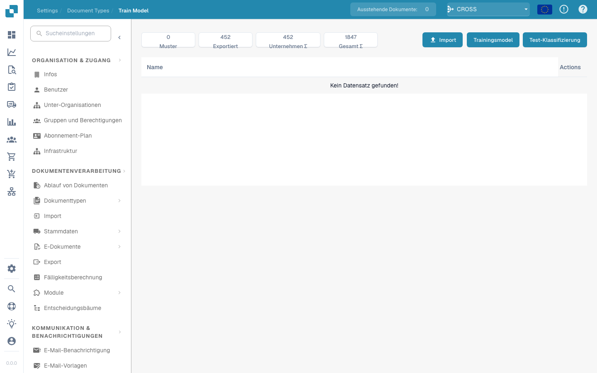

# Modelltraining

<figure><figcaption></figcaption></figure>

#### Überblick

Das Modelltraining ermöglicht es Administratoren, das Training von Machine-Learning-Modellen für jeden Dokumenttyp zu überwachen und zu verwalten. Durch die Bereitstellung einer strukturierten Oberfläche zum Importieren von Beispieldaten, zum Trainieren von Modellen und zum Testen ihrer Leistung stellt Docbits sicher, dass sich seine Fähigkeiten zur Datenextraktion im Laufe der Zeit kontinuierlich verbessern.

#### Schlüsselfunktionen und Optionen

1. **Übersicht der Metriken**:
* **Beispiel**: Anzahl der für das Training verwendeten Beispieldokumente.
* **Exportiert**: Anzahl der Dokumente, die nach der Verarbeitung erfolgreich exportiert wurden.
* **Unternehmen Σ**: Gesamtanzahl der verarbeiteten unternehmensspezifischen Dokumente.
* **Gesamt Σ**: Gesamtanzahl der über alle Kategorien hinweg verarbeiteten Dokumente.
2. **Trainings- und Testoptionen**:
* **Import**: Ermöglicht es Administratoren, neue Trainingsdatensätze zu importieren, die in der Regel strukturierte Beispiele von Dokumenten sind, die das System erkennen soll.
* **Modell trainieren**: Startet den Trainingsprozess unter Verwendung der importierten Daten, um die Erkennungs- und Extraktionsfähigkeiten des Systems zu verbessern.
* **Klassifizierung testen**: Ermöglicht es, das Modell zu testen, um seine Leistung bei der Klassifizierung und Extraktion von Daten aus neuen oder bisher nicht gesehenen Dokumenten zu bewerten.
3. **Aktionsschaltflächen**:
* **Feld erstellen**: Neue Datenfelder hinzufügen, die das Modell erkennen und extrahieren soll.
* **Aktionen**: Dieses Dropdown-Menü kann Optionen wie das Anzeigen von Details, das Bearbeiten von Konfigurationen oder das Löschen von Trainingsdaten enthalten.


