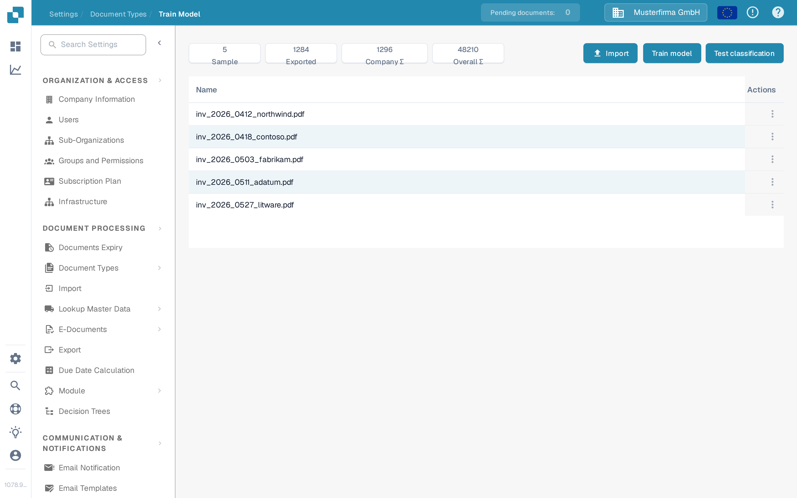

# Model Training

<figure><figcaption>
The Train Model page shows the sample metrics, the Import, Train model and Test classification actions, and the list of training documents.
</figcaption></figure>

#### Overview

Model Training allows administrators to oversee and manage the training of machine learning models specific to each document type. By providing a structured interface for importing sample data, training models, and testing their performance, Docbits ensures that its data extraction capabilities continuously improve over time.

#### Key Features and Options

1. **Metrics Overview**:
   * **Sample**: Number of sample documents used for training.
   * **Exported**: Number of documents that have been successfully exported after processing.
   * **Company Σ**: Total number of company-specific documents processed.
   * **Overall Σ**: Total number of documents processed across all categories.
2. **Training and Testing Options**:
   * **Import**: Allows administrators to import new training data sets which are typically structured samples of documents that should be recognized by the system. For the step-by-step workflow, see [Import sample documents for model training](import-data-model-training.md).
   * **Train model**: Starts the training process using the imported data to enhance the recognition and extraction capabilities of the system.
   * **Test classification**: Enables testing of the model to evaluate its performance on classifying and extracting data from new or unseen documents.
3. **Training Document List**:
   * **Name**: Shows the file name of each imported training document.
   * **Actions** (the three-dot menu in each row): Offers **Delete** to remove that training document from the list. For how to manage the imported samples, see [Manage training data](manage-training-data.md).
