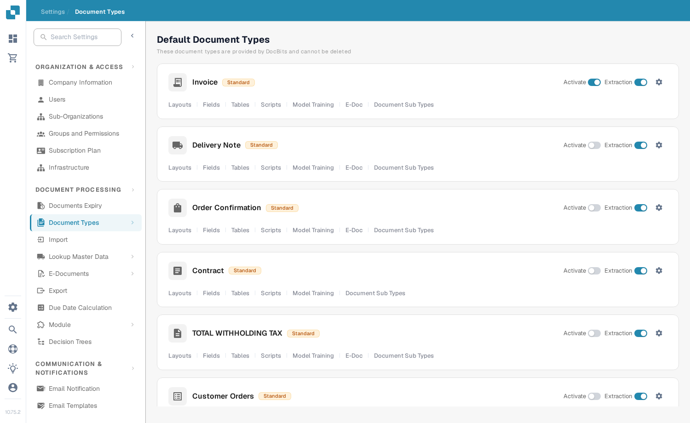
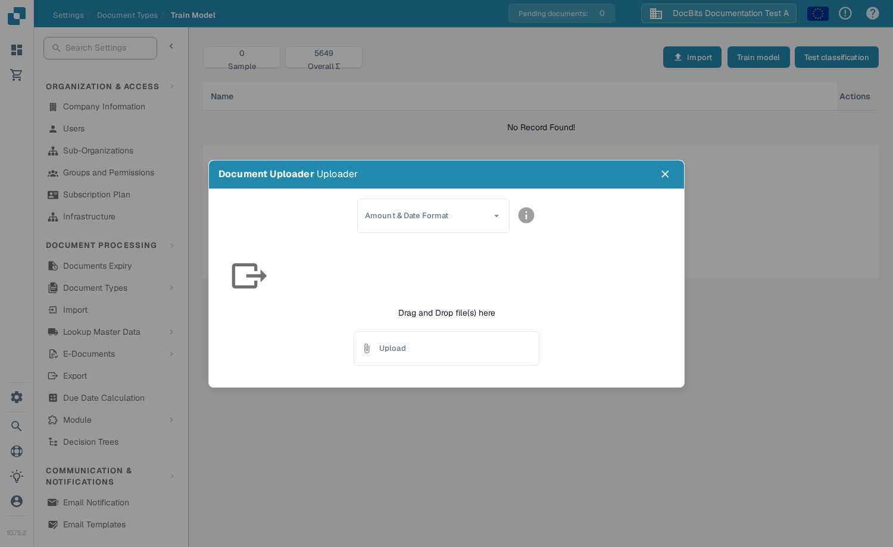
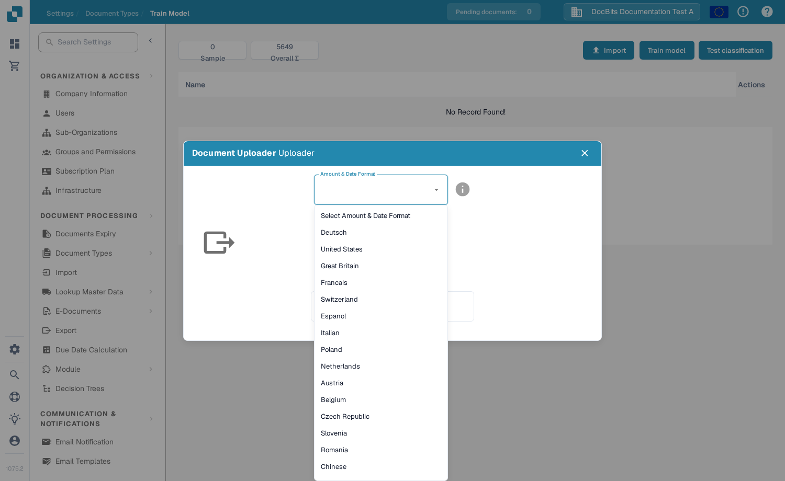
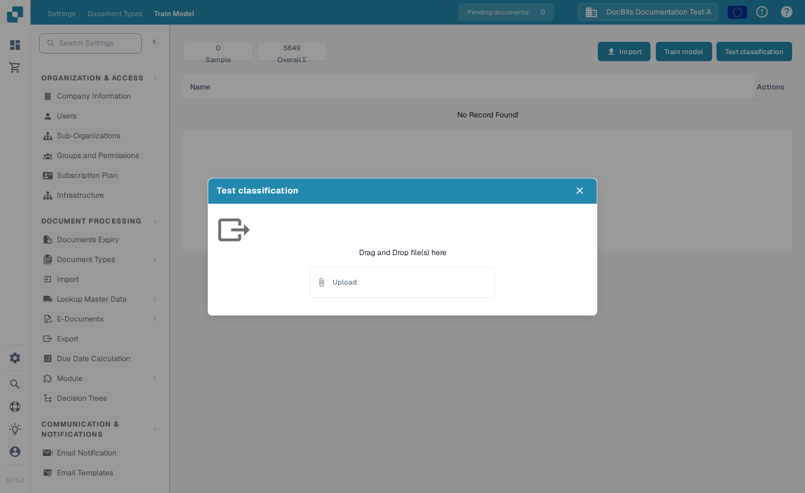

# Import sample documents for model training

Use this page to add sample PDFs for a document type, then train or test its classification model. You need access to **Settings** and **Document Types**. For the purpose of the training features, see [Purpose and Use: Model Training](purpose-and-use-model-training.md).

## Open the document type

1. Go to **Settings → Document Types**.
2. Find the document type you want to train. In its row, select **Model Training**. The example below uses **Invoice**.

<figure><figcaption>
Open Model Training from the chosen document type.
</figcaption></figure>

The other controls on this card serve different purposes: **Activate** enables the document type, **Extraction** switches its extraction mode, the gear opens its settings, and the remaining links open other configuration areas. You do not need to change them just to open Model Training.

The **Train Model** page shows the sample count and a list of uploaded training documents. In the example organization, the list is empty; your organization can show different documents and counts.

<figure><figcaption>
The three actions are at the top right of the training list.
</figcaption></figure>

## Import sample PDFs

1. Select **Import**.
2. Choose the **Amount & Date Format** that matches the sample document. For example, choose **United States** for US number and date conventions. This selection tells DocBits how to interpret values in the uploaded document; it does not change the app language.
3. Drag PDF files into the dialog or use **Upload** to select them. The current sample-document importer accepts **PDF files**; it rejects other file types. Selecting the files starts the upload.
4. Close the dialog and check that the documents appear in the training list. If DocBits reports an upload error or a document already exists, correct the file or choose a different sample before continuing.

<figure><figcaption>
Choose a format before selecting sample PDFs.
</figcaption></figure>

<figure><figcaption>
Pick the format used in the document, not your preferred interface language.
</figcaption></figure>

For actions on imported samples, see [Manage training data](manage-training-data.md).

## Train and check the model

When the intended sample PDFs are in the list, select **Train model**. DocBits may process training in the background; wait for its completion message before treating the new model as ready. The sample count and any plan limit shown on this page belong to your organization.

To check classification, select **Test classification**, then upload a separate example file in the dialog. After processing, DocBits shows whether the predicted document type matches this page and reports classification details. The empty test dialog below is shown without submitting a file.

<figure><figcaption>
Use Test classification to check the model with another document.
</figcaption></figure>

For interpreting the result, see [Testing the model](testing-the-model.md). If the result is poor, review the [training data](manage-training-data.md) and the [troubleshooting guide](troubleshooting.md) before adding more samples.
