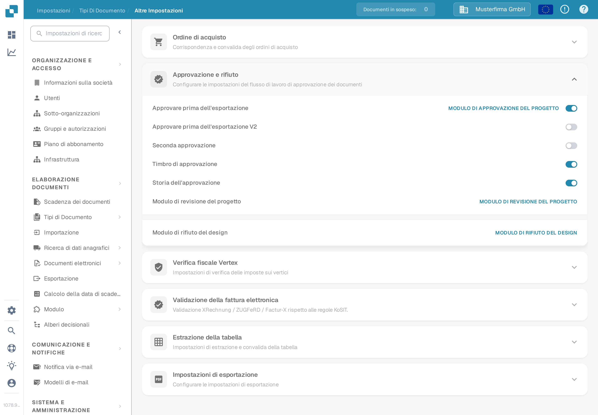

# Approvazione

Usa le opzioni di approvazione per decidere come un documento viene controllato prima di lasciare DocBits. Le opzioni sono configurate per ogni tipo di documento, quindi inizia dal tipo usato dal tuo team, ad esempio **Fattura**.

1. Apri **Impostazioni** → **Tipi Di Documento**.
2. Seleziona il tipo di documento e apri **Altre Impostazioni**.
3. Scorri fino a **Approvazione e rifiuto**. Controlla i quattro interruttori prima di modificarne uno.

<figure><figcaption>
Vista attuale della Sandbox in italiano per il tipo di documento Fattura, con dati di esempio inventati. In questo esempio tutti e quattro gli interruttori sono disattivati.
</figcaption></figure>

| Opzione | A cosa serve |
| --- | --- |
| **Approvare prima dell'esportazione** | Richiede una decisione di approvazione prima di esportare il documento. |
| **Seconda approvazione** | Aggiunge un ulteriore passaggio di approvazione quando una sola decisione non basta per il tuo processo. |
| **Timbro di approvazione** | Aggiunge un marchio di approvazione a un documento approvato. Vedi [Timbro di approvazione](approval-stamp.md) per la configurazione e le opzioni di download. |
| **Storia dell'approvazione** | Conserva una registrazione delle decisioni di approvazione. Vedi [Storia dell'approvazione](approval-history.md) per l'impostazione e per come consultare la storia. |

Scegli le opzioni richieste dal tuo processo. Poi usa un documento di prova senza cliente reale e i ruoli di revisore previsti per verificare il percorso di approvazione prima di applicarlo a documenti reali. L'immagine mostra le impostazioni disponibili; durante questo controllo della documentazione non è stato eseguito alcun flusso di approvazione né alcuna esportazione.
