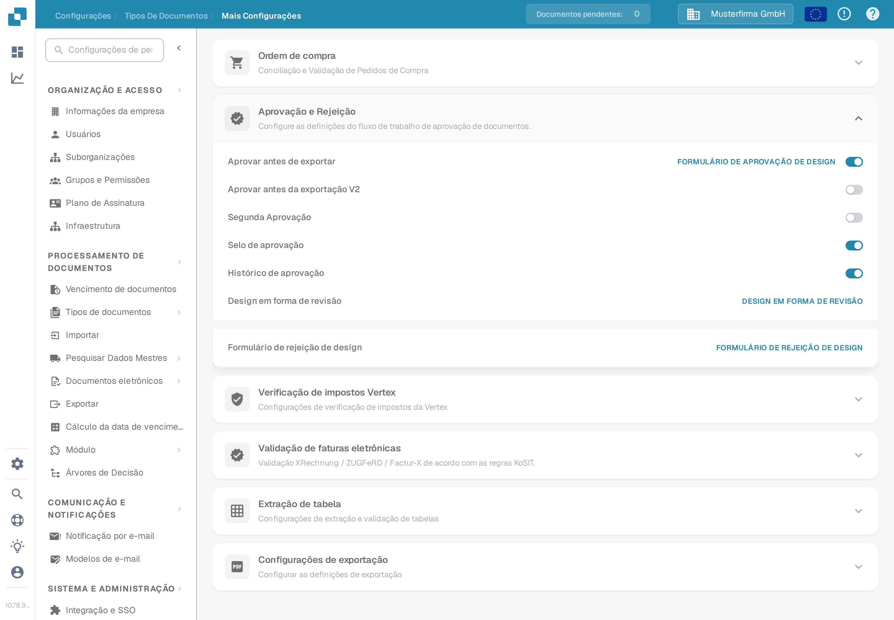

# Aprovação

Use as opções de aprovação para decidir como um documento é verificado antes de sair do DocBits. As opções são configuradas por tipo de documento, então comece pelo tipo que sua equipe usa, como **Fatura**.

1. Abra **Configurações** → **Tipos De Documentos**.
2. Selecione o tipo de documento e abra **Mais Configurações**.
3. Role até **Aprovação e Rejeição**. Revise os quatro interruptores antes de alterar qualquer um deles.

<figure><figcaption>Vista atual da Sandbox em português para Fatura no DocBits Documentation Test A. Todos os quatro interruptores estão desativados neste exemplo.</figcaption></figure>

| Opção | Para que serve |
| --- | --- |
| **Aprovar antes de exportar** | Exigir uma decisão de aprovação antes de exportar o documento. |
| **Segunda Aprovação** | Adicionar outra etapa de aprovação quando uma decisão não for suficiente para o seu processo. |
| **Selo de aprovação** | Adicionar uma marca de aprovação a um documento aprovado. Consulte [Selo de aprovação](approval-stamp.md) para ver a configuração e as opções de download. |
| **Histórico de aprovação** | Manter um registro das decisões de aprovação. Consulte [Histórico de aprovação](approval-history.md) para ver a configuração e como verificar o histórico. |

Escolha as opções exigidas pelo seu próprio processo. Depois use um documento de teste sem dados de cliente e as funções de revisor pretendidas para verificar o caminho de aprovação antes de aplicá-lo a documentos reais. A captura de tela mostra as configurações disponíveis; nenhum fluxo de aprovação ou exportação foi executado durante esta verificação da documentação.
