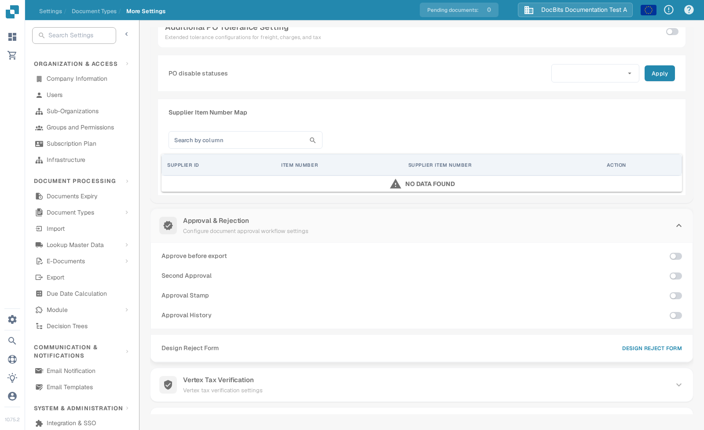

# Approval

Use the approval options to decide how a document is checked before it leaves DocBits. The options are configured for each document type, so start with the type your team uses, such as **Invoice**.

1. Open **Settings** → **Document Types**.
2. Select the document type and open **More Settings**.
3. Scroll to **Approval & Rejection**. Review the four switches before changing any of them.

<figure><figcaption>Current English Sandbox view for Invoice in DocBits Documentation Test A. All four switches are off in this example.</figcaption></figure>

| Option | What it is for |
| --- | --- |
| **Approve before export** | Require an approval decision before exporting the document. |
| **Second Approval** | Add another approval step when one decision is not enough for your process. |
| **Approval Stamp** | Add an approval mark to an approved document. See [Approval Stamp](approval-stamp.md) for the setup and download options. |
| **Approval History** | Keep a record of approval decisions. See [Approval History](approval-history.md) for the setting and how to check the history. |

Choose the options required by your own process. Then use a non-customer test document and the intended reviewer roles to check the approval path before applying it to live documents. The screenshot shows the available settings; no approval flow or export was performed during this documentation check.
