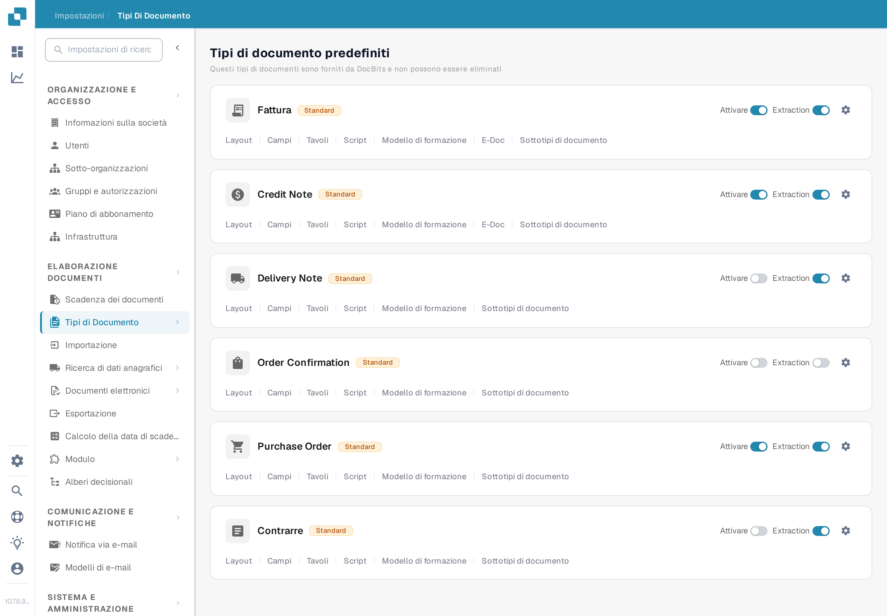

# Storia dell'approvazione

La **Storia dell'approvazione** consente di esaminare le decisioni del flusso di approvazione di un documento. La versione precedente di questa pagina rimandava a un vecchio percorso in **Impostazioni generali** e mostrava tre immagini di un'interfaccia più vecchia senza spiegare i comandi. Usa le impostazioni attuali del tipo di documento per attivare l'opzione, poi verifica il risultato con un'approvazione di prova nella tua organizzazione.

## Attivare l'opzione per un tipo di documento

1. Con un account amministratore, apri **Impostazioni** → **Tipi Di Documento**. Trova il tipo di documento, ad esempio **Fattura**, e seleziona la sua **icona a ingranaggio** per aprire **Altre Impostazioni**. I link **Layout** e **Campi** sulla scheda portano ad altri editor.

   <figure><figcaption>
Apri «Altre Impostazioni» sul tipo di documento di cui vuoi esaminare il flusso di approvazione.
</figcaption></figure>

2. Espandi **Approvazione e rifiuto** e individua **Storia dell'approvazione**. Questo interruttore è separato da **Approvare prima dell'esportazione**, **Seconda approvazione** e **Timbro di approvazione**. La cattura italiana mostra il tipo di documento **Fattura** con dati di esempio inventati. Nessuna impostazione è stata modificata per questa guida.

   <figure><figcaption>
Controlla l'interruttore «Storia dell'approvazione» per il tipo di documento selezionato.
</figcaption></figure>

3. Attiva **Storia dell'approvazione** solo dopo aver confermato il flusso di approvazione previsto e chi può vedere le sue decisioni. Annota l'impostazione precedente, così da poter confrontare una prova con essa.

## Verificare con un documento di prova

Usa un documento di prova del tipo configurato che entri davvero nel flusso di approvazione. Fai approvare o rifiutare il documento da un utente di prova autorizzato, poi apri la vista di approvazione di quel documento e controlla la storia disponibile. Confronta la decisione, l'utente, l'ora e l'eventuale commento inserito con l'azione eseguita. Per un flusso con più approvatori, verifica l'ordine dopo ogni decisione. Se non è visibile alcuna storia, controlla il tipo di documento, lo stato del flusso, l'interruttore e i diritti di visualizzazione prima di considerarlo un errore di documentazione o del prodotto.

I colori e la navigazione in alto a sinistra delle vecchie immagini non sono presentati come comportamento attuale, perché non era disponibile alcun documento approvato o rifiutato. Le due nuove immagini verificano solo il percorso attuale delle impostazioni e l'interruttore; la vista della storia richiede ancora un documento di prova con un'attività di approvazione.
