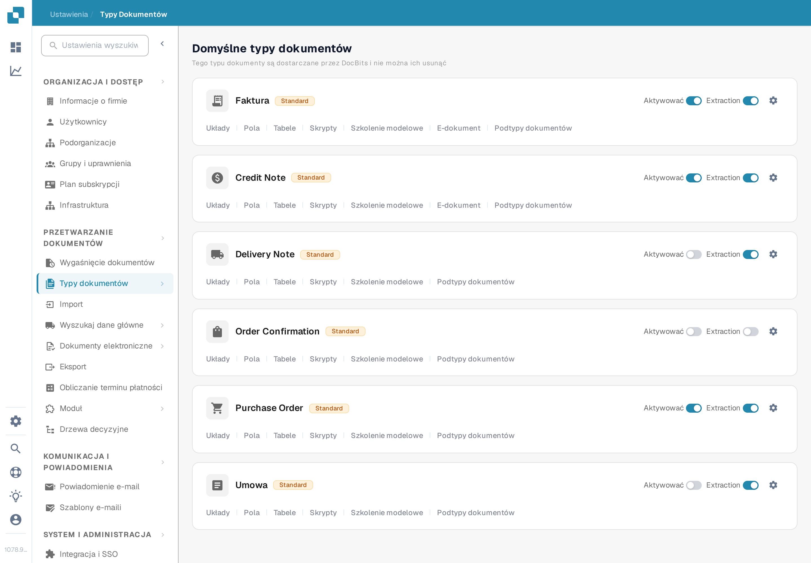
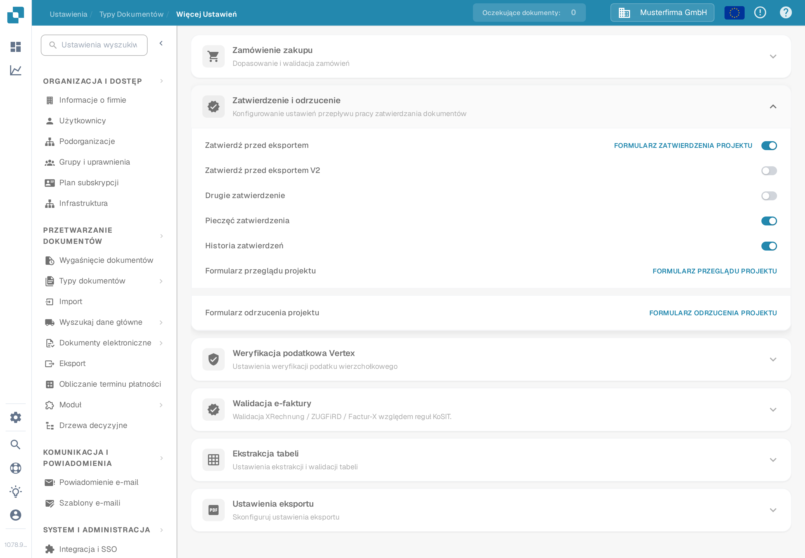

# Historia zatwierdzeń

**Historia zatwierdzeń** pozwala użytkownikom przejrzeć decyzje w przepływie zatwierdzania dokumentu. Poprzednia wersja tej strony wskazywała stary **Ustawienia ogólne** i pokazywała trzy obrazy ze starszego interfejsu bez wyjaśnienia elementów sterujących. Użyj bieżących ustawień typu dokumentu, aby włączyć opcję, a następnie sprawdź wynik za pomocą próbnego zatwierdzenia we własnej organizacji.

## Włączanie opcji dla typu dokumentu

1. Z kontem administratora otwórz **Ustawienia → Typy Dokumentów**. Znajdź typ dokumentu, na przykład **Faktura**, i wybierz jego **ikonę koła zębatego**, aby otworzyć **Więcej Ustawień**. Linki **Układy** i **Pola** na karcie prowadzą do innych edytorów.

   <figure><figcaption>
Otwórz **Więcej Ustawień** w typie dokumentu, którego przepływ zatwierdzania chcesz przejrzeć.
</figcaption></figure>

2. Rozwiń **Zatwierdzenie i odrzucenie** i znajdź **Historia zatwierdzeń**. Ten przełącznik jest niezależny od **Zatwierdź przed eksportem**, **Drugie zatwierdzenie** i **Pieczęć zatwierdzenia**. Polski zrzut ekranu przedstawia typ dokumentu **Faktura** z wymyślonymi danymi przykładowymi. Żadne ustawienie nie zostało zmienione na potrzeby tego przewodnika.

   <figure><figcaption>
Sprawdź przełącznik **Historia zatwierdzeń** dla wybranego typu dokumentu.
</figcaption></figure>

3. Włącz **Historię zatwierdzeń** dopiero po potwierdzeniu zamierzonego przepływu zatwierdzania i ustaleniu, kto może widzieć jego decyzje. Zapisz poprzednie ustawienie, aby móc porównać z nim wynik testu.

## Sprawdzenie za pomocą dokumentu testowego

Użyj dokumentu testowego skonfigurowanego typu, który rzeczywiście trafi do przepływu zatwierdzania. Poproś upoważnionego użytkownika testowego o jego zatwierdzenie lub odrzucenie, a następnie otwórz widok zatwierdzania tego dokumentu i przejrzyj dostępną historię. Porównaj decyzję, użytkownika, czas oraz wpisany komentarz z wykonaną czynnością. W przepływie z więcej niż jednym zatwierdzającym sprawdź kolejność po każdej decyzji. Jeśli historia nie jest widoczna, sprawdź typ dokumentu, stan przepływu, przełącznik i uprawnienia do wyświetlania, zanim uznasz to za błąd dokumentacji lub produktu.

Kolory i nawigacja w lewym górnym rogu starych zrzutów ekranu nie są przedstawiane jako bieżące zachowanie, ponieważ w środowisku testowym nie było dostępnego zatwierdzonego ani odrzuconego dokumentu. Dwa nowe obrazy weryfikują wyłącznie bieżącą ścieżkę ustawień i przełącznik; widok historii nadal wymaga dokumentu testowego z aktywnością zatwierdzania.
