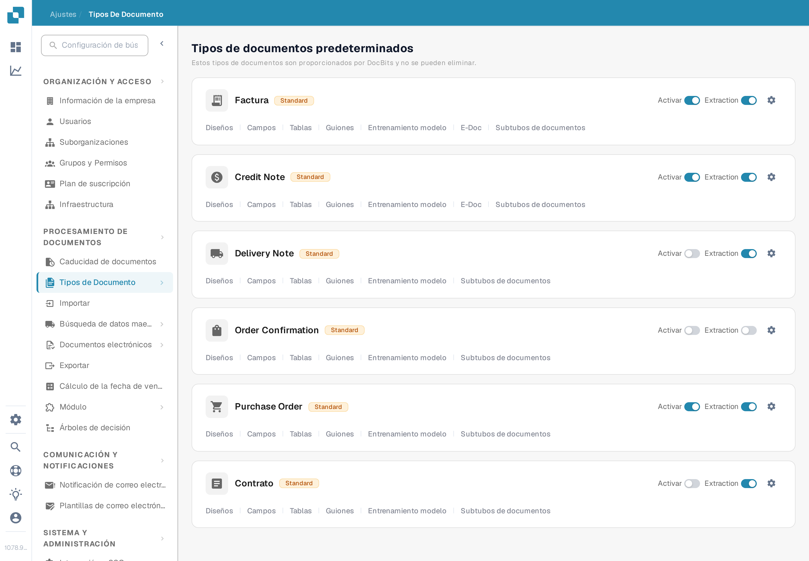
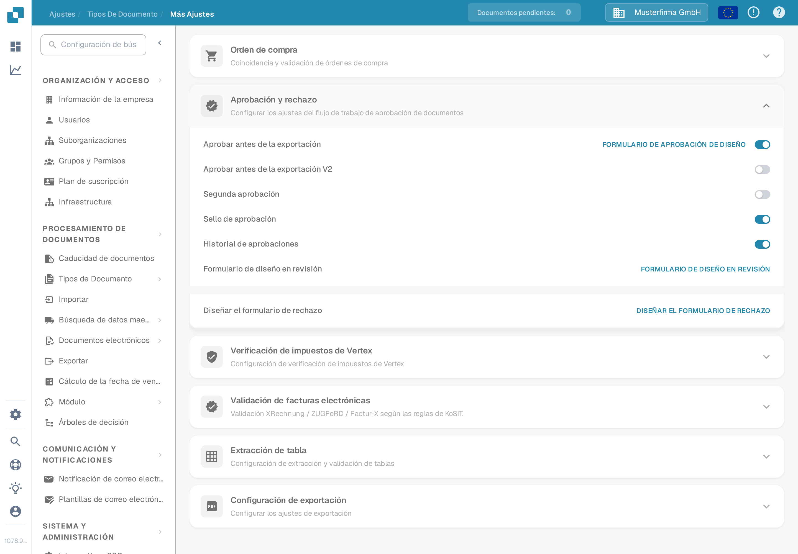

# Historial de aprobaciones

El **Historial de aprobaciones** permite revisar las decisiones del flujo de aprobación de un documento. La versión anterior de esta página enlazaba una ruta antigua de **Ajustes generales** y mostraba tres imágenes de una interfaz más antigua sin explicar los controles. Use la configuración actual de tipos de documento para activar la opción y verifique el resultado con una aprobación de prueba en su propia organización.

## Activar la opción para un tipo de documento

1. Con una cuenta de administrador, abra **Ajustes** → **Tipos de documento**. Busque el tipo de documento, por ejemplo **Factura**, y seleccione su **icono de engranaje** para abrir **Más ajustes**. Los enlaces **Diseños** y **Campos** de la tarjeta llevan a otros editores.

   <figure><figcaption>
Abra **Más ajustes** en el tipo de documento cuyo flujo de aprobación desea revisar.
</figcaption></figure>

2. Despliegue **Aprobación y rechazo** y busque **Historial de aprobaciones**. Este interruptor es independiente de **Aprobar antes de la exportación**, **Segunda aprobación** y **Sello de aprobación**. La captura en español muestra el tipo de documento **Factura** con datos de ejemplo inventados; los cuatro interruptores están **apagados** en este ejemplo. No se cambió ningún ajuste para esta guía.

   <figure><figcaption>
Compruebe el interruptor **Historial de aprobaciones** del tipo de documento seleccionado.
</figcaption></figure>

3. Active **Historial de aprobaciones** solo después de confirmar el flujo de aprobación previsto y quién puede ver sus decisiones. Anote el ajuste previo para poder compararlo con la prueba.

## Verificar con un documento de prueba

Use un documento de prueba del tipo configurado que entre realmente en el flujo de aprobación. Pida a un usuario de prueba autorizado que lo apruebe o lo rechace, abra después la vista de aprobación de ese documento y revise el historial disponible. Compare la decisión, el usuario, la hora y cualquier comentario introducido con la acción que realizó. En un flujo con más de un aprobador, compruebe la secuencia tras cada decisión. Si no se ve ningún historial, revise el tipo de documento, el estado del flujo, el interruptor y los permisos de visualización antes de tratarlo como un error de documentación o del producto.

Los colores y la navegación superior izquierda de las imágenes antiguas no se presentan como comportamiento actual, porque no había ningún documento aprobado o rechazado disponible en la Sandbox. Las dos imágenes nuevas solo verifican la ruta de configuración actual y el interruptor; la vista de historial todavía necesita un documento de prueba con actividad de aprobación.
