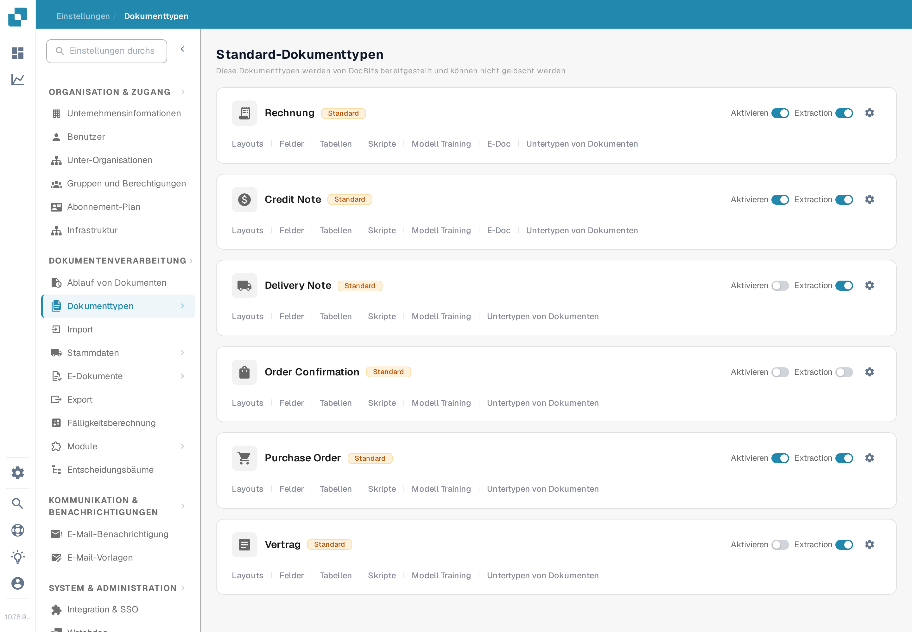
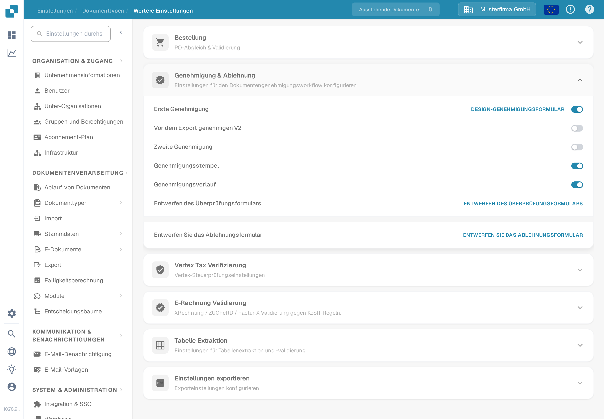

# Genehmigungsverlauf

Der **Genehmigungsverlauf** hilft dabei, Entscheidungen im Genehmigungsworkflow eines Dokuments nachzuvollziehen. Die frühere Version dieser Seite verwies auf einen alten Pfad über **Allgemeine Einstellungen** und zeigte drei Bilder einer älteren Oberfläche, ohne die Bedienelemente zu erklären. Aktivieren Sie die Option in den aktuellen Dokumenttyp-Einstellungen und prüfen Sie das Ergebnis anschließend mit einer Testgenehmigung in Ihrer eigenen Organisation.

## Option für einen Dokumenttyp aktivieren

1. Öffnen Sie mit einem Administratorkonto **Einstellungen** → **Dokumenttypen**. Suchen Sie den Dokumenttyp, zum Beispiel **Rechnung**, und wählen Sie das **Zahnrad-Symbol**, um **Weitere Einstellungen** zu öffnen. Die Links **Layouts** und **Felder** auf der Karte führen zu anderen Editoren.

   <figure><figcaption>
Öffnen Sie „Weitere Einstellungen“ bei dem Dokumenttyp, dessen Genehmigungsworkflow Sie prüfen möchten.
</figcaption></figure>

2. Klappen Sie **Genehmigung & Ablehnung** auf und suchen Sie **Genehmigungsverlauf**. Dieser Schalter ist unabhängig von **Erste Genehmigung**, **Zweite Genehmigung** und **Genehmigungsstempel**. Die deutsche Aufnahme zeigt den Dokumenttyp **Rechnung** mit erfundenen Beispieldaten; alle vier Schalter sind in diesem Beispiel **aus**. Für diese Anleitung wurde keine Einstellung geändert.

   <figure><figcaption>
Prüfen Sie den Schalter „Genehmigungsverlauf“ für den ausgewählten Dokumenttyp.
</figcaption></figure>

3. Aktivieren Sie den Genehmigungsverlauf erst, nachdem Sie den vorgesehenen Genehmigungsworkflow und die Personen, die die Entscheidungen sehen dürfen, geklärt haben. Notieren Sie die vorherige Einstellung, damit ein Test damit verglichen werden kann.

## Mit einem Testdokument prüfen

Verwenden Sie ein Testdokument des eingerichteten Typs, das tatsächlich in den Genehmigungsworkflow gelangt. Lassen Sie es von einem berechtigten Testbenutzer genehmigen oder ablehnen, öffnen Sie dann die Genehmigungsansicht dieses Dokuments und prüfen Sie den verfügbaren Verlauf. Vergleichen Sie Entscheidung, Benutzer, Zeitpunkt und einen eventuell eingegebenen Kommentar mit der von Ihnen ausgeführten Aktion. Bei einem Workflow mit mehr als einer genehmigenden Person prüfen Sie die Reihenfolge nach jeder Entscheidung. Ist kein Verlauf sichtbar, prüfen Sie Dokumenttyp, Workflow-Status, Schalter und Ansichtsberechtigungen, bevor Sie es als Dokumentations- oder Produktfehler behandeln.

Die Farben und die Navigation oben links der alten Bilder werden nicht als aktuelles Verhalten dargestellt, da in der Sandbox kein genehmigtes oder abgelehntes Dokument verfügbar war. Die zwei neuen Bilder belegen nur den aktuellen Einstellungsweg und den Schalter; die Verlaufsansicht benötigt weiterhin ein Testdokument mit Genehmigungsaktivität.
