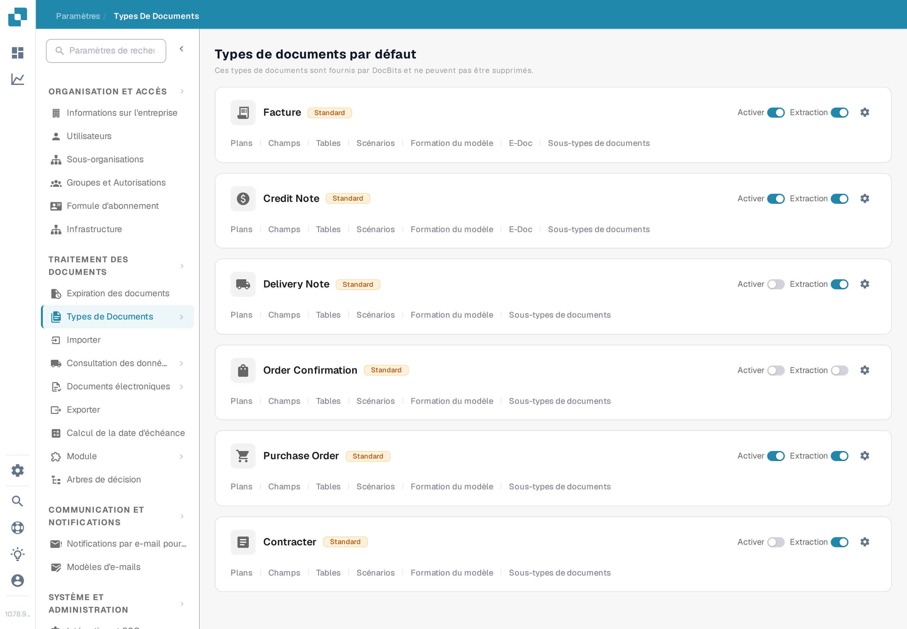
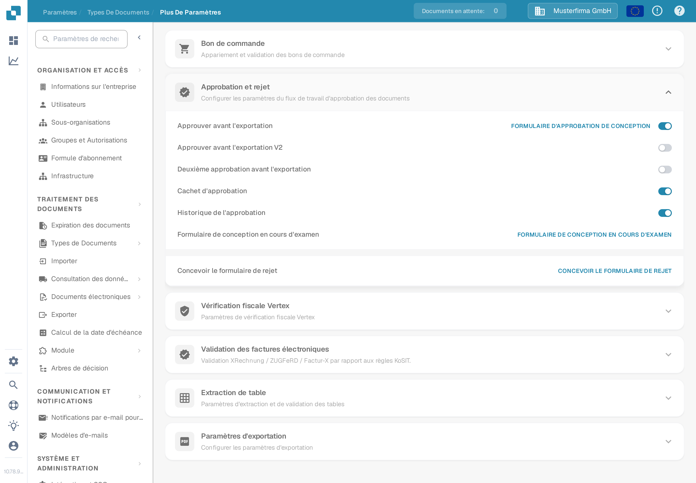

# Historique de l'approbation

L'**Historique de l'approbation** permet de consulter les décisions du workflow d'approbation d'un document. L'ancienne version de cette page indiquait un ancien chemin via **Paramètres généraux** et montrait trois images d'une interface plus ancienne sans expliquer les commandes. Utilisez les paramètres actuels du type de document pour activer l'option, puis vérifiez le résultat avec une approbation de test dans votre propre organisation.

## Activer l'option pour un type de document

1. Avec un compte administrateur, ouvrez **Paramètres** → **Types de documents**. Recherchez le type de document, par exemple **Facture**, et sélectionnez son **icône d'engrenage** pour ouvrir **Plus de paramètres**. Les liens **Layouts** et **Champs** sur la carte mènent à d'autres éditeurs.

   <figure><figcaption>
Ouvrez « Plus de paramètres » sur le type de document dont vous voulez examiner le workflow d'approbation.
</figcaption></figure>

2. Dépliez **Approbation et rejet** et repérez **Historique de l'approbation**. Ce commutateur est indépendant de **Première approbation**, **Deuxième approbation** et **Cachet d'approbation**. La capture française montre le type de document **Facture** avec des données d'exemple inventées ; les quatre commutateurs sont **désactivés** dans cet exemple. Aucun paramètre n'a été modifié pour ce guide.

   <figure><figcaption>
Vérifiez le commutateur « Historique de l'approbation » pour le type de document sélectionné.
</figcaption></figure>

3. N'activez l'historique d'approbation qu'après avoir confirmé le workflow d'approbation prévu et les personnes autorisées à voir ses décisions. Notez le paramètre précédent afin de pouvoir comparer un test avec celui-ci.

## Vérifier avec un document de test

Utilisez un document de test du type configuré qui entre réellement dans le workflow d'approbation. Faites-le approuver ou rejeter par un utilisateur de test autorisé, puis ouvrez la vue d'approbation de ce document et consultez l'historique disponible. Comparez la décision, l'utilisateur, l'heure et tout commentaire saisi avec l'action effectuée. Pour un workflow avec plusieurs approbateurs, vérifiez l'ordre après chaque décision. Si aucun historique n'est visible, contrôlez le type de document, l'état du workflow, le commutateur et les droits de consultation avant de le considérer comme une erreur de documentation ou de produit.

Les couleurs et la navigation en haut à gauche des anciennes images ne sont pas présentées comme le comportement actuel, car aucun document approuvé ou rejeté n'était disponible. Les deux nouvelles images ne vérifient que le chemin des paramètres actuels et le commutateur ; la vue d'historique nécessite encore un document de test avec une activité d'approbation.
