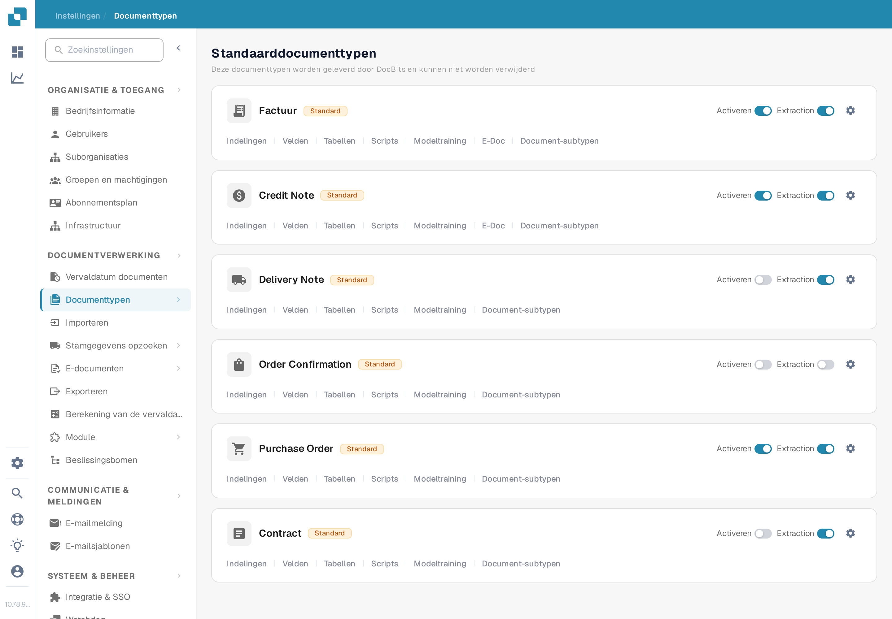
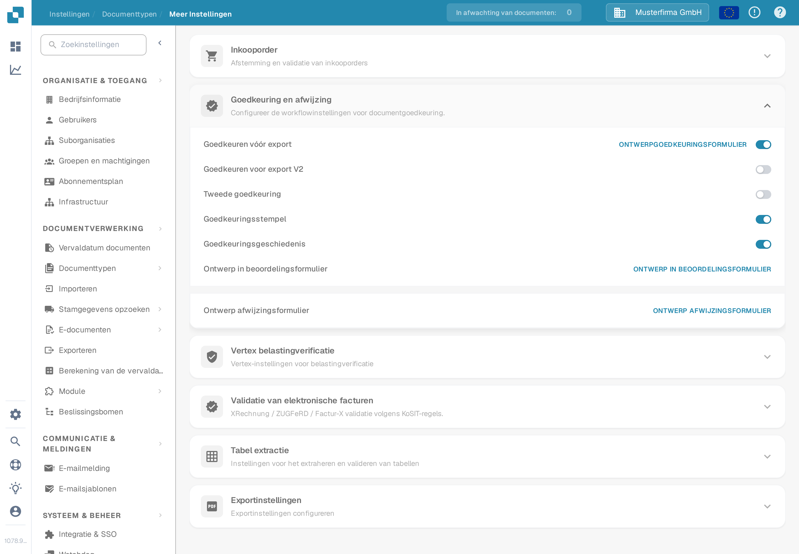

# Goedkeuringsgeschiedenis

Met Goedkeuringsgeschiedenis kunnen gebruikers de beslissingen in de goedkeuringsworkflow van een document bekijken. De vorige versie van deze pagina verwees naar een oud pad via **Algemene instellingen** en toonde drie afbeeldingen van een oudere interface zonder uitleg over de bediening. Gebruik de huidige instellingen van het documenttype om de optie in te schakelen en controleer het resultaat daarna met een synthetische goedkeuring in uw eigen organisatie.

## De optie voor een documenttype inschakelen

1. Open met een beheerdersaccount **Instellingen → Documenttypen**. Zoek het documenttype, bijvoorbeeld **Factuur**, en selecteer het **tandwielpictogram** om **Meer Instellingen** te openen. De links **Indelingen** en **Velden** op de kaart leiden naar andere editors.

   <figure><figcaption>
Open Meer Instellingen op het documenttype waarvan u de goedkeuringsworkflow wilt bekijken.
</figcaption></figure>

2. Klap **Goedkeuring en afwijzing** open en zoek **Goedkeuringsgeschiedenis**. Deze schakelaar staat los van **Goedkeuren vóór export**, **Tweede goedkeuring** en **Goedkeuringsstempel**. De Nederlandse screenshot toont het documenttype **Factuur** met verzonnen voorbeeldgegevens; de vier schakelaars staan in dit voorbeeld **uit**. Er is voor deze handleiding geen instelling gewijzigd.

   <figure><figcaption>
Controleer de schakelaar Goedkeuringsgeschiedenis voor het geselecteerde documenttype.
</figcaption></figure>

3. Schakel Goedkeuringsgeschiedenis pas in nadat u de bedoelde goedkeuringsworkflow hebt bevestigd en weet wie de beslissingen mag zien. Noteer de vorige instelling zodat een test ermee kan worden vergeleken.

## Controleren met een testdocument

Gebruik een synthetisch document van het ingestelde type dat daadwerkelijk in de goedkeuringsworkflow terechtkomt. Laat een gemachtigde testgebruiker het goedkeuren of afwijzen en open daarna de goedkeuringsweergave van dat document om de beschikbare geschiedenis te bekijken. Controleer de beslissing, gebruiker, tijd en een eventueel ingevoerde opmerking tegen de actie die u hebt uitgevoerd. Controleer bij een workflow met meer dan één goedkeurder de volgorde na elke beslissing. Als er geen geschiedenis zichtbaar is, controleer dan het documenttype, de workflowstatus, de schakelaar en de weergaverechten voordat u dit als documentatie- of productfout behandelt.

De kleuren en de navigatie linksboven in de oude screenshots worden niet als huidig gedrag gepresenteerd, omdat er in Test A geen goedgekeurd of afgewezen document beschikbaar was. De twee nieuwe afbeeldingen verifiëren alleen het huidige pad naar de instellingen en de schakelaar; de geschiedenisweergave moet nog met een synthetisch document met goedkeuringsactiviteit worden gecontroleerd.
