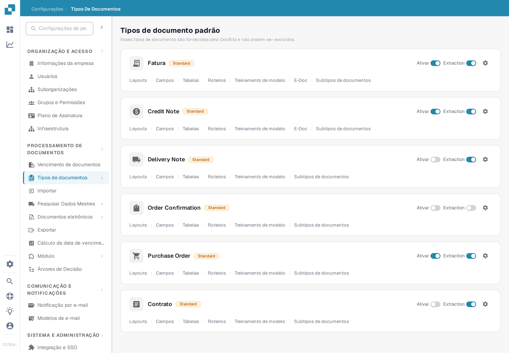

# Histórico de Aprovação

O **Histórico de aprovação** ajuda os usuários a inspecionar as decisões no fluxo de aprovação de um documento. A versão anterior desta página indicava um caminho antigo em **Configurações Gerais** e mostrava três imagens de uma interface mais antiga sem explicar os controles. Use as configurações atuais do tipo de documento para habilitar a opção e depois verifique o resultado com uma aprovação de teste na sua própria organização.

## Habilitar a opção para um tipo de documento

1. Com uma conta de administrador, abra **Configurações → Tipos de documentos**. Encontre o tipo de documento, como **Fatura**, e selecione seu **ícone de engrenagem** para abrir **Mais Configurações**. Os links **Layouts** e **Campos** no cartão levam a editores diferentes.

   <figure><figcaption>
Abra <strong>Mais Configurações</strong> no tipo de documento cujo fluxo de aprovação você deseja inspecionar.
</figcaption></figure>

2. Expanda **Aprovação e Rejeição** e localize **Histórico de aprovação**. Este interruptor é independente de **Aprovar antes de exportar**, **Segunda Aprovação** e **Selo de aprovação**. A captura de tela em português mostra o tipo de documento **Fatura** com dados de exemplo inventados. Nenhuma configuração foi alterada para este guia.

   <figure><figcaption>
Verifique o interruptor <strong>Histórico de aprovação</strong> para o tipo de documento selecionado.
</figcaption></figure>

3. Habilite o Histórico de aprovação somente depois de confirmar o fluxo de aprovação pretendido e quem pode ver suas decisões. Anote a configuração anterior para poder compará-la com um teste.

## Verificar com um documento de teste

Use um documento de teste do tipo configurado que realmente entre no fluxo de aprovação. Peça a um usuário de teste autorizado que o aprove ou rejeite e depois abra a visualização de aprovação desse documento e inspecione o histórico disponível. Compare a decisão, o usuário, o horário e qualquer comentário inserido com a ação executada. Em um fluxo com mais de um aprovador, verifique a sequência após cada decisão. Se nenhum histórico estiver visível, verifique o tipo de documento, o estado do fluxo, o interruptor e as permissões de visualização antes de tratá-lo como erro de documentação ou do produto.

As cores e a navegação no canto superior esquerdo das capturas antigas não são apresentadas como comportamento atual, porque nenhum documento aprovado ou rejeitado estava disponível. As duas novas imagens verificam apenas o caminho atual das configurações e o interruptor; a visualização do histórico ainda exige um documento de teste com atividade de aprovação.
