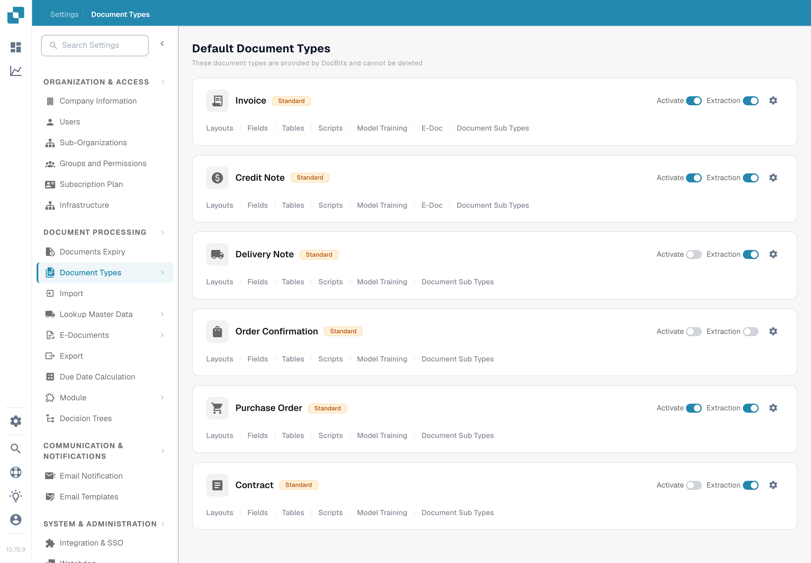

# Approval Stamp

An approval stamp is an annotation added during document approval when the option is enabled for that document type. It is useful when a reviewer needs to see who approved a document and when. The previous page showed six screenshots from an older interface and treated the stamp, IDM export and PDF download options as already verified together. Check each result in your own workflow before relying on it.

## Find the option

1. With an administrator account, open **Settings → Document Types**. Find the type you want to configure, such as **Invoice**, and select the **gear icon** on that card. The gear opens **More Settings** for that document type; **Layouts** and **Fields** open different editors.

   <figure><figcaption>
Open the gear on the relevant document type.
</figcaption></figure>

2. In **More Settings**, expand **Approval & Rejection**. Locate the **Approval Stamp** switch next to **Approve before export**, **Second Approval** and **Approval History**. The screenshot shows the synthetic **DocBits Documentation Test A** organisation with the stamp **off**. It does not show a stamped document.

   <figure><figcaption>
Check the Approval Stamp setting for the selected document type.
</figcaption></figure>

3. Enable the switch only after agreeing how approvals and exports work in your organisation. Keep a record of the previous setting so you can verify the effect on a test invoice.

## Verify an approval

Send a synthetic invoice of this document type through the configured approval workflow. On the **Ready for approval** screen, approve it with an authorised test account. The current DocBits web client checks the Approval Stamp option during approval and adds a stamp annotation with the approver name and date. Reopen the approved document and inspect the annotation and the downloaded PDF that your workflow actually uses. If the stamp is absent, check the document type, approval status, setting and export configuration.

An approval stamp is separate from **Second Approval** and **Approval History**. Enabling one does not prove that the others are configured. The available dashboard download actions and IDM export format depend on the environment and were not verified for this page, so this guide does not promise specific download menu labels or automatic IDM output.

The two new screenshots were visually checked in the English Test A Sandbox. No switch was changed and no document was approved or exported during this check; the stamped end state needs a dedicated synthetic approved invoice.
