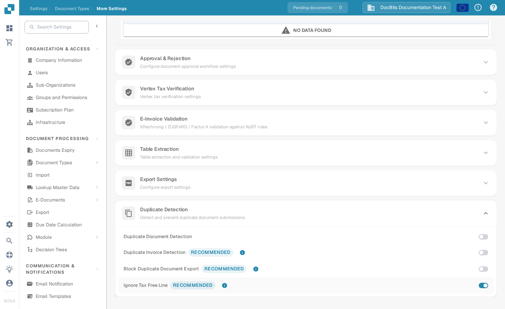
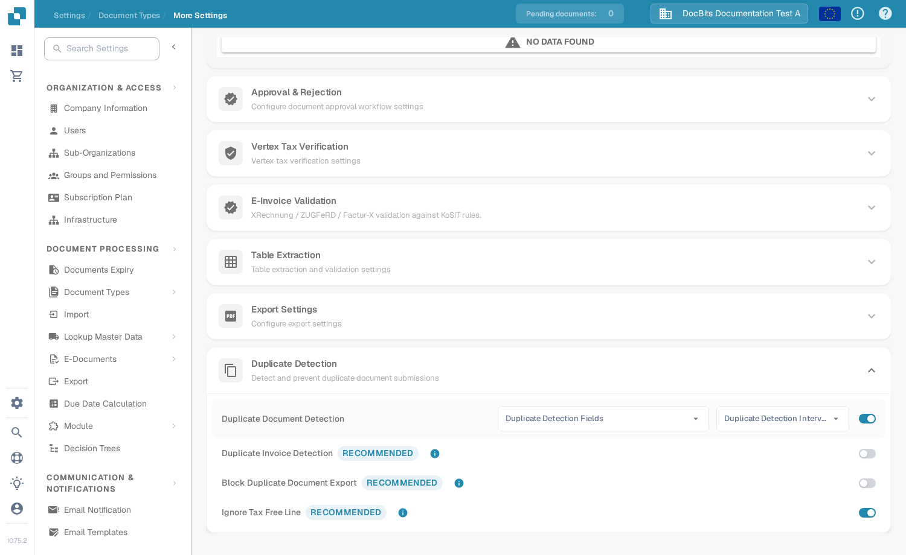
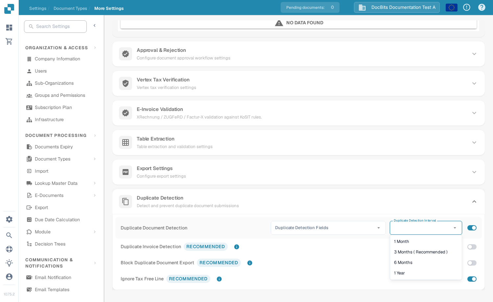

# Duplicate Detection

Use **Duplicate Detection** to flag documents that match another document on selected fields within a chosen time period. The options belong to each document type.

## Open the settings

1. Open **Settings → Document Types**.
2. On the document type you want to configure, select **Settings**.
3. In **More Settings**, open **Duplicate Detection**.

<figure><figcaption>
The Invoice settings show four separate switches. The field and interval selectors appear when detection is enabled.
</figcaption></figure>

## Choose what counts as a duplicate

1. Turn on **Duplicate Document Detection**. The **Duplicate Detection Fields** and **Duplicate Detection Interval** selectors appear.
2. Select the fields that must match. For an invoice, you might choose **Supplier ID** and **Invoice number**. Choose fields that distinguish documents in your own process.
3. Choose an interval: **1 Month**, **3 Months (Recommended)**, **6 Months**, or **1 Year**. A longer interval checks a wider date range and may take longer to load.

Each change is saved when you make it; there is no separate Save button in this section. If you switch detection off, the field and interval selectors are hidden.

<figure><figcaption>
Enable detection before selecting the comparison fields and time interval.
</figcaption></figure>

<figure><figcaption>
Three months is marked as the recommended interval in the menu.
</figcaption></figure>

For **Invoice**, this section also offers **Duplicate Invoice Detection**, **Block Duplicate Document Export**, and **Ignore Tax Free Line**. These are separate switches; enable only the behavior your invoice process needs. The extra switches are not shown for other document types.

## Review a flagged document

When DocBits finds a match, the document's row on the **Dashboard** shows a duplicate icon. Select the icon to compare the matching records in the side panel. The icon appears only when a match exists.

When you open a flagged document, the duplicate warning offers **View Duplicate**, **Proceed Anyway**, and, if the document has not already been archived, **Archive**. Review the matching records before choosing an action. See [the Dashboard guide](../../dashboard/README.md) for the document list.
