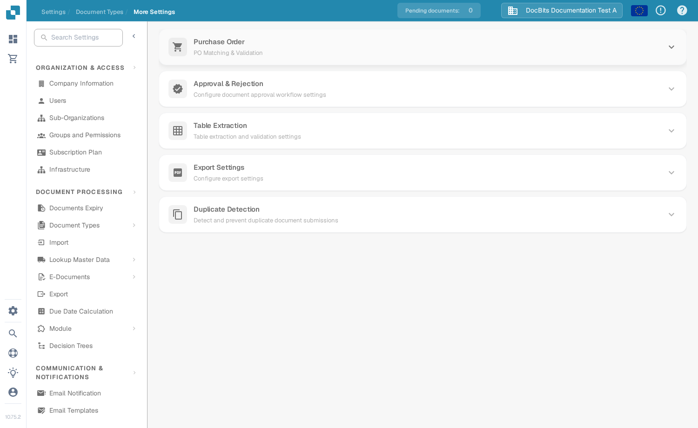

# Purchase Order

Use this section when invoices should be checked against purchase orders (POs). Start with the invoice document type used by your team; the options for other document types may differ.

1. Open **Settings** → **Document Types**.
2. Select **Invoice**, then open **More Settings**.
3. Expand **Purchase Order** to review the available matching and validation options.

<figure><figcaption>Current English Sandbox view in DocBits Documentation Test A. The Purchase Order section is closed here; no setting was changed.</figcaption></figure>

Choose the guide for the task you need:

* [Purchase Order Matching Rules](purchase-order-matching-rules.md) explains the matching configuration.
* [PO Table in Layout Builder](po-table-in-layout-builder.md) covers the fields displayed for PO lines.
* [Purchase order tolerance settings](purchase-order-tolerance-settings-additional-purchase-order-tolerance.md) covers allowed differences between an invoice and its PO.
* [Consumed PO Line Status](consumed-po-line-status.md) and [Update Document Purchase Order Status](update-document-purchase-order-status.md) cover the resulting statuses.

Before using a rule with live invoices, check it with a synthetic PO and an invoice whose PO number and lines you know. This page shows where the settings are; it does not claim that a PO match or export was completed in the Sandbox.
