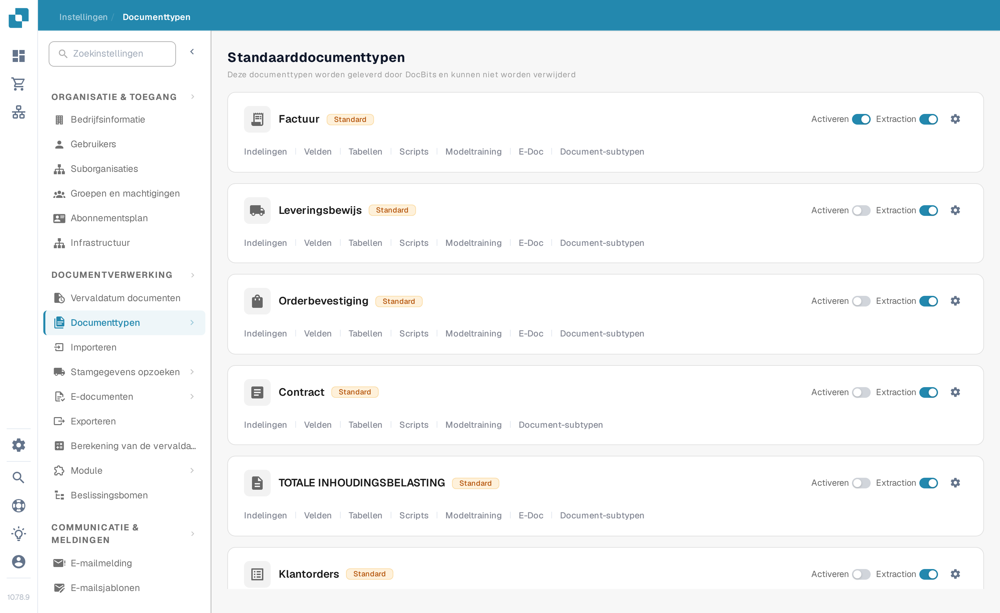
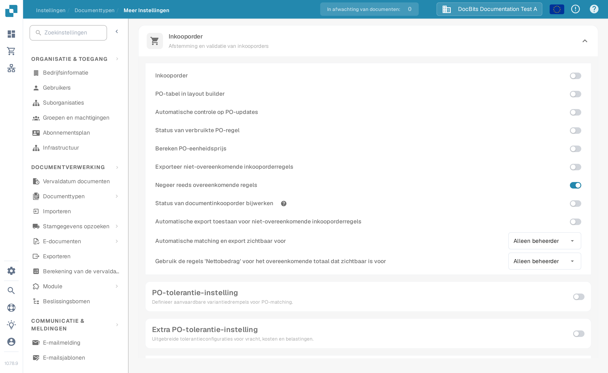
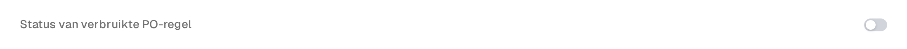

# Status van geconsumeerde PO-regel

**Status van geconsumeerde PO-regel** kleurt inkooporderregels in het matchingscherm op basis van hoeveel van elke regel al is gematcht. Zet deze instelling aan voor het documenttype van je facturen als je team ongebruikte, deels gebruikte en volledig gebruikte PO-regels snel moet kunnen herkennen. De kleur is een visuele hulp; controleer de **Gematchte hoeveelheid** en de geselecteerde PO-hoeveelheidskolom voordat je beslist of een regel opnieuw kan worden gematcht.

## De instelling inschakelen

1. Open **Instellingen → Documenttypen**. Zoek het documenttype dat je voor je facturen gebruikt en selecteer het tandwiel op de kaart om **Meer Instellingen** te openen. De screenshot toont de kaart **Factuur**. Laat de schakelaars **Activeren** en **Extraction** staan zoals ze zijn.

   <figure><figcaption>
Open Meer Instellingen via de kaart Factuur.
</figcaption></figure>

2. Vouw **Inkooporder** uit als het is ingeklapt. Zoek **Status van verbruikte PO-regel** en zet die schakelaar aan. Dit is een andere instelling dan **Status van documentinkooporder bijwerken**, verderop in dezelfde sectie.

   <figure><figcaption>
Kies de schakelaar Status van verbruikte PO-regel.
</figcaption></figure>

   <figure><figcaption>
De schakelaar staat in dit voorbeeld uit; zet hem aan om de matchingskleuren te tonen.
</figcaption></figure>

3. Open een factuur met inkoopordermatching en bekijk de PO-regels. De voorbeelden hieronder laten zien hoe de regelkleuren zich verhouden tot de matchingsstatus. Zie [Inkooporder Matching Scherm](../../../../../../end-user-and-partner-section/end-user-section/purchase-order-matching/README.md) voor de matchingstappen.

## De PO-regelkleuren lezen

| Weergave | Betekenis | Wat je controleert |
| --- | --- | --- |
| Effen of wit | Er is nog geen hoeveelheid van deze PO-regel gematcht. | Controleer de PO-hoeveelheid en de factuurregel voor je matcht. |
| Blauwe tint | Je hebt de regel geselecteerd in het huidige matchingscherm. | Selectie is tijdelijk; het betekent niet dat de regel volledig is gematcht. |
| Bleekoranje | Er is enige hoeveelheid gematcht, maar de gematchte hoeveelheid blijft onder de geselecteerde PO-hoeveelheid. | Controleer hoeveel hoeveelheid er overblijft. |
| Bleekviolet | De gematchte hoeveelheid is ten minste de geselecteerde PO-hoeveelheid. | Ga er niet vanuit dat er nog meer beschikbaar is. |

<figure><figcaption>
Er is nog geen hoeveelheid gematcht.
</figcaption></figure>

<figure><figcaption>
De regel is geselecteerd voor de huidige matching.
</figcaption></figure>

<figure><figcaption>
De regel is deels gebruikt.
</figcaption></figure>

<figure><figcaption>
De regel is volledig gebruikt.
</figcaption></figure>

Een doorgekruiste regel heeft een andere betekenis: de PO-status ervan kan zijn uitgesloten door [PO-uitschakelstatussen](purchase-order-disable-statuses.md). Controleer die instelling als een regel niet kan worden geselecteerd.
