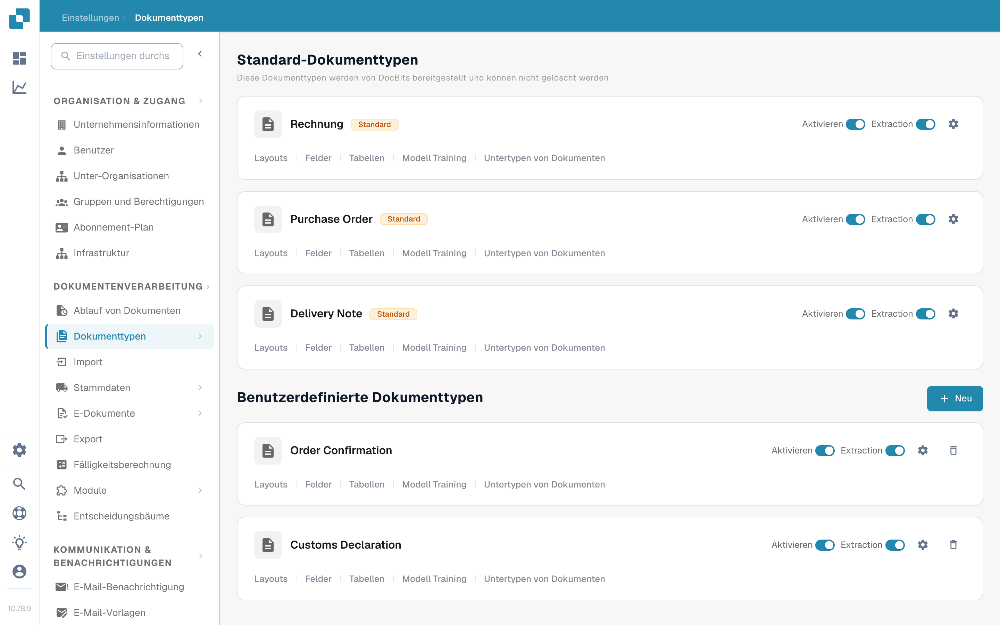
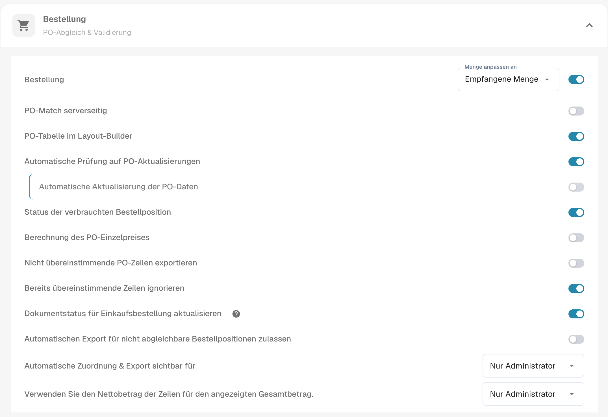
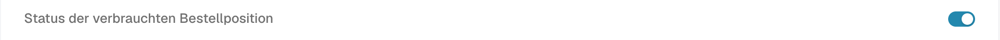

# Verbrauchter PO-Zeilenstatus

**Der Verbrauchte PO-Zeilenstatus** färbt Bestellpositionen (PO-Positionen) in der Abgleichsansicht entsprechend dem Anteil ein, der bereits abgeglichen wurde. Aktivieren Sie die Einstellung für den Dokumenttyp Ihrer Rechnungen, wenn Ihr Team noch nicht genutzte, teilweise genutzte und vollständig genutzte PO-Positionen schnell erkennen soll. Die Farbe ist nur ein visuelles Hilfsmittel; prüfen Sie vor der Entscheidung, ob eine Position erneut abgeglichen werden kann, die **Abgeglichene Menge** und die gewählte PO-Mengenspalte.

## Einstellung aktivieren

1. Öffnen Sie **Einstellungen → Dokumenttypen**. Suchen Sie den Dokumenttyp, den Sie für Ihre Rechnungen verwenden, und wählen Sie das Zahnrad auf seiner Karte, um **Weitere Einstellungen** zu öffnen. Der Screenshot zeigt die Karte **Rechnung**. Lassen Sie die Schalter **Aktivieren** und **Extraktion** unverändert.

   <figure><figcaption>
Weitere Einstellungen über die Rechnung-Karte öffnen.
</figcaption></figure>

2. Klappen Sie **Bestellung** auf, falls es eingeklappt ist. Suchen Sie **Status der verbrauchten Bestellposition** und aktivieren Sie seinen Schalter. Das ist eine eigene Einstellung, unabhängig von **Dokumentstatus für Einkaufsbestellung aktualisieren** weiter unten im selben Abschnitt.

   <figure><figcaption>
Den Schalter „Status der verbrauchten Bestellposition“ wählen.
</figcaption></figure>

   <figure><figcaption>
Der Schalter ist in diesem Beispiel ausgeschaltet; schalten Sie ihn ein, um die Abgleichsfarben zu sehen.
</figcaption></figure>

3. Öffnen Sie eine Rechnung mit Bestellabgleich und prüfen Sie ihre PO-Positionen. Die Beispiele unten zeigen, wie die Positionsfarben zum Abgleichstatus gehören. Die Abgleichsschritte finden Sie unter [Bildschirm „Bestellabgleich“](../../../../../../end-user-and-partner-section/end-user-section/purchase-order-matching/README.md).

## Die PO-Positionsfarben lesen

| Aussehen | Bedeutung | Was prüfen |
| --- | --- | --- |
| Unauffällig oder weiß | Für diese PO-Position wurde noch keine Menge abgeglichen. | PO-Menge und Rechnungsposition vor dem Abgleich prüfen. |
| Blauer Ton | Sie haben die Position in der aktuellen Abgleichsansicht ausgewählt. | Die Auswahl ist vorübergehend; sie bedeutet nicht, dass die Position vollständig abgeglichen ist. |
| Blassorange | Ein Teil der Menge ist abgeglichen, aber die abgeglichene Menge liegt unter der gewählten PO-Menge. | Prüfen, welche Menge noch verfügbar ist. |
| Blassviolett | Die abgeglichene Menge erreicht mindestens die gewählte PO-Menge. | Gehen Sie nicht davon aus, dass weitere Menge verfügbar ist. |

<figure><figcaption>
Für diese Position wurde noch keine Menge abgeglichen.
</figcaption></figure>

<figure><figcaption>
Die Position ist für den aktuellen Abgleich ausgewählt.
</figcaption></figure>

<figure><figcaption>
Die Position ist teilweise genutzt.
</figcaption></figure>

<figure><figcaption>
Die Position ist vollständig genutzt.
</figcaption></figure>

Eine durchgestrichene Position hat eine andere Bedeutung: Ihr PO-Status ist möglicherweise durch [PO-Deaktivierungsstatus](purchase-order-disable-statuses.md) ausgeschlossen. Prüfen Sie diese Einstellung, wenn sich eine Position nicht auswählen lässt.
