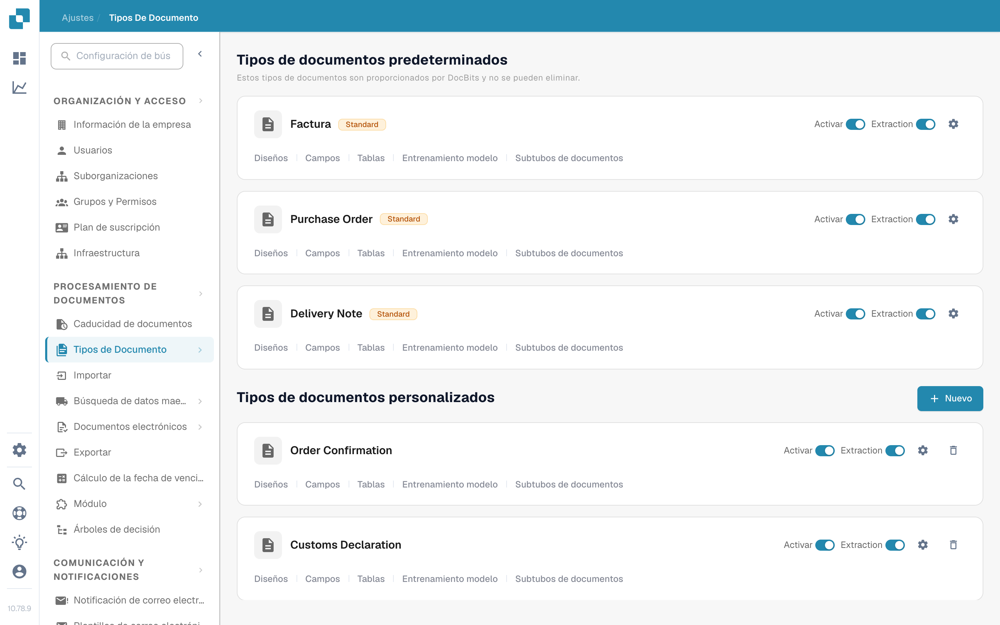
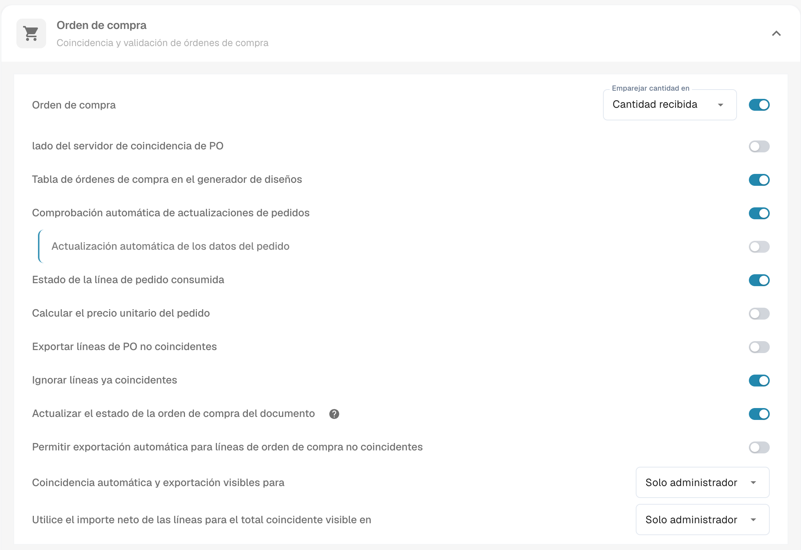
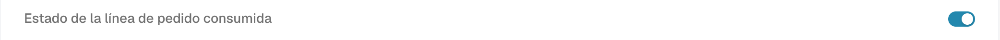

# Estado de la línea de pedido consumida

**El Estado de la línea de pedido consumida** colorea las líneas de pedido de compra (PO) en la vista de coincidencia según la cantidad de cada línea que ya se ha emparejado. Actívelo para el tipo de documento que usa en sus facturas si su equipo necesita distinguir rápidamente las líneas de PO sin usar, parcialmente usadas y completamente usadas. El color es solo una ayuda visual; compruebe la **Cantidad coincidente** y la columna de cantidad de PO seleccionada antes de decidir si una línea puede volver a emparejarse.

## Activar la configuración

1. Abra **Ajustes → Tipos de documento**. Busque el tipo de documento que usa para sus facturas y seleccione el engranaje de su tarjeta para abrir **Más ajustes**. La captura muestra la tarjeta **Factura**. Deje sin cambios los interruptores **Activar** y **Extraction**.

   <figure><figcaption>
Abra Más ajustes desde la tarjeta Factura.
</figcaption></figure>

2. Despliegue **Orden de compra** si está contraído. Busque **Estado de la línea de pedido consumida** y active su interruptor. Es un ajuste independiente de **Actualizar el estado de la orden de compra del documento**, más abajo en la misma sección.

   <figure><figcaption>
Seleccione el interruptor Estado de la línea de pedido consumida.
</figcaption></figure>

   <figure><figcaption>
En este ejemplo el interruptor está apagado; actívelo para ver los colores de coincidencia.
</figcaption></figure>

3. Abra una factura con coincidencia de órdenes de compra y revise sus líneas de PO. Los ejemplos de abajo muestran cómo se relacionan los colores de las líneas con el estado de coincidencia. Para los pasos de coincidencia, consulte [Pantalla de Coincidencia de Órdenes de Compra](../../../../../../end-user-and-partner-section/end-user-section/purchase-order-matching/README.md).

## Leer los colores de las líneas de PO

| Apariencia | Significado | Qué comprobar |
| --- | --- | --- |
| Sin color o blanca | Aún no se ha emparejado ninguna cantidad de esta línea de PO. | Compruebe la cantidad de la PO y la línea de la factura antes de emparejar. |
| Tinte azul | Ha seleccionado la línea en la vista de coincidencia actual. | La selección es temporal; no significa que la línea esté completamente emparejada. |
| Naranja pálido | Se ha emparejado parte de la cantidad, pero la cantidad coincidente es inferior a la cantidad de PO seleccionada. | Compruebe qué cantidad queda disponible. |
| Violeta pálido | La cantidad coincidente alcanza al menos la cantidad de PO seleccionada. | No dé por hecho que queda más cantidad disponible. |

<figure><figcaption>
Aún no se ha emparejado ninguna cantidad.
</figcaption></figure>

<figure><figcaption>
La línea está seleccionada para la coincidencia actual.
</figcaption></figure>

<figure><figcaption>
La línea está parcialmente usada.
</figcaption></figure>

<figure><figcaption>
La línea está completamente usada.
</figcaption></figure>

Una línea tachada tiene otro significado: su estado de PO puede estar excluido por [PO desactivar estados](purchase-order-disable-statuses.md). Revise ese ajuste si una línea no se puede seleccionar.
