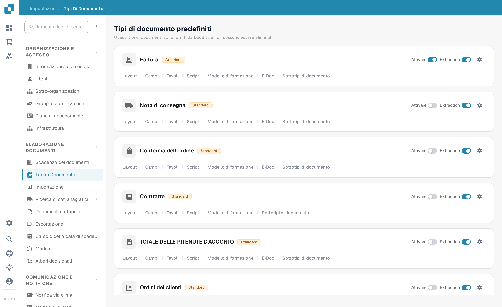
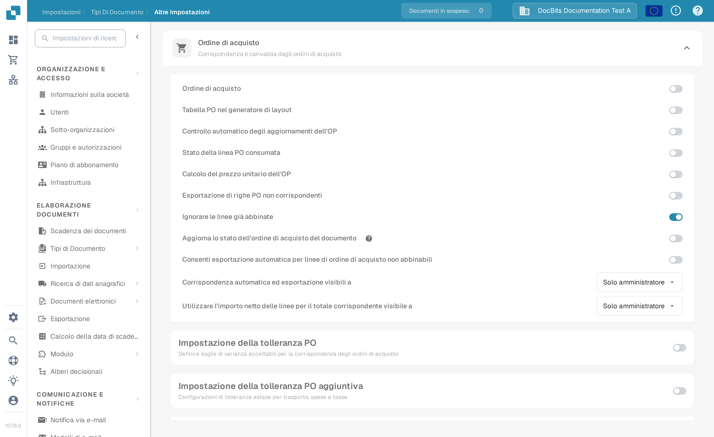
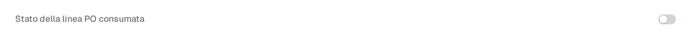

# Stato della riga PO consumata

**Stato della riga PO consumata** colora le righe dell'ordine di acquisto (PO) nella schermata di abbinamento in base alla quantità di ciascuna riga già abbinata. Attivalo per il tipo di documento che usi per le fatture se il tuo team deve riconoscere rapidamente le righe PO non usate, parzialmente usate e completamente usate. Il colore è solo un aiuto visivo; controlla la **Quantità corrispondente** e la colonna della quantità PO selezionata prima di decidere se una riga può essere abbinata di nuovo.

## Attivare l'impostazione

1. Apri **Impostazioni → Tipi di Documento**. Trova il tipo di documento che usi per le fatture e seleziona l'icona dell'ingranaggio sulla sua scheda per aprire **Altre impostazioni**. Lo screenshot mostra la scheda **Fattura**. Lascia invariati gli interruttori **Attivare** ed **Extraction**.

   <figure><figcaption>
Apri Altre impostazioni dalla scheda Fattura.
</figcaption></figure>

2. Espandi **Ordine di acquisto** se è contratto. Trova **Stato della linea PO consumata** e attiva il suo interruttore. È un'impostazione separata da **Aggiorna lo stato dell'ordine di acquisto del documento**, più in basso nella stessa sezione.

   <figure><figcaption>
Scegli l'interruttore Stato della linea PO consumata.
</figcaption></figure>

   <figure><figcaption>
In questo esempio l'interruttore è spento; attivalo per vedere i colori di abbinamento.
</figcaption></figure>

3. Apri una fattura con l'abbinamento dell'ordine di acquisto e controlla le sue righe PO. Gli esempi qui sotto mostrano come i colori delle righe si collegano allo stato di abbinamento. Per i passaggi di abbinamento, vedi [Schermata di Abbinamento Ordini di Acquisto](../../../../../../end-user-and-partner-section/end-user-section/purchase-order-matching/README.md).

## Leggere i colori delle righe PO

| Aspetto | Significato | Cosa controllare |
| --- | --- | --- |
| Neutro o bianco | Nessuna quantità di questa riga PO è ancora stata abbinata. | Controlla la quantità della PO e la riga della fattura prima di abbinare. |
| Tinta blu | Hai selezionato la riga nella schermata di abbinamento attuale. | La selezione è temporanea; non significa che la riga sia completamente abbinata. |
| Arancione pallido | Una parte della quantità è stata abbinata, ma la quantità corrispondente è inferiore alla quantità PO selezionata. | Controlla quanta quantità rimane. |
| Viola pallido | La quantità corrispondente raggiunge almeno la quantità PO selezionata. | Non dare per scontato che ci sia altra quantità disponibile. |

<figure><figcaption>
Nessuna quantità è ancora stata abbinata.
</figcaption></figure>

<figure><figcaption>
La riga è selezionata per l'abbinamento attuale.
</figcaption></figure>

<figure><figcaption>
La riga è parzialmente usata.
</figcaption></figure>

<figure><figcaption>
La riga è completamente usata.
</figcaption></figure>

Una riga barrata ha un altro significato: il suo stato PO potrebbe essere escluso da [Stati di disabilitazione dell'OP](purchase-order-disable-statuses.md). Controlla quell'impostazione se una riga non può essere selezionata.
