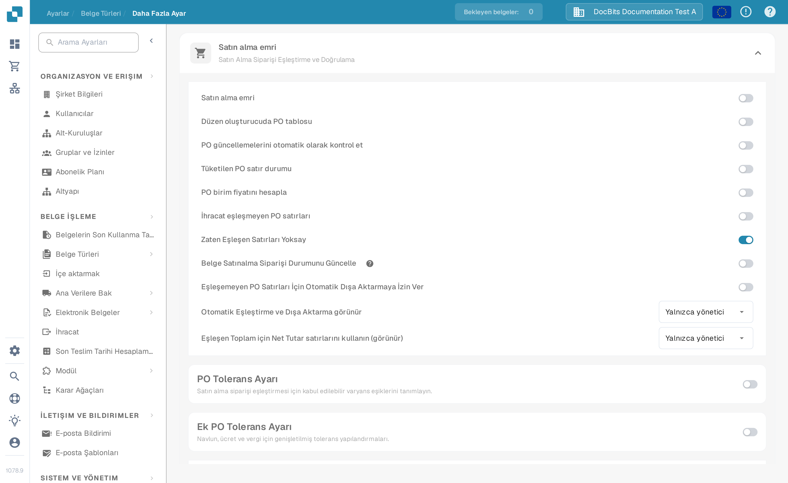
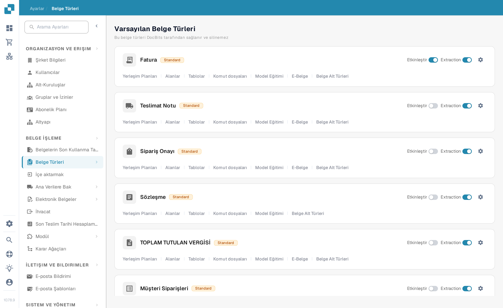

# Consumed PO Line Status

Bu ayar, bir fatura satırının bir Satın Alma Siparişi (PO) satırına eşleştirilip eşleştirilmediğini gösteren **Eşleşen Miktar** değerinin, PO satırının durumunu güncelleyip güncellemeyeceğini belirler.

<figure><figcaption>
Tüketilen PO satır durumu kapalıyken
</figcaption></figure>

Kapalıyken (varsayılan), PO satırının durumu eşleştirmeden etkilenmez.

<figure><figcaption>
Tüketilen PO satır durumu açıkken
</figcaption></figure>

Açıkken, bir fatura satırı bir PO satırına eşleştirildiğinde ve **Eşleşen Miktar** PO miktarına ulaştığında, PO satırının durumu otomatik olarak **Consumed** olarak güncellenir.

<figure><figcaption>
PO Eşleştirme ekranındaki <strong>Eşleşen Miktar</strong> sütunu
</figcaption></figure>

PO Eşleştirme ekranındaki **Eşleşen Miktar** sütunu, bir PO satırına eşleştirilen miktarı gösterir. Ayar açıkken bu değer PO miktarına ulaştığında satır **Consumed** olarak işaretlenir.

## Etki alanı

Bu ayar yalnızca PO satırlarının durumunu etkiler. Fatura durumunu, PO eşleştirme sonuçlarını ve PO satırının durumunu elle değiştirmenizi etkilemez.

## İlgili ayarlar

* [Purchase Order Matching Rules](purchase-order-matching-rules.md)
* [Calculate PO Unit Price](calculate-po-unit-price.md)
