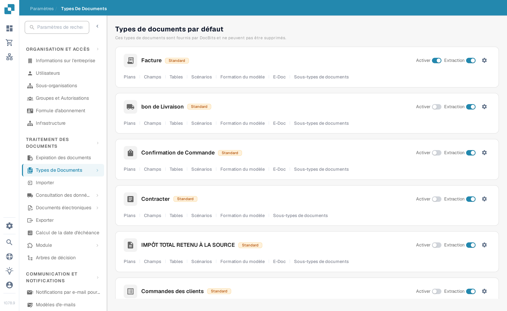
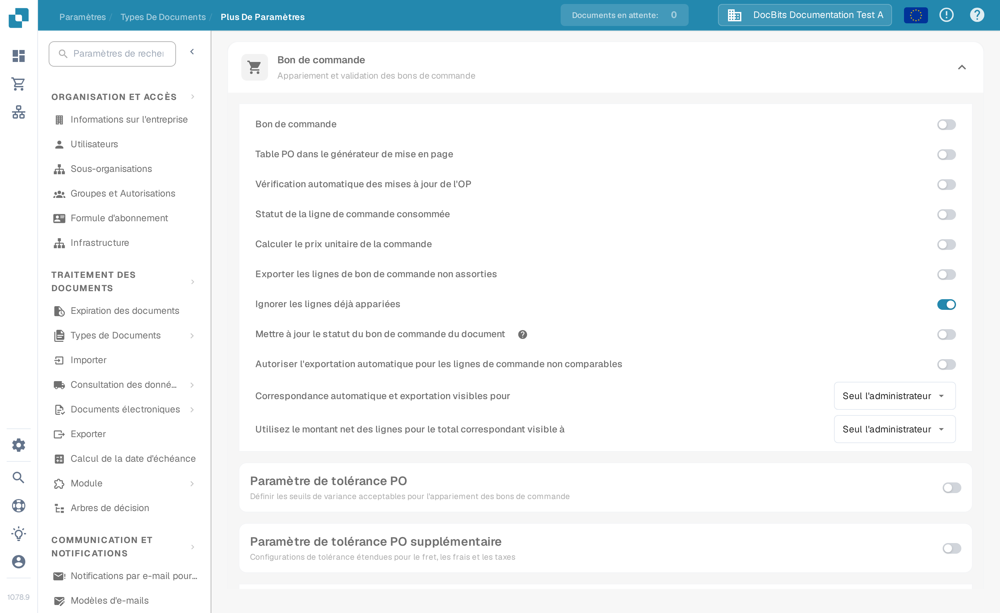
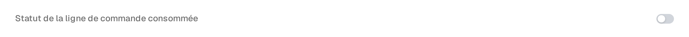
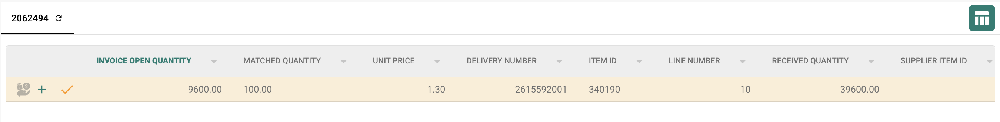

# Statut de la ligne de commande PO consommée

**Le statut de la ligne de commande PO consommée** colore les lignes de bon de commande dans l'écran de correspondance selon la proportion de chaque ligne déjà appariée. Activez-le pour le type de document utilisé par vos factures si votre équipe doit repérer rapidement les lignes de PO non utilisées, partiellement utilisées et entièrement utilisées. La couleur est une aide visuelle ; vérifiez la **quantité appariée** et la colonne de quantité de PO sélectionnée avant de décider si une ligne peut être appariée à nouveau.

## Activer le paramètre

1. Ouvrez **Paramètres → Types de documents**. Trouvez le type de document utilisé pour vos factures et sélectionnez la roue dentée sur sa carte pour ouvrir **Plus de paramètres**. La capture montre la carte **Facture**. Laissez les interrupteurs **Activer** et **Extraction** tels quels.

   <figure><figcaption>
Ouvrez Plus de paramètres depuis la carte Facture.
</figcaption></figure>

2. Dépliez **Bon de commande** s'il est replié. Trouvez **Statut de la ligne de commande consommée** et activez son interrupteur. C'est un paramètre distinct de **Mettre à jour le statut du bon de commande du document** plus bas dans la même section.

   <figure><figcaption>
Choisissez l'interrupteur Statut de la ligne de commande consommée.
</figcaption></figure>

   <figure><figcaption>
L'interrupteur est éteint dans cet exemple ; allumez-le pour afficher les couleurs de correspondance.
</figcaption></figure>

3. Ouvrez une facture avec la correspondance de bon de commande et inspectez ses lignes de PO. Les exemples ci-dessous montrent comment les couleurs des lignes se rapportent à l'état de correspondance. Pour les étapes de correspondance, voir [Écran de Correspondance des Bons de Commande](../../../../../../end-user-and-partner-section/end-user-section/purchase-order-matching/README.md).

## Lire les couleurs des lignes de PO

| Apparence | Signification | À vérifier |
| --- | --- | --- |
| Neutre ou blanche | Aucune quantité de cette ligne de PO n'a encore été appariée. | Vérifiez la quantité de PO et la ligne de facture avant l'appariement. |
| Teinte bleue | Vous avez sélectionné la ligne dans l'écran de correspondance actuel. | La sélection est temporaire ; elle ne signifie pas que la ligne est entièrement appariée. |
| Orange pâle | Une partie de la quantité est appariée, mais la quantité appariée est inférieure à la quantité de PO sélectionnée. | Vérifiez la quantité restante. |
| Violet pâle | La quantité appariée atteint au moins la quantité de PO sélectionnée. | Ne partez pas du principe qu'une quantité supplémentaire est disponible. |

<figure><figcaption>
Aucune quantité n'a encore été appariée.
</figcaption></figure>

<figure><figcaption>
La ligne est sélectionnée pour la correspondance en cours.
</figcaption></figure>

<figure><figcaption>
La ligne est partiellement utilisée.
</figcaption></figure>

<figure><figcaption>
La ligne est entièrement utilisée.
</figcaption></figure>

Une ligne barrée a une signification différente : son statut de PO est peut-être exclu par [Statuts de désactivation des bons de commande](purchase-order-disable-statuses.md). Vérifiez ce paramètre si une ligne ne peut pas être sélectionnée.
