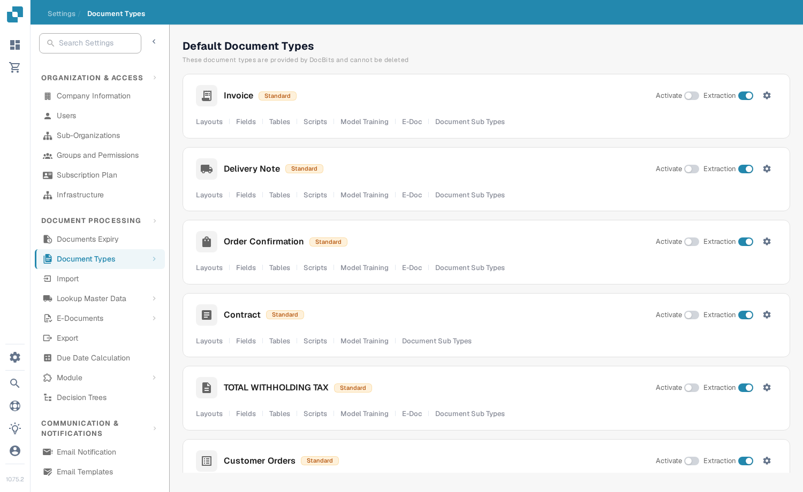
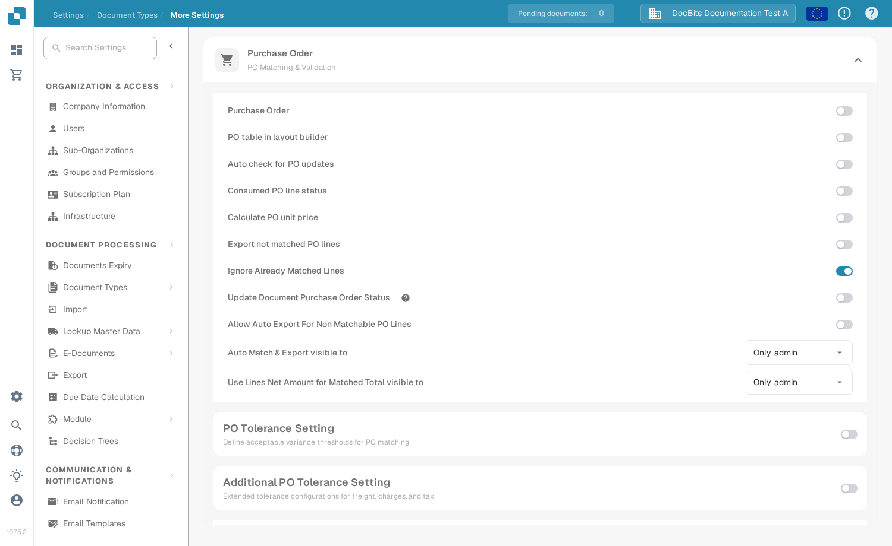
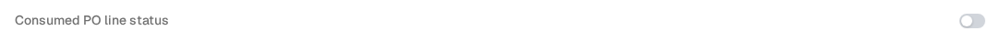

# Consumed PO line status

**Consumed PO line status** colors purchase order lines in the matching view according to how much of each line has already been matched. Turn it on for the invoice document type if your team needs to spot unused, partly used, and fully used PO lines quickly. The color is a visual aid; check the **Matched Quantity** and the selected PO quantity column before deciding whether a line can be matched again.

## Turn on the setting

1. Open **Settings → Document Types**. Find the document type used for your invoices and select the gear on its card to open **More Settings**. The screenshot shows the **Invoice** card. Leave the **Activate** and **Extraction** switches as they are.

   <figure><figcaption>
Open More Settings from the Invoice card.
</figcaption></figure>

2. Expand **Purchase Order** if it is collapsed. Find **Consumed PO line status** and turn on its switch. This is a separate setting from **Update Document Purchase Order Status** further down the same section.

   <figure><figcaption>
Choose the Consumed PO line status switch.
</figcaption></figure>

   <figure><figcaption>
The switch is off in this example; turn it on to show the matching colors.
</figcaption></figure>

3. Open an invoice with purchase order matching and inspect its PO lines. The examples below show how the line colors relate to matching state. For the matching steps, see [Purchase Order Matching](../../../../../../end-user-and-partner-section/end-user-section/purchase-order-matching/README.md).

## Read the PO line colors

| Appearance | Meaning | What to check |
| --- | --- | --- |
| Plain or white | No quantity on this PO line has been matched yet. | Check the PO quantity and invoice line before matching. |
| Blue tint | You selected the line in the current matching view. | Selection is temporary; it does not mean the line is fully matched. |
| Pale orange | Some quantity has been matched, but the matched quantity is below the selected PO quantity. | Check how much quantity remains. |
| Pale violet | The matched quantity is at least the selected PO quantity. | Do not assume more quantity is available. |

<figure><figcaption>
No quantity has been matched yet.
</figcaption></figure>

<figure><figcaption>
The line is selected for the current match.
</figcaption></figure>

<figure><figcaption>
The line is partly used.
</figcaption></figure>

<figure><figcaption>
The line is fully used.
</figcaption></figure>

A crossed-out line has a different meaning: its PO status may be excluded by [PO disable statuses](purchase-order-disable-statuses.md). Check that setting if a line cannot be selected.
