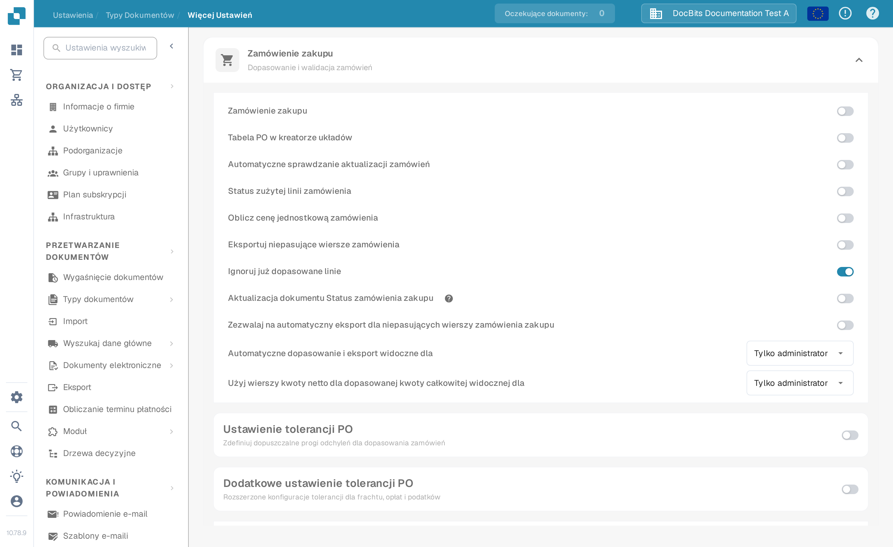
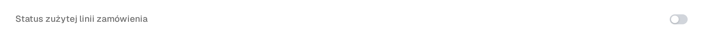

# Status zużytej linii zamówienia PO

**Status zużytej linii zamówienia PO** koloruje linie zamówienia zakupu na ekranie dopasowywania według tego, jak duża część każdej linii została już dopasowana. Włącz to ustawienie dla typu dokumentu używanego dla faktur, jeśli zespół musi szybko rozpoznać linie PO jeszcze niedopasowane, częściowo dopasowane i w pełni dopasowane. Kolor to tylko pomoc wizualna; przed decyzją, czy linię można dopasować ponownie, sprawdź **Dopasowaną ilość** i wybraną kolumnę ilości zamówienia zakupu.

## Włączanie ustawienia

1. Otwórz **Ustawienia → Typy dokumentów**. Znajdź typ dokumentu używany dla faktur i wybierz zębatkę na jego karcie, aby otworzyć **Więcej ustawień**. Zrzut pokazuje kartę **Faktura**. Przełączników **Aktywować** i **Extraction** nie zmieniaj.

   <figure><figcaption>
Otwórz Więcej ustawień z karty Faktura.
</figcaption></figure>

2. Rozwiń sekcję **Zamówienie zakupu**, jeśli jest zwinięta. Znajdź pozycję **Status zużytej linii zamówienia** i włącz jej przełącznik. To ustawienie jest oddzielne od **Aktualizacja dokumentu Status zamówienia zakupu** dalej w tej samej sekcji.

   <figure><figcaption>
Wybierz przełącznik Status zużytej linii zamówienia.
</figcaption></figure>

   <figure><figcaption>
Na tym przykładzie przełącznik jest wyłączony; włącz go, aby zobaczyć kolory dopasowania.
</figcaption></figure>

3. Otwórz fakturę z dopasowywaniem zamówień zakupu i przejrzyj jej linie PO. Poniższe przykłady pokazują, jak kolory linii odnoszą się do stanu dopasowania. Kroki dopasowania opisuje [Ekran dopasowywania zamówień zakupu](../../../../../../end-user-and-partner-section/end-user-section/purchase-order-matching/README.md).

## Co oznaczają kolory linii PO

| Wygląd | Znaczenie | Co sprawdzić |
| --- | --- | --- |
| Zwykły lub biały | Żadna ilość w tej linii PO nie została jeszcze dopasowana. | Przed dopasowaniem sprawdź ilość zamówienia zakupu i linię faktury. |
| Niebieski odcień | Linia została wybrana w bieżącym widoku dopasowania. | Wybór jest tymczasowy; nie oznacza, że linia jest w pełni dopasowana. |
| Blady pomarańczowy | Część ilości została dopasowana, ale dopasowana ilość jest mniejsza niż wybrana ilość zamówienia zakupu. | Sprawdź, ile ilości jeszcze pozostaje. |
| Blady fioletowy | Dopasowana ilość jest co najmniej równa wybranej ilości zamówienia zakupu. | Nie zakładaj, że dostępna jest dodatkowa ilość. |

<figure><figcaption>
Żadna ilość nie została jeszcze dopasowana.
</figcaption></figure>

<figure><figcaption>
Linia jest wybrana do bieżącego dopasowania.
</figcaption></figure>

<figure><figcaption>
Linia jest częściowo użyta.
</figcaption></figure>

<figure><figcaption>
Linia jest w pełni użyta.
</figcaption></figure>

Przekreślona linia ma inne znaczenie: jej status zamówienia zakupu może być wyłączony przez ustawienie [Statusy wyłączenia zamówienia zakupu](purchase-order-disable-statuses.md). Sprawdź to ustawienie, jeśli linii nie można wybrać.
