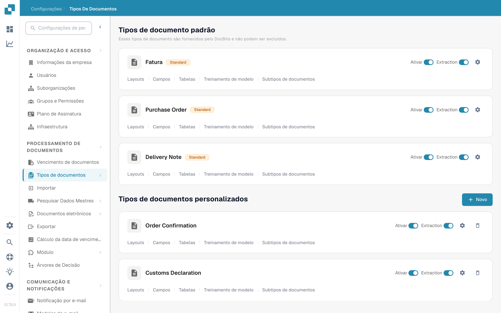
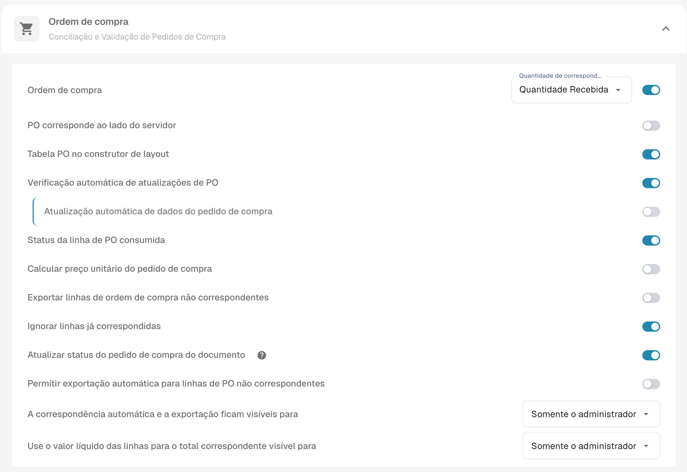
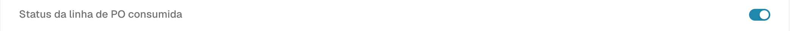

# Status da linha de PO consumida

**Status da linha de PO consumida** colore as linhas do pedido de compra (PO) na tela de correspondência de acordo com a quantidade de cada linha que já foi correspondida. Ative essa opção para o tipo de documento usado nas suas faturas se a sua equipe precisa identificar rapidamente as linhas de PO não usadas, parcialmente usadas e totalmente usadas. A cor é apenas uma ajuda visual; verifique a **Quantidade correspondida** e a coluna de quantidade de PO selecionada antes de decidir se uma linha pode ser correspondida novamente.

## Ativar a configuração

1. Abra **Configurações → Tipos de documentos**. Encontre o tipo de documento usado para as suas faturas e selecione a engrenagem no seu cartão para abrir **Mais configurações**. A captura de tela mostra o cartão **Fatura**. Deixe as chaves **Ativar** e **Extraction** como estão.

   <figure><figcaption>
Abra Mais configurações a partir do cartão Fatura.
</figcaption></figure>

2. Expanda **Ordem de compra** se estiver recolhida. Encontre **Status da linha de PO consumida** e ative a sua chave. Essa é uma configuração separada de **Atualizar status do pedido de compra do documento**, mais abaixo na mesma seção.

   <figure><figcaption>
Escolha a chave Status da linha de PO consumida.
</figcaption></figure>

   <figure><figcaption>
Neste exemplo a chave está desligada; ligue-a para mostrar as cores de correspondência.
</figcaption></figure>

3. Abra uma fatura com correspondência de pedido de compra e inspecione as suas linhas de PO. Os exemplos abaixo mostram como as cores das linhas se relacionam com o estado de correspondência. Para as etapas de correspondência, veja [Correspondência de Pedidos de Compra](../../../../../../end-user-and-partner-section/end-user-section/purchase-order-matching/README.md).

## Ler as cores das linhas de PO

| Aparência | Significado | O que verificar |
| --- | --- | --- |
| Sem cor ou branca | Nenhuma quantidade nesta linha de PO foi correspondida ainda. | Verifique a quantidade da PO e a linha da fatura antes de correspondê-la. |
| Tom azul | Você selecionou a linha na tela de correspondência atual. | A seleção é temporária; não significa que a linha esteja totalmente correspondida. |
| Laranja claro | Parte da quantidade foi correspondida, mas a quantidade correspondida é inferior à quantidade de PO selecionada. | Verifique quanta quantidade ainda resta. |
| Violeta claro | A quantidade correspondida é pelo menos a quantidade de PO selecionada. | Não presuma que há mais quantidade disponível. |

<figure><figcaption>
Nenhuma quantidade foi correspondida ainda.
</figcaption></figure>

<figure><figcaption>
A linha está selecionada para a correspondência atual.
</figcaption></figure>

<figure><figcaption>
A linha está parcialmente usada.
</figcaption></figure>

<figure><figcaption>
A linha está totalmente usada.
</figcaption></figure>

Uma linha riscada tem um significado diferente: o status da PO dela pode estar excluído por [Status de desativação de PO](purchase-order-disable-statuses.md). Verifique essa configuração se uma linha não puder ser selecionada.
