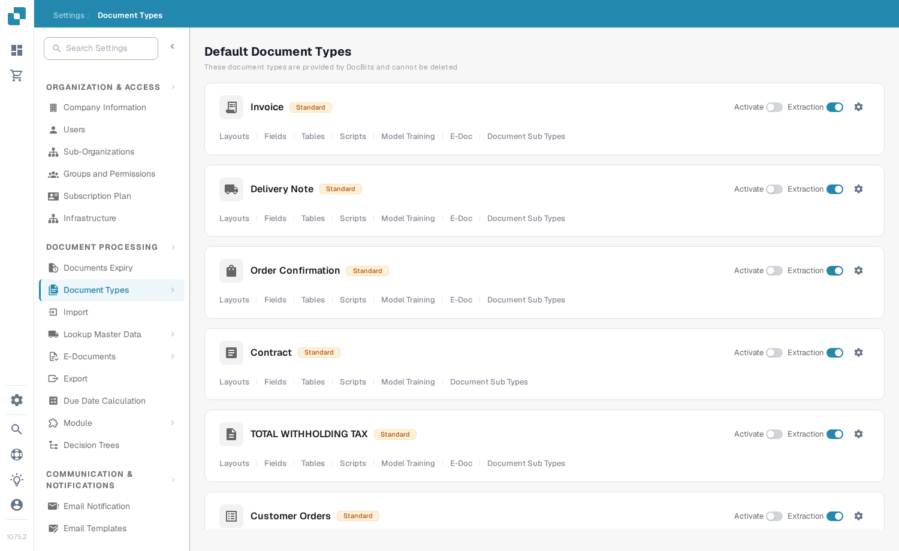
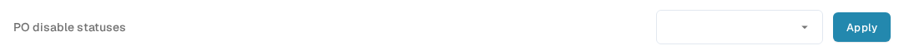
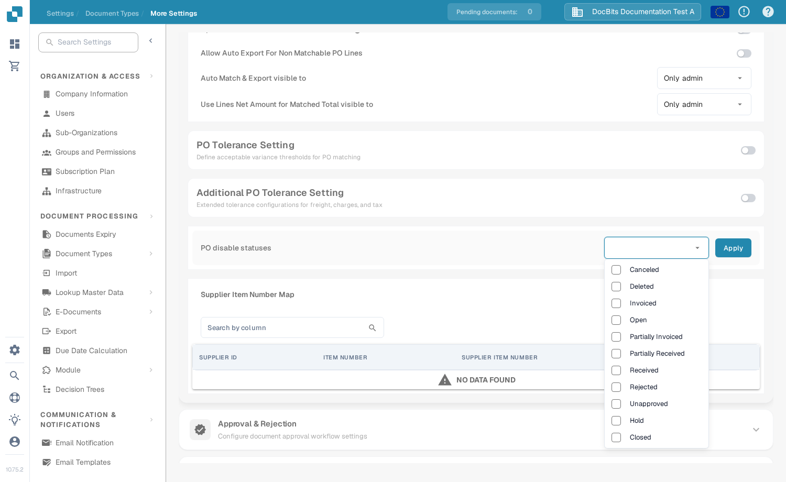

# Purchase order disable statuses

Use **PO disable statuses** to keep purchase order lines with selected statuses out of invoice matching. For example, if you disable **Canceled**, a canceled PO line is crossed out in the matching table and cannot be selected for matching. This setting applies to the document type whose **More Settings** page you edit.

## Choose the statuses

1. Open **Settings → Document Types**. Find the document type used for the invoices you want to match. The screenshot shows the **Invoice** card; use its gear icon on the right to open **More Settings**. Do not change the **Activate** or **Extraction** switches for this task.

   <figure><figcaption>
Open the gear on the Invoice card.
</figcaption></figure>

2. In **More Settings**, expand **Purchase Order** if it is collapsed. Scroll to **PO disable statuses**. The field holds the statuses to exclude; **Apply** saves the selection.

   <figure><figcaption>
The setting is in the Purchase Order section.
</figcaption></figure>

3. Open the status field and check each status you want to exclude. You can select more than one. Click a checked status again to remove it from the selection. Then select **Apply** to save the change.

   <figure><figcaption>
Select the statuses to exclude, then apply the change.
</figcaption></figure>

The list currently offers **Canceled**, **Deleted**, **Invoiced**, **Open**, **Partially Invoiced**, **Partially Received**, **Received**, **Rejected**, **Unapproved**, **Hold**, and **Closed**. These are choices, not a recommended default. Select only the statuses your team does not want to match.

## What changes in matching

A PO line whose status is selected here is crossed out in the PO matching table. The line cannot be dragged into a match while that status is disabled. Other PO lines remain available according to the normal [purchase order matching steps](../../../../../../end-user-and-partner-section/end-user-section/purchase-order-matching/README.md).

<figure><figcaption>
A crossed-out line cannot be used for matching.
</figcaption></figure>

To allow a status again, return to **PO disable statuses**, remove its checkmark, and select **Apply**. Check the matching view again after saving.
