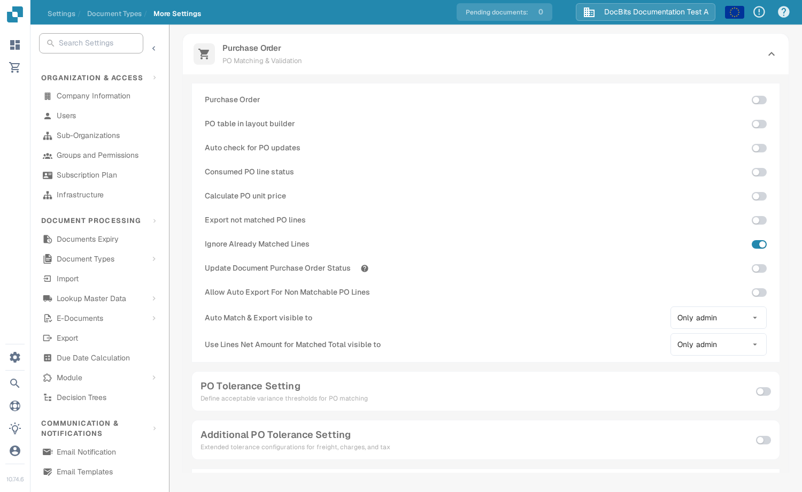
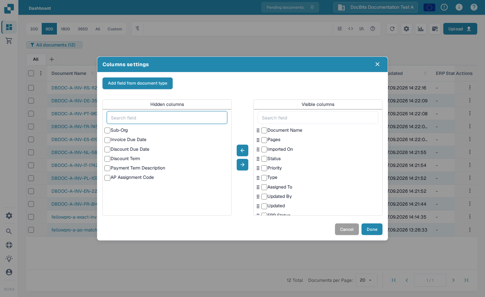
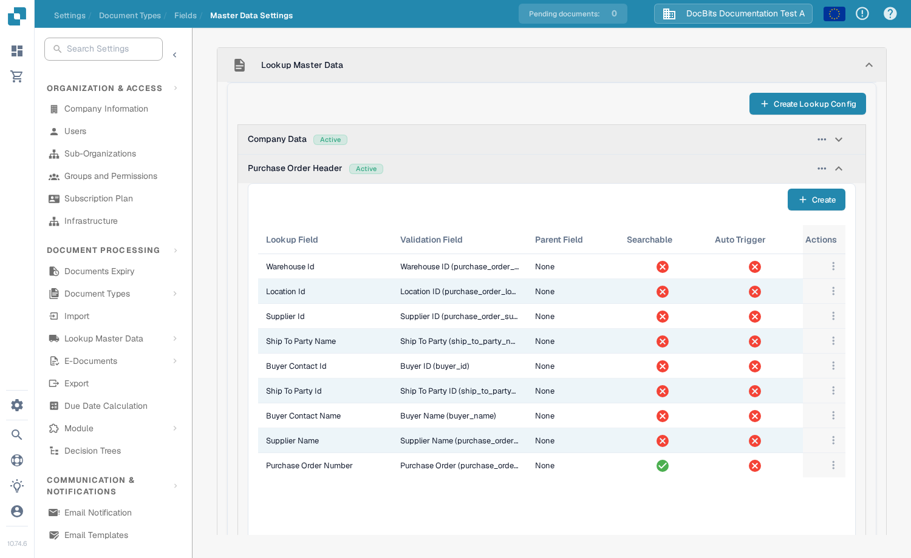

# Update Document Purchase Order Status

This setting is for document types that use purchase orders. It controls whether a document can receive status updates from its linked purchase order. The switch is configured per document type. To see a PO status in the dashboard, the relevant field must also be available and visible as a column.

Before changing the setting, choose the correct organization and document type. You need administrator access to edit document type settings. A purchase order must be linked to a document before a status change can be checked.

## Turn on the setting

1. Open **Settings → Document Processing → Document Types**.
2. Find the document type used for the PO-linked documents, such as **Invoice**, and select the gear on its card to open **More Settings**.
3. Expand **Purchase Order**. Find **Update Document Purchase Order Status** and turn it on. The nearby help icon explains the option in the application. Changing this switch does not change the other PO settings in the same section.

<figure><figcaption>Open the settings for the document type you use.</figcaption></figure>

<figure><figcaption>The status update switch in the Purchase Order settings.</figcaption></figure>

## Show a PO status on the dashboard

1. Return to the dashboard and select the gear above the document table.
2. Open **Columns settings** from the **Advanced settings** menu.
3. Select **Add field from document type**, choose the document type, and search for **PO Status**. If that field is available, select it, choose **Add to visible columns**, then select **Done**.

The column dialog contains **Hidden columns** and **Visible columns**. Use the arrows to move a selected column between them. See [Change Document Columns](../../../../../../end-user-and-partner-section/end-user-section/dashboard/change-document-columns.md) for the full column guide. If **PO Status** is absent for the selected type, ask an administrator to check its field and lookup configuration; the display switch alone does not create a missing field.

<figure><figcaption>Choose which columns appear in the dashboard.</figcaption></figure>

## Check the purchase order lookup

In **Settings → Document Processing → Document Types → Fields → Master Data Settings**, expand **Lookup Master Data**, then **Purchase Order Header**. Check that the required PO field mapping exists and that the relevant lookup has **Auto Trigger** when automatic lookup is needed. The screenshot below shows the configuration list; its red crosses mean Auto Trigger is off for those example rows. It does not demonstrate an updated PO status.

<figure><figcaption>Check the actual lookup rows for the document type.</figcaption></figure>

For help setting up a lookup, see [Fuzzy Data Configuration with Master Data](../../../../../setup/document-types/fuzzy-data-configuration-with-master-data.md).

## Verify with a known document

Use a document already linked to a test purchase order. Change that purchase order's status through your normal process, refresh the dashboard, and check the document and the visible PO status field. If the status does not update, check the document's PO link, the lookup configuration, and whether the relevant field was added to the dashboard. Do not infer a successful update from the switch alone.
