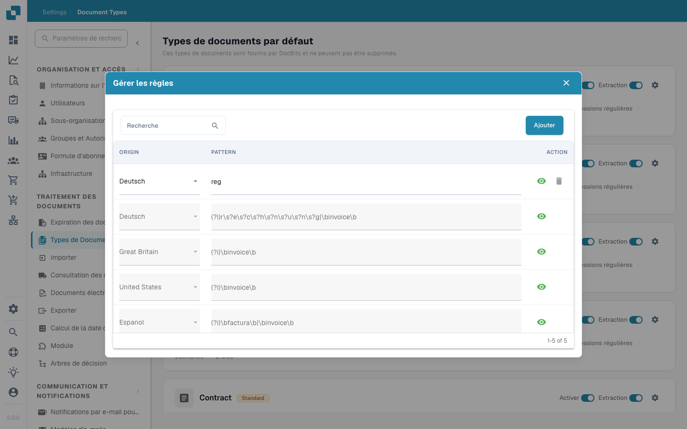

# Reguliere expressies

<figure><figcaption></figcaption></figure>

In DocBits stelt de configuratie van reguliere expressies beheerders in staat om aangepaste patronen te definiëren die het systeem gebruikt om gegevens uit documenten te vinden en te extraheren. Deze functie is vooral nuttig in situaties waarin gegevens uit ongestructureerde tekst moeten worden geëxtraheerd of wanneer de gegevens een voorspelbaar formaat volgen dat met regex-patronen kan worden vastgelegd.

#### Belangrijkste functies en opties

1. **Beheer van reguliere expressies**:
* **Toevoegen**: Hiermee kun je een nieuw regex-patroon aanmaken voor een specifiek documenttype.
* **Wijzigingen opslaan**: Slaat de wijzigingen in de bestaande regex-configuraties op.
* **Patroon**: Hier kun je het regex-patroon definiëren dat overeenkomt met het specifiek vereiste gegevensformaat.
* **Herkomst**: Dit is de herkomst van het document - je kunt bijvoorbeeld een andere regex definiëren voor Duitsland


