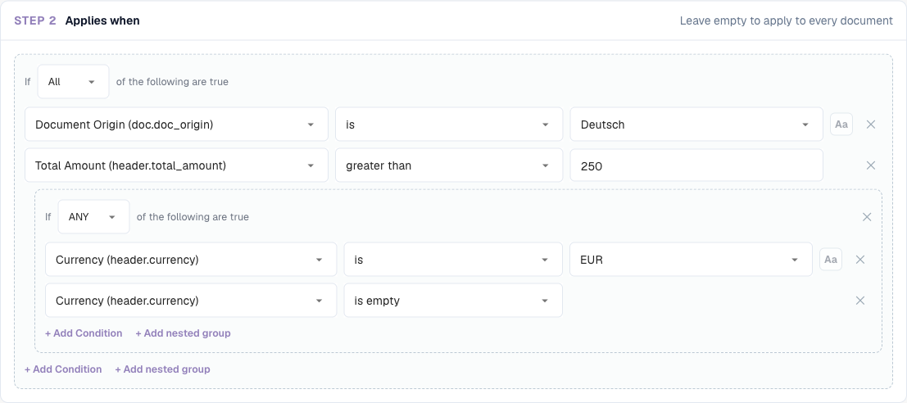
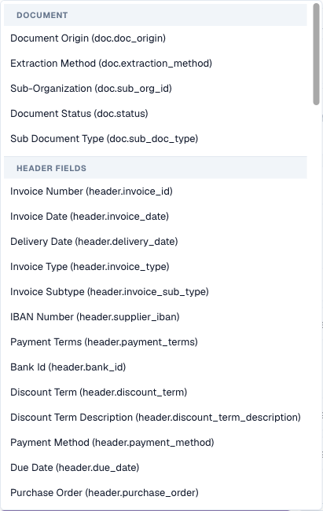
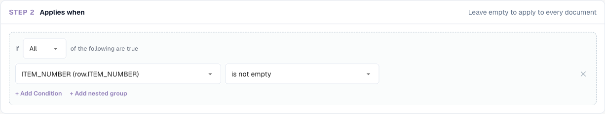
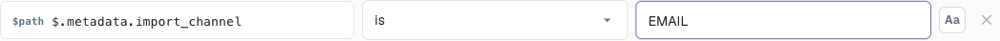
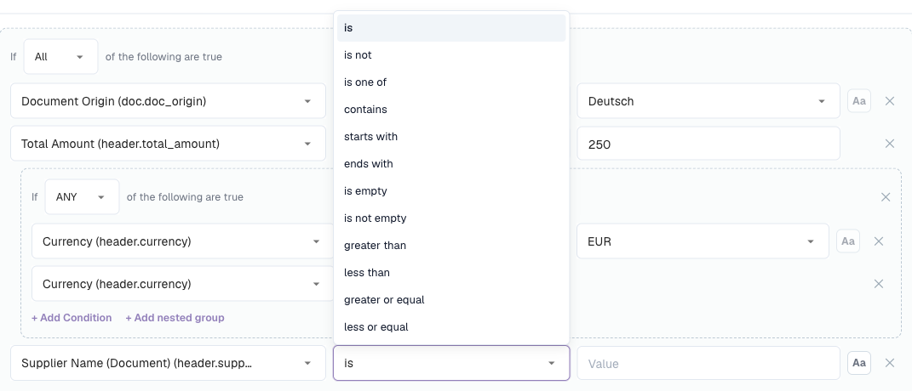
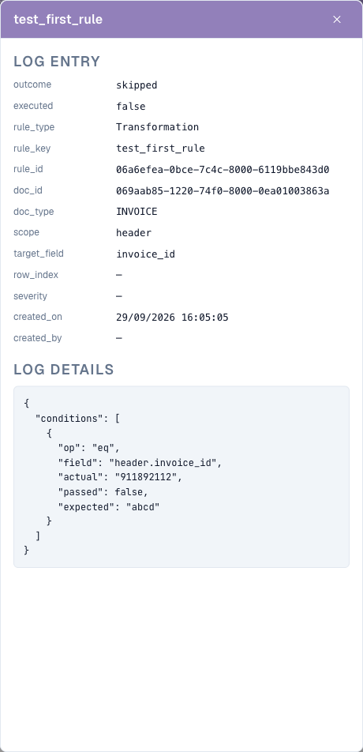

# Rule Conditions (Applies when)

## Overview

Every rule in DocBits' rule features has an **Applies when** section. It decides **for which documents (and, for table rules, for which rows) the rule does anything at all**. The rule's actual job — raising a validation error, changing a value, picking a layout — only happens when the condition is true.

The same condition builder is used in all three rule features:

| Feature | Label in the builder | When the condition is true… | When it is false… | When it is left empty… |
| --- | --- | --- | --- | --- |
| [Custom Validation Rules](custom-validation-rules.md) | Step 2 **Applies when** | the check in step 3 runs | the rule is skipped — no error, no warning | the check runs on every document |
| [Transformation Rules](transformation-rules.md) | Step 2 **When it runs** → **Only when…** | the pipeline changes the value | the value is left as it is | choose **Always**: the rule runs on every document |
| [Layout Selection Rules](layout-manager/layout-selection-rules.md) | Step 2 **Applies when** | the document gets this rule's layout (first match wins) | DocBits tries the next rule | the rule matches every document at its priority |

Learn it once here and you can use it everywhere.


A condition only decides **whether** a rule applies. It never changes data and never shows a message by itself. "The supplier tax ID must be filled" is the **check** of a validation rule; "only for German invoices" is its **condition**.


## Reading a condition

A condition reads like a sentence. The builder below says:

> **If ALL** of the following are true: the Document Origin **is** Deutsch, the Total Amount is **greater than** 250, and (**ANY** of: the Currency **is** EUR, the Currency **is empty**).

<figure><figcaption>
Two conditions combined with ALL, plus a nested group combined with ANY
</figcaption></figure>

With that condition, the rule applies to:

| Document | Origin | Total amount | Currency | Applies? | Why |
| --- | --- | --- | --- | --- | --- |
| A | DE | 469.18 | EUR | **yes** | all three parts are true |
| B | DE | 469.18 | *(empty)* | **yes** | the ANY group is true because the currency is empty |
| C | DE | 120.00 | EUR | no | 120 is not greater than 250 |
| D | DE | 469.18 | USD | no | neither line of the ANY group is true |
| E | AT | 469.18 | EUR | no | the origin is not DE |

## The building blocks

### Condition lines

Each line has four parts:

| Part | What it is |
| --- | --- |
| **Field** | The value that is checked: a document attribute, a header field, a table column or a JSON path. See [Fields you can use](#fields-you-can-use). |
| **Operator** | How the value is compared — *is*, *contains*, *greater than*, *is empty* … See [Operators](#operators). |
| **Value** | What the field is compared with. Hidden for *is empty* / *is not empty*. For fields with a fixed list of values (origin, status, currency…) the value is picked from a dropdown. |
| **Aa** | Ignore upper/lower case. Available for text comparisons only. When it is on, `gmbh` matches `GmbH`. |

Click **✕** to remove a line.

### ALL and ANY

The selector at the start of a group decides how its lines are combined:

* **All** of the following are true — every line must be true (AND).
* **ANY** of the following are true — at least one line must be true (OR).

### Nested groups

Click **+ Add nested group** to put a group inside a group. A nested group counts as one line of its parent group, so you can mix AND and OR:

* *ALL of*: origin is DE, **ANY of** (currency is EUR, currency is empty)
* *ANY of*: supplier is 10040, **ALL of** (supplier is 20723, total amount greater than 1000)

Groups can be nested as deeply as you need. Keep it readable: two levels are enough for almost every business rule.

### An empty condition

If you add no lines, the rule has no condition and **always applies** (for layout rules: it matches every document at its priority). This is the right choice for rules that must run everywhere, such as "trim the invoice number" or "quantity must be positive".

## Fields you can use

Open the field dropdown to see every field, grouped by where it comes from. Type to filter the list.

<figure><figcaption>
The field picker: document attributes first, then the header fields of the document type
</figcaption></figure>

### Document attributes (`doc.`)

Information DocBits knows about the document itself, independent of the extracted fields:

| Field in the picker | Key | Example values | Typical use |
| --- | --- | --- | --- |
| **Document Origin** | `doc.doc_origin` | `DE`, `AT`, `US` (shown as Deutsch, Austria, United States) | country-specific rules and layouts |
| **Extraction Method** | `doc.extraction_method` | `ELECTRONIC_DOCUMENT`, `FELLOW_KV2`, `MANUAL` | treat e-invoices (XRechnung, ZUGFeRD) differently from scanned PDFs |
| **Document Status** | `doc.status` | Ready for validation, Pending Approval, Pending second approval … | layouts per workflow stage, rules that only apply before approval |
| **Sub Document Type** | `doc.sub_doc_type` | your sub types, e.g. credit memo | rules for one sub type only |

### Header fields (`header.`)

Every field of the document type, for example **Invoice Number** (`header.invoice_id`), **Supplier ID** (`header.supplier_id`), **Total Amount** (`header.total_amount`), **Currency** (`header.currency`), **Supplier Tax ID** (`header.supplier_tax_id`), **Purchase Order** (`header.purchase_order`). The picker shows the label and, in brackets, the technical key. The value used is the current value of the field — including corrections a user has made.

### Table columns (`row.`)

Columns of the current table row, for example `row.QUANTITY` or `row.ITEM_NUMBER`. They appear in the picker as **Table columns** only in rules that run **once per row**:

* validation rules with the level **Table line**
* transformation rules with the scope **Table column**

In these rules, the condition is checked **for each row separately**. A row that does not match is skipped; the other rows are still processed.

<figure><figcaption>
A per-row condition: only rows that have an item number are checked
</figcaption></figure>

Rules that run once per document (header rules, whole-table rules, layout rules) cannot use `row.` fields — there is no single row they could look at.

### Custom JSON path (Advanced)

At the bottom of the picker, **Advanced → Custom JSON path…** turns the field into a free text box marked `$path`. It reads a value anywhere in the document's extracted data, even if it is not a field of the document type.

<figure><figcaption>
A JSON path condition on the import channel of the document
</figcaption></figure>

* The path starts with `$` and uses `.name` for keys and `[0]` for list positions, for example `$.metadata.import_channel` or `$.shipping.addresses[0].country`.
* It must end on a single value. A path that ends on a list or an object counts as empty.
* JSON path lines offer the operators *is*, *is not*, *matches*, *is empty* and *is not empty*.

Use JSON paths sparingly. They depend on the internal structure of the extracted data; a field of the document type is easier to understand and to maintain.

### Where each kind of field can be used

| | Validation: Header field | Validation: Table line | Validation: Whole table | Transformation: Header / Routing / Table rows | Transformation: Table column | Layout selection |
| --- | --- | --- | --- | --- | --- | --- |
| `doc.` document attributes | ✓ | ✓ | ✓ | ✓ | ✓ | ✓ |
| `header.` header fields | ✓ | ✓ | ✓ | ✓ | ✓ | ✓ |
| `row.` table columns | – | ✓ | – | – | ✓ | – |
| `$` JSON path | ✓ | ✓ | ✓ | ✓ | ✓ | ✓ |

## Operators

<figure><figcaption>
The operators offered for a text field
</figcaption></figure>

| Operator | True when… | Value | Example |
| --- | --- | --- | --- |
| **is** | the field equals the value | one value | Supplier ID **is** `20723` |
| **is not** | the field does not equal the value | one value | Currency **is not** `EUR` |
| **is one of** | the field equals any value of a list | values separated by commas | Supplier ID **is one of** `10040, 10041, 20723` |
| **contains** | the value appears anywhere in the field | text | Supplier Name **contains** `GmbH` |
| **starts with** | the field begins with the value | text | Invoice Number **starts with** `GS-` |
| **ends with** | the field ends with the value | text | Purchase Order **ends with** `-IT` |
| **matches** | a regular expression finds a match in the field | regular expression | Invoice Number **matches** `^INV-\d{6}$` |
| **is empty** | the field has no value (missing, or only spaces) | – | Purchase Order **is empty** |
| **is not empty** | the field has a value | – | Purchase Order **is not empty** |
| **greater than** / **less than** | the field is a number above / below the value | number | Total Amount **greater than** `10000` |
| **greater or equal** / **less or equal** | the same, including the value itself | number | Total Amount **less or equal** `250` |

### Which operators a field offers

The list adapts to the type of the field:

| Field type | Operators |
| --- | --- |
| Text | all operators |
| Number and amount (Total Amount, Quantity …) | is, is not, greater than, less than, greater or equal, less or equal, is empty, is not empty |
| Fields with a fixed list (Document Origin, Status, Currency …) | is, is not, is one of, is empty, is not empty |
| Date (Invoice Date, Due Date …) | is, is not, is empty, is not empty |
| Yes/No | is, is not, is empty, is not empty |
| Custom JSON path | is, is not, matches, is empty, is not empty |


**Dates cannot be compared with *before* or *after* in a condition.** "Due date after invoice date" or "invoice date older than 90 days" belongs in the **check** of a validation rule (**Compare fields**), not in *Applies when*.


## How values are compared

Knowing these rules avoids most surprises:

1. **Numbers are compared as numbers.** If both sides look like numbers, `250`, `250.00` and `250,00` are equal. Locale-formatted amounts such as `1.234,56` are understood.
2. **Everything else is compared as text, after removing leading and trailing spaces.** `" EUR "` is `EUR`.
3. **Upper and lower case matter** unless **Aa** (ignore case) is switched on.
4. **Empty is special.** A field that is missing or blank:
   * is true for **is empty** and **is not**,
   * is false for **is**, **is one of**, **contains**, **starts with**, **ends with**, **matches** and all number comparisons.


Because of rule 4, *Currency **is not** EUR* is also true for documents **without** a currency. If that is not what you want, add a second line *Currency **is not empty***.



Because of rule 1, values that look like numbers are compared numerically even when they are codes: `007` **is** `7` is true. For codes where leading zeros matter, use **matches** with a pattern such as `^007$`.


## Examples

**Only German documents** — `Document Origin` **is** `Deutsch`.

**Only e-invoices** — `Extraction Method` **is** `ELECTRONIC_DOCUMENT`. Use **is not** to exclude them, for example for a rule that repairs OCR errors.

**A group of suppliers** — `Supplier ID` **is one of** `10040, 10041, 20723`.


For fields whose value is picked from a dropdown (origin, status, currency), **is one of** only lets you pick one entry. To accept several, create an **ANY** group with one **is** line per value.


**High-value invoices of one supplier** — **All of**: `Supplier ID` **is** `20723`, `Total Amount` **greater than** `10000`.

**Invoices without a purchase order** — `Purchase Order` **is empty**. A typical condition for a "cost center required" rule.

**Everything except credit notes** — `Invoice Type` **is not** `credit_note` (use the values your organisation stores in the field).

**Invoices that came in by email** — Custom JSON path `$.metadata.import_channel` **is** `EMAIL`.

**Article lines only** (table line / table column rules) — `row.ITEM_NUMBER` **is not empty**. Freight or discount lines without an item number are skipped.

**Second approval stage** (layout rules on the Approval screen) — `Document Status` **is** `Pending second approval`.

**EU or missing currency** — **All of**: `Document Origin` **is** `Deutsch`, **ANY of** (`Currency` **is** `EUR`, `Currency` **is empty**). This is the condition shown at the top of this page.

## Test and debug a condition

Each feature lets you try a condition before relying on it:

* **Validation rules** — **Test rule** runs the rule against a real document. "*Rule skipped — scope not matched*" means the condition was false for that document. See [Test rule](custom-validation-rules.md#test-rule).
* **Transformation rules** — the **Live preview** has **Condition values**: type a value for every field of the condition and see "*Conditions match — rule runs*" or "*Conditions do not match — rule is skipped*".
* **Layout selection rules** — the **Live preview · /resolve** panel shows which rule matched for a sample document.

### Read the condition trace in the logs

Switch on **Log execution** in a rule. Every evaluation is then written to **Document Types → (document type) → Logs**. Open an entry: under **Log details** each condition line is listed with the value the rule expected, the value the document actually had and whether the line passed.

<figure><figcaption>
The log entry explains why the rule was skipped: the rule expected <code>abcd</code>, the document had <code>911892112</code>
</figcaption></figure>

The logs can be searched by **Rule key**, **Rule ID** or **Document**, and filtered by rule type, outcome and date. Switch **Log execution** off again when you are done — it writes one entry per evaluation, and rules run on every save.

## Common mistakes

| Symptom | Cause | Fix |
| --- | --- | --- |
| The rule never applies | The value differs in case or spelling (`Gmbh` vs `GmbH`) | Switch on **Aa**, or copy the value exactly from the document |
| The rule applies to documents without the field | **is not** is true for empty fields | Add *field* **is not empty** |
| *greater than* never matches | The field is not a number, or it is a date | Use a number field; compare dates in a validation check |
| The rule applies to too many documents | Lines were combined with **ANY** instead of **All** | Check the selector of each group |
| Table columns are missing from the picker | The rule runs once per document | Use the level **Table line** (validation) or the scope **Table column** (transformation) |
| The condition worked in the preview but not on the document | The preview used values you typed | Test with **Test rule** on a real document, or check the log trace |
