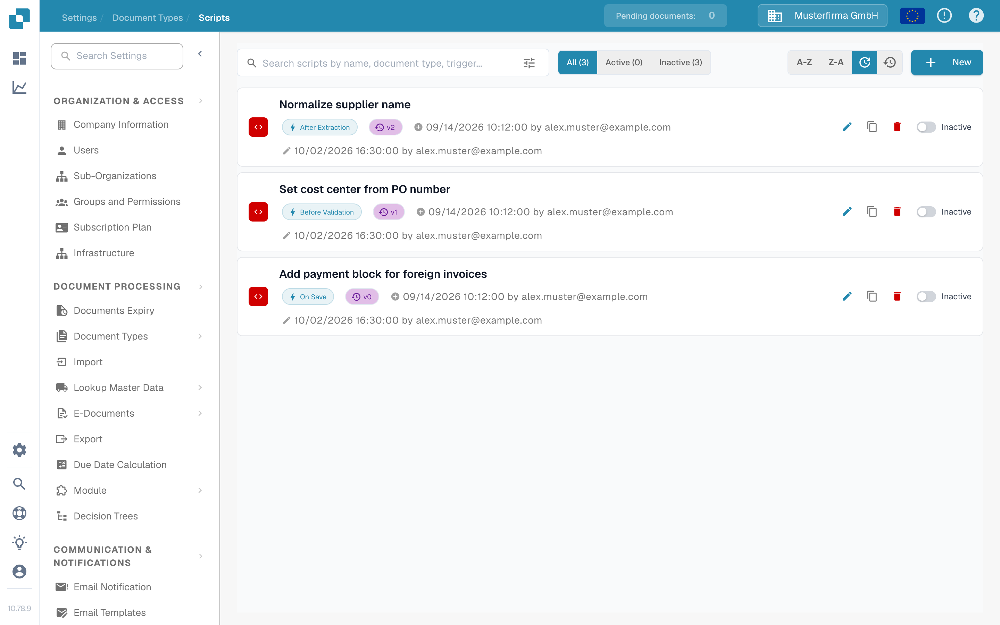
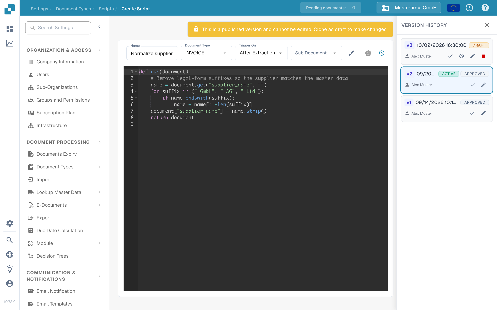
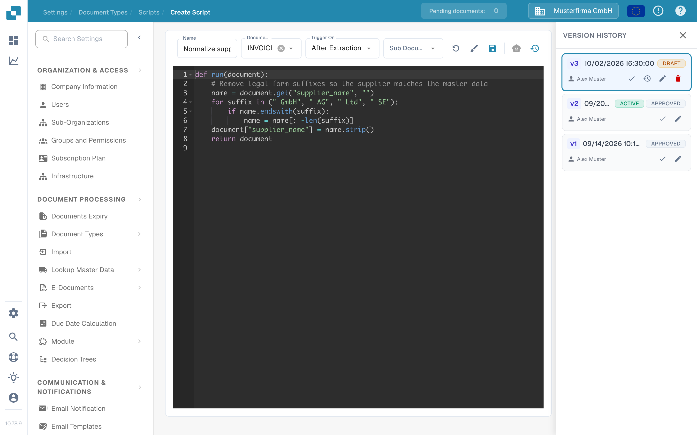

# Script Activation and Management

Administrators can use **Scripts** to manage processing rules for a document type. This guide shows where to find scripts, how to switch them on or off, and how to change a published script safely.

## Find a script

1. Open **Settings → Document Types**.
2. On the document type you want to manage, select **Scripts**. The page lists scripts for that document type.
3. Search by name or use **All**, **Active**, and **Inactive** to narrow the list. You can also sort it by name or modification date.

Each card shows the script name, trigger, version, and status. The pencil opens the editor; the copy icon duplicates the script. **New** opens the editor for a new script.

<figure><figcaption>
Check the status at the right of the script card before changing it.
</figcaption></figure>

## Activate or deactivate a script

Use the **Active/Inactive** switch on the script card. The change is saved immediately; the list counts update to show the result. An inactive script remains available to inspect or edit, but it does not run during document processing.

**Check the status after creating a script.** In the current Sandbox interface, saving a new script created an active version and set the card to **Active**. Switch it to **Inactive** if it is only a draft or a test example.

## Change an existing script

1. Select the script card or its pencil icon. A published version is read-only, so you cannot type over it directly.
2. In **Version History**, select the pencil icon on the version you want to change. This creates a **Draft** based on that version.
3. Edit the draft and select the **Save** icon. Review the name, document type, trigger, and code before saving.
4. Test the changed script with representative documents in a test environment. When it is ready, select the check icon for the draft in **Version History** to make that version active.
5. Return to the Scripts list and check the card's **Active/Inactive** switch. The version marked **ACTIVE** in Version History identifies the selected version; the card switch controls whether the script runs.

<figure><figcaption>
A published version cannot be edited directly. Use the pencil in Version History to create a draft.
</figcaption></figure>

<figure><figcaption>
Save and check the draft before making it the active version.
</figcaption></figure>

For scripting examples and available functions, see [Scripting in DocBits](scripting-in-docbits/README.md).
