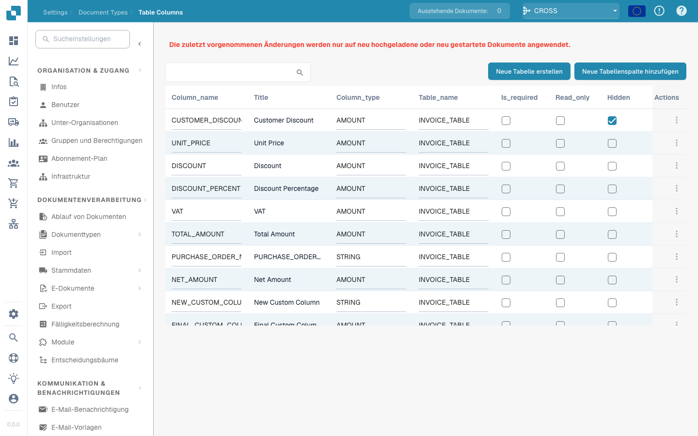
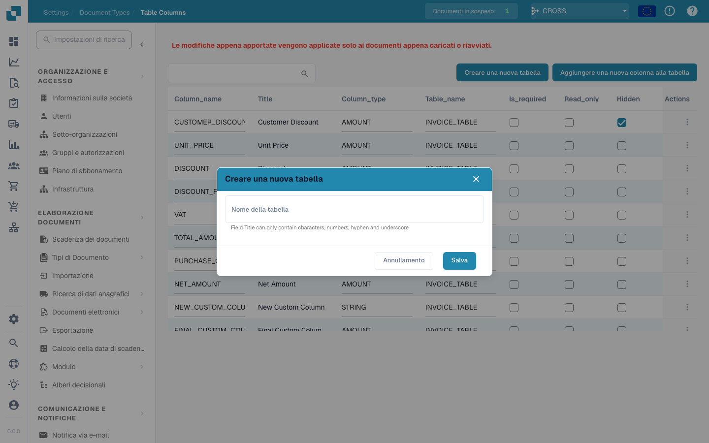
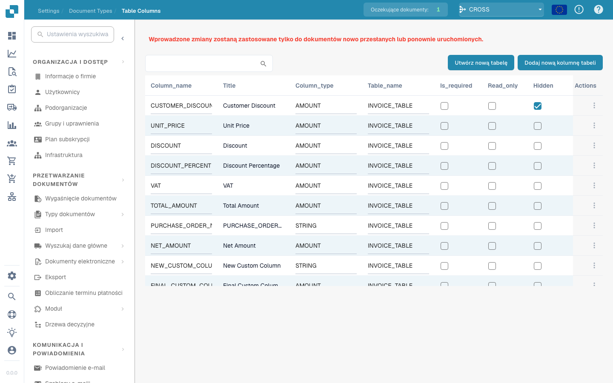

# Tabellenspalten

<figure><figcaption></figcaption></figure>

#### Überblick

Die Oberfläche „Tabellenspalten" in Docbits dient dazu, die Spalten festzulegen, die in den Datentabellen für jeden Dokumenttyp angezeigt werden. Jede Spalte kann so konfiguriert werden, dass sie bestimmte Datentypen enthält, etwa Zeichenketten oder numerische Werte, und kann für die Sortier-, Filter- und Berichtsfunktionen innerhalb von Docbits von zentraler Bedeutung sein.

#### Wichtige Funktionen und Optionen

1. **Spaltenkonfiguration**:
* **Spaltenname**: Der Bezeichner der Spalte in der Datenbank.
* **Titel**: Der menschenlesbare Titel der Spalte, der in der Oberfläche angezeigt wird.
* **Spaltentyp**: Legt den Datentyp der Spalte fest (z. B. STRING, AMOUNT) und bestimmt damit, welche Art von Daten in der Spalte gespeichert werden können.
* **Tabellenname**: Gibt an, zu welcher Tabelle die Spalte gehört, und verknüpft sie mit einem bestimmten Dokumenttyp wie INVOICE\_TABLE.
2. **Aktionen**:
* **Bearbeiten**: Ändern der Konfiguration einer vorhandenen Spalte.
* **Löschen**: Entfernen der Spalte aus der Tabelle. Dies ist nützlich, wenn die Daten nicht mehr benötigt werden oder sich die Datenstruktur des Dokumenttyps ändert.
3. **Neue Spalten und Tabellen hinzufügen**:
* **Neue Tabellenspalte hinzufügen**: Öffnet ein Dialogfeld, in dem Sie eine neue Spalte definieren können, einschließlich ihres Namens, ob sie erforderlich ist, ihres Datentyps und der Tabelle, zu der sie gehört.
* **Neue Tabelle erstellen**: Ermöglicht das Erstellen einer neuen Tabelle, indem ein eindeutiger Name festgelegt wird, der zum Speichern von Daten verwendet wird, die sich auf einen bestimmten Satz von Dokumenttypen beziehen.

<figure><figcaption></figcaption></figure>

<figure><figcaption></figcaption></figure>

Dieser Abschnitt ist von entscheidender Bedeutung, um die strukturelle Integrität und die Nutzbarkeit der Daten innerhalb des Docbits-Systems zu wahren, und stellt sicher, dass die aus Dokumenten extrahierten Daten organisiert und zugänglich gespeichert werden.


