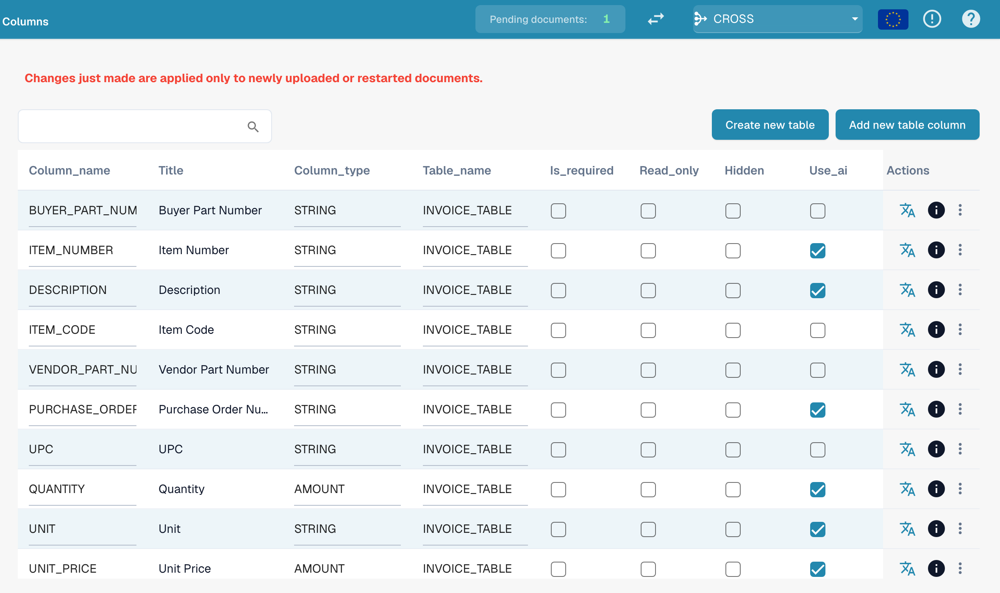

# Colonne della Tabella

Le colonne della tabella definiscono quali colonne ha la tabella delle voci di riga di un tipo di documento: cosa DocBits estrae in ogni colonna, cosa vede l'utente nella schermata di validazione e cosa viene inviato all'ERP in fase di esportazione.

**Dove:** Impostazioni → Impostazioni Globali → Tipi di Documento → Colonne della Tabella

<figure><figcaption>
Colonne della Tabella: una riga per colonna, i flag si attivano direttamente nell'elenco
</figcaption></figure>

## Cosa vedi

Ogni riga è una colonna di una tabella. L'elenco mostra:

| Colonna | Significato |
|---|---|
| **Nome colonna** | Nome tecnico, generato dal titolo (maiuscole, trattini bassi). Viene usato negli script, nelle mappature di esportazione e nell'API. Non può essere modificato in seguito. |
| **Titolo** | Etichetta mostrata nella schermata di validazione. Si modifica con l'icona di traduzione nella colonna *Azioni* (*Aggiorna chiave di traduzione*). |
| **Tipo di colonna** | `AMOUNT`, `STRING`, `DATE`, `NUMBER`, `BOOLEAN` o `CURRENCY`. Determina la validazione e la formattazione. |
| **Nome tabella** | La tabella a cui appartiene la colonna, ad esempio `INVOICE_TABLE`. |
| **Obbligatoria** | Il documento non può essere approvato finché questa colonna è vuota in una qualsiasi riga. |
| **Sola lettura** | Gli utenti vedono il valore ma non possono modificarlo. |
| **Nascosta** | La colonna non viene né mostrata né esportata. Serve per disattivare le colonne predefinite che non ti servono. |
| **Usa AI** | L'estrazione AI della tabella compila questa colonna, anche quando il fornitore ha regole addestrate. |
| **Azioni** | Icona di traduzione: rinomina il titolo. Icona info: da dove proviene l'etichetta mostrata (la tua traduzione, il valore predefinito, la chiave). Menu a tre punti: *Elimina*, solo per le colonne create dalla tua organizzazione; le colonne predefinite possono solo essere nascoste. |

Sopra l'elenco ci sono due pulsanti:

* **Crea nuova tabella**: una seconda tabella di voci di riga per il tipo di documento (ad esempio una tabella degli oneri accanto alla tabella degli articoli).
* **Aggiungi nuova colonna della tabella**: apre la finestra di dialogo descritta in [Aggiungere una nuova colonna](adding-a-new-column.md).

## Colonne predefinite e colonne personalizzate

Ogni tipo di documento viene fornito con un set di colonne predefinite (per le fatture: numero articolo, descrizione, quantità, prezzo unitario, importo totale, imposta, …). Appartengono a DocBits, non alla tua organizzazione, quindi non possono essere eliminate: nascondile invece. Le colonne che aggiungi tu appartengono alla tua organizzazione e possono essere eliminate.


**Le modifiche valgono solo per i nuovi documenti.** Una colonna che aggiungi, nascondi o elimini compare sui documenti caricati o riavviati dopo la modifica. I documenti già presenti nella dashboard mantengono la tabella così come è stata estratta. Riavvia un documento per applicare la nuova configurazione.


## Pagine correlate

* [Scopo e utilizzo](purpose-and-use.md): dove compaiono le colonne della tabella
* [Aggiungere una nuova colonna](adding-a-new-column.md)
* [Modifica ed eliminazione delle colonne](editing-and-deleting-columns.md)
* [Buone pratiche](best-practices-2.md)
* [Risoluzione dei problemi](troubleshooting-1.md)
* [Campi di addestramento Linee/Tabella di addestramento](../../../../setup/document-training/training-line-fields-table-training/README.md): insegna a DocBits dove si trova la tabella di un fornitore
* [Tabella AI](../../../../../end-user-and-partner-section/end-user-section/ai-table/README.md): cosa vede l'utente nella schermata di validazione
