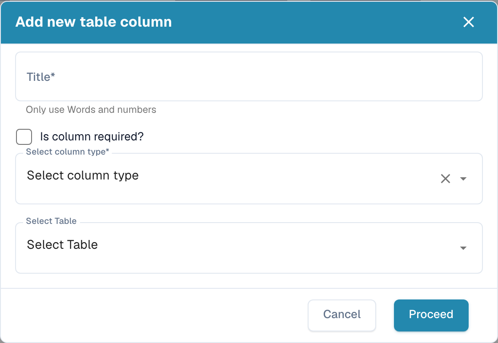

# Een nieuwe kolom toevoegen

Voeg een kolom toe wanneer per regelitem een waarde moet worden vastgelegd die de standaardkolommen niet dekken: een kostenplaats, een projectnummer, een intern artikelnummer.

## Voordat u begint

* Bepaal bij welke **tabel** de kolom hoort. De meeste documenttypen hebben één tabel (bijvoorbeeld `INVOICE_TABLE`). Als de lijst leeg is, klikt u eerst op **Nieuwe tabel maken**; het dialoogvenster vraagt alleen om een tabelnaam.
* Bepaal het **type**: `AMOUNT` voor geldbedragen, `NUMBER` voor hoeveelheden, `DATE`, `BOOLEAN` voor ja/nee, `CURRENCY` voor een ISO-valutacode, `STRING` voor al het andere. Het type kan na het opslaan niet meer worden gewijzigd.
* Controleer of er al een **standaardkolom** met dezelfde betekenis bestaat die verborgen is. Verborgen kolommen staan in de lijst met de vlag *Verborgen* ingeschakeld; maak die zichtbaar in plaats van een duplicaat aan te maken.

## Stappen

1. Open **Instellingen → Globale instellingen → Documenttypen → Tabelkolommen**.
2. Klik op **Nieuwe tabelkolom toevoegen**.

<figure><figcaption>
Nieuwe tabelkolom toevoegen
</figcaption></figure>

3. Vul het dialoogvenster in:

| Veld | Wat u invoert |
|---|---|
| **Titel** | Label dat de gebruiker op het validatiescherm ziet, bijvoorbeeld `Cost Centre`. Alleen letters en cijfers. DocBits leidt hieruit de technische *Kolomnaam* af (`COST_CENTRE`). |
| **Is kolom verplicht?** | Vink aan wanneer het document niet mag worden goedgekeurd zolang de kolom in een rij leeg is. |
| **Selecteer kolomtype** | Zie de typelijst hierboven. |
| **Selecteer tabel** | De tabel die de kolom krijgt. |

4. Klik op **Doorgaan**. De kolom verschijnt in de lijst met *Alleen-lezen*, *Verborgen* en *AI gebruiken* uitgeschakeld. Schakel die vlaggen indien nodig in de lijst om, zie [Kolommen bewerken en verwijderen](editing-and-deleting-columns.md).

## Na het toevoegen

* De kolom is **leeg op bestaande documenten**. Ze wordt gevuld op documenten die na de wijziging worden geüpload of opnieuw gestart.
* Voor leveranciers met **getrainde regels** opent u een van hun documenten in de tabeltraining en koppelt u de nieuwe kolom; anders blijft de kolom voor die leverancier leeg. Zie [Tabellen en kolommen definiëren](../../../../setup/document-training/training-line-fields-table-training/defining-tables-and-columns.md).
* Met **AI-tabelextractie** vult de AI de kolom als de waarde op het document herkenbaar is. Markeer de kolom met *AI gebruiken* als de leverancier getrainde regels heeft, maar deze kolom toch uit de AI moet komen.
* Voeg de kolom toe aan de **exportmapping** als het ERP de kolom moet ontvangen, zie [Exporteren](../../../document-processing/export.md).

## Meldingen

| Melding | Betekenis |
|---|---|
| *Column name already exists* | Een kolom met deze technische naam staat al in de tabel. Kies een andere titel. |
| *Column name already exists – Please activate it in Table Column settings* | Een verborgen standaardkolom heeft deze naam. Schakel de vlag *Verborgen* van die kolom uit in plaats van een nieuwe kolom aan te maken. |
| *No table exists. Please create table before creating columns.* | Het documenttype heeft nog geen tabel: klik eerst op **Nieuwe tabel maken**. |
