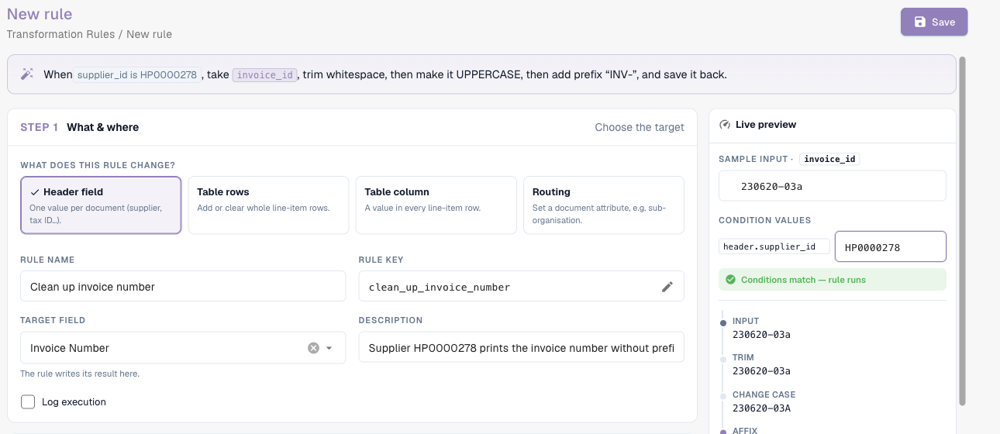
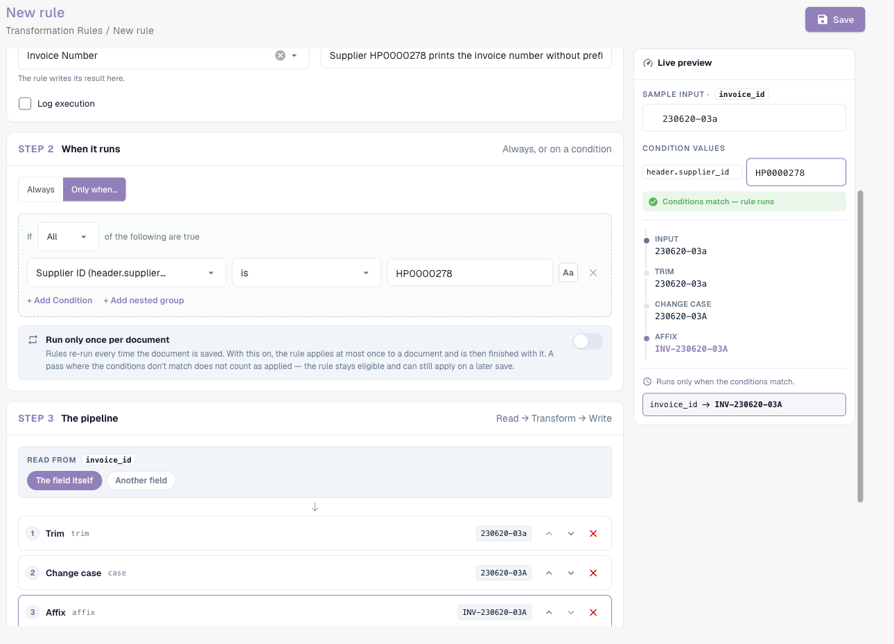
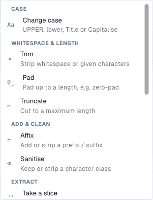
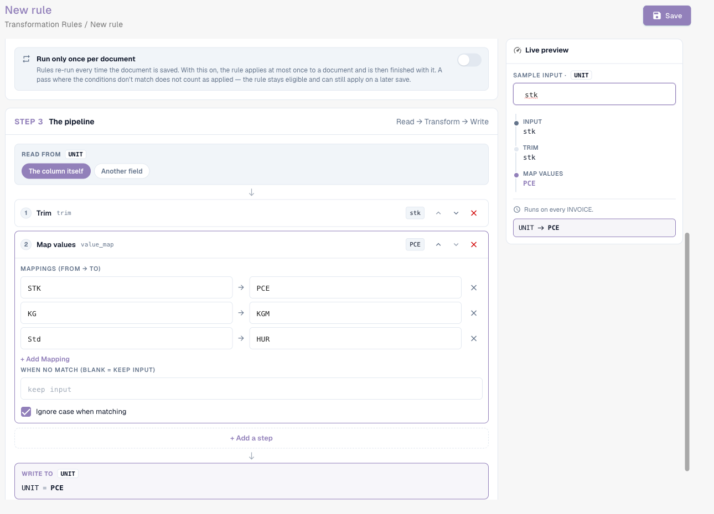
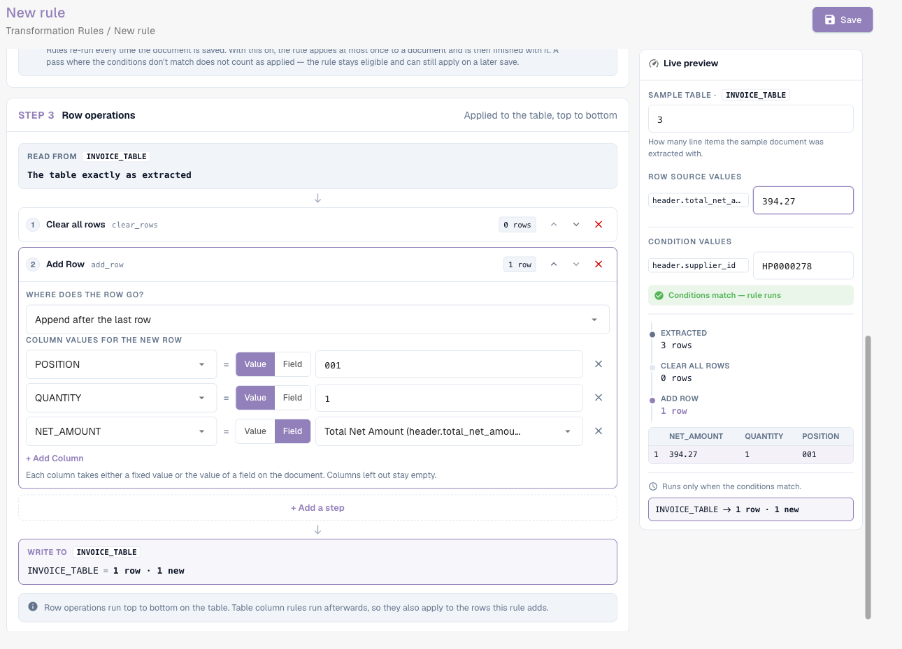

# Transformation Rules

## Overview

Transformation rules clean up or rewrite extracted data **automatically**, every time a document is processed and every time it is saved. A rule can change:

* a **header field** (invoice number, currency, supplier tax ID …),
* a **column** in every row of a table (unit, item number, price basis …),
* the **rows** of a table (clear them, add a row),
* an **attribute of the document** — today the sub-organisation it belongs to (**Routing**).

Each rule **reads** a value, sends it through a short **pipeline** of steps, and **writes** the result back. Rules run **before** validation, scripts and purchase order matching, so everything downstream already sees the corrected values.

Transformation rules replace most of the small scripts organisations used to write for "always trim this field", "map this supplier's unit codes", "add the prefix our ERP expects" or "collapse this supplier's lines into one total line" — with a form, a live preview and no code.

### Problems they solve

| Requirement | Rule |
| --- | --- |
| A supplier prints the invoice number without the `INV-` prefix our ERP expects | Header field *Invoice Number*, only for that supplier: Trim → UPPERCASE → Affix: add prefix `INV-` |
| Suppliers send German unit codes (`STK`, `Std`), the ERP expects UN/ECE codes (`PCE`, `HUR`) | Table column *UNIT*: Map values `STK → PCE`, `KG → KGM`, `Std → HUR` |
| Item numbers come with a prefix such as `Art.-Nr. 4711` | Table column *ITEM_NUMBER*: Affix: strip prefix `Art.-Nr. ` |
| Tax IDs contain spaces and dots | Header field *Supplier Tax ID*: Sanitise, keep alphanumeric |
| A supplier is matched on the total, not on lines | Table rows: Clear all rows → Add a row with the net amount |
| All documents of certain suppliers belong to a sub-organisation | Routing: set the sub-organisation when *Supplier ID is one of …* |
| Dates must be written in a fixed format into a free-text field | Header field: Reformat date `%d.%m.%Y` |


While the feature is in beta, the settings described below only appear when the **Document Types** settings page is opened with `?beta=true` appended to the address.


## Enable transformation rules

Transformation rules are switched on **per document type** by an **organisation administrator**.

1. Go to **Settings → Global Settings → Document Types**.
2. Click the **settings** (gear) icon on the document type card.
3. Open **Transformation Rules** and turn the toggle on. Click **Manage transformation rules** to open the list.

<figure><figcaption>
The Transformation Rules toggle in the additional settings of a document type
</figcaption></figure>

The card of the document type now shows a **Transformation Rules** link, and a **Logs** link for the execution logs.

## The rule list

The list shows all rules of the document type in the order they run, each with a one-sentence summary ("When invoice_id is abcd, take invoice_id, make it UPPERCASE, and save it back."), its scope (**Header**, **Table**, **Column**, **Routing**), the number of steps, its source and whether **Log execution** is on. Filter by scope and by **Active / Inactive**, search, and use the **⋮** menu to duplicate or delete a rule.

Rules come from three sources, as for validation rules: **System default** rules shipped with DocBits (click **Customize** to get an editable copy), **Customized** system rules (**Reset to Default** restores the original) and **Custom** rules you created.

## Create a rule

Click **New rule**. The builder has three steps on the left and a **Live preview** on the right. At the top it summarises the rule in one sentence while you build it.

<figure><figcaption>
Step 1: what the rule changes. The sentence at the top describes the rule in plain language
</figcaption></figure>

### Step 1 — What & where

**What does this rule change?** — the scope:

| Scope | Changes | Target | Runs |
| --- | --- | --- | --- |
| **Header field** | one value per document | a header field, e.g. *Invoice Number* | once per document |
| **Table rows** | whole line-item rows — clear them or add rows | a table, e.g. `INVOICE_TABLE` | once per document |
| **Table column** | a value in every line-item row | a table and a column, e.g. `INVOICE_TABLE` / `UNIT` | once per row |
| **Routing** | an attribute of the document — today the sub-organisation | *sub-organisation* | once per document |

Then enter the **Rule Name** (the **Rule key** is generated from it), pick the **Target field** / **Table name** / **Target column**, and optionally a **Description**. **Log execution** writes one log entry per application — useful while you tune a rule.

### Step 2 — When it runs

* **Always** — the rule runs on every document of the type.
* **Only when…** — the rule runs only if a condition is true, for example *Supplier ID is HP0000278*. For **Table column** rules the condition can use the columns of the current row and is checked row by row. See [Rule Conditions (Applies when)](rule-conditions-applies-when.md) for all fields, operators and examples.

Two options control how often the rule applies:

| Option | Effect |
| --- | --- |
| **Run only once per document** | Normally rules run again on every save. With this on, the rule applies **at most once** to a document and is then finished with it. A pass in which the conditions do not match does not count, so the rule can still apply on a later save. Needed for steps that would change the value again on every save (see [Idempotency](#run-once-and-idempotency)) and for table rules that should not rebuild the lines again. |
| **Run after lookup population (before PO match)** | *(newer versions)* Runs the rule in an additional pass after the lookup data (for example supplier master data) has been filled in, and before purchase order matching. Use it when the rule needs a value that a lookup provides. The rule still runs at the usual stages too; a run-once rule with this option waits for this pass instead of running right after extraction. |

### Step 3 — The pipeline

<figure><figcaption>
Read → Trim → Change case → Affix → Write, with the value after every step in the live preview
</figcaption></figure>

* **Read from** — **the field (or column) itself**, or **another field**. Reading from another field lets you fill a field from a different one, for example copy the purchase order number from a free-text field.
* **Steps** — the value goes through the steps **from top to bottom**; the output of one step is the input of the next. Add steps with **+ Add a step**, reorder them with the arrows, remove them with **✕**. Every step shows the intermediate value of the sample on its right.
* **Write to** — the target from step 1. DocBits writes the stored value and refreshes the display value automatically afterwards.

### The steps

<figure><figcaption>
All steps, grouped by purpose
</figcaption></figure>

| Step | Settings | Example input → output |
| --- | --- | --- |
| **Change case** | UPPERCASE, lowercase, Title Case, Capitalise first | `inv-4711` → `INV-4711` |
| **Trim** | side (both, left, right); characters (blank = whitespace) | `  4711 ` → `4711`; with characters `0` and side left: `004711` → `4711` |
| **Pad** | length, fill character, side | length 10, `0`, left: `4711` → `0000004711` |
| **Truncate** | maximum length | 10: `ABCDEFGHIJKL` → `ABCDEFGHIJ` |
| **Affix** | add prefix, add suffix, strip prefix, strip suffix; text | add prefix `INV-`: `4711` → `INV-4711`; strip prefix `Art.-Nr. `: `Art.-Nr. 4711` → `4711` |
| **Sanitise** | keep only (alphanumeric, letters, digits, alphanumeric + space) or strip given characters | keep alphanumeric: `DE 123.456.789` → `DE123456789` |
| **Take a slice** | start, length or end | start 0, length 4: `2026-09-29` → `2026` |
| **Extract** | pattern, capture group | pattern `PO[- ]?(\d+)`, group 1: `Order PO-45001234` → `45001234` |
| **Find & replace** | pattern, replace with, count (0 = all) | pattern `\s+`, replace with ` `: `ACME    GmbH` → `ACME GmbH` |
| **Map values** | mappings (from → to), value when no match (blank = keep input), ignore case | `STK → PCE`: `stk` → `PCE` |
| **Reformat date** | output pattern (`%d.%m.%Y`, `%m/%d/%Y`, `%Y-%m-%d`, `%d %b %Y`) | `%d.%m.%Y`: `2026-09-29` → `29.09.2026` |
| **Format number** | locale (de_DE, en_US, en_GB, fr_FR), min. and max. decimals | de_DE, 2 decimals: `1234.5` → `1.234,50` |
| **Fix value** | the value | always writes the value, whatever the field contained |
| **Clear** | – | empties the field |

**Table rows** rules use two different steps, which work on rows instead of values:

| Step | Effect |
| --- | --- |
| **Clear all rows** | deletes every extracted row. Rows added by a later step survive. |
| **Add a row** | adds one row **after the last row** or **before the first row**. For each column choose **Value** (a fixed value) or **Field** (the value of a header field). Columns you leave out stay empty. |


**Reformat date** expects the date as DocBits stores it internally (`YYYY-MM-DD`). Apply it to the field itself, not to a text that already contains a formatted date.


### Live preview

The live preview runs the rule on a sample while you build it:

* **Sample input** — type a value as it would come from the document. For table rules, enter the number of extracted rows (**Sample table**) and values for the fields that new rows read (**Row source values**).
* **Condition values** — for rules with a condition, type the values of the condition fields. The preview shows **Conditions match — rule runs** or **Conditions do not match — rule is skipped**.
* Below, you see the value after **every step** and the final result that would be written ("invoice_id → INV-230620-03A", or "unchanged").

Nothing is saved while you use the preview. Click **Save** to store the rule.

## Examples

### Clean up a supplier's invoice number

Header field **Invoice Number** · only when *Supplier ID is HP0000278* · Trim → Change case UPPERCASE → Affix add prefix `INV-`.
Sample `  230620-03a ` → `INV-230620-03A`. See the screenshot of the pipeline above.

### Map unit codes

Table column **INVOICE_TABLE / UNIT** · always · Trim → Map values `STK → PCE`, `KG → KGM`, `Std → HUR`, **Ignore case when matching** on, no-match value blank (keep input).

<figure><figcaption>
Map values on the UNIT column: <code>stk</code> becomes <code>PCE</code>
</figcaption></figure>

### One total line for a supplier matched on the total

Table rows **INVOICE_TABLE** · only when *Supplier ID is HP0000278* · Clear all rows → Add a row with `POSITION` = value `001`, `QUANTITY` = value `1`, `NET_AMOUNT` = field *Total Net Amount*.

<figure><figcaption>
Three extracted rows are replaced by one row carrying the net amount
</figcaption></figure>

Order matters: **Clear all rows** must come **before** **Add a row**. The builder warns you if it does not ("Clear all rows runs after Add a row …"), and it also warns if an **Add a row** step is not preceded by **Clear all rows**, because the rule would then append another copy of the row on every save. Pair this rule with a match-on-total purchase order matching rule that is active for one-line documents.

### More examples

| Goal | Scope | Condition | Steps |
| --- | --- | --- | --- |
| Remove spaces and dots from the tax ID | Header *Supplier Tax ID* | always | Sanitise: keep alphanumeric |
| Strip the article prefix | Column *ITEM_NUMBER* | always | Affix: strip prefix `Art.-Nr. ` |
| 10-digit supplier numbers | Header *Supplier ID* | always | Trim → Pad length 10 with `0`, left |
| Take the PO number out of a reference text | Header *Purchase Order*, read from another field | only when *Purchase Order is empty* | Extract `PO[- ]?(\d+)`, group 1 |
| Always use one currency for a supplier | Header *Currency* | only when *Supplier ID is 10040* | Fix value `CHF` |
| Remove a wrongly extracted value | Header *Discount Term* | only when *Supplier ID is 20723* | Clear |
| Price basis per unit | Column *UNIT_PRICE_PER* | only when *row.UNIT_PRICE_PER is empty* | Fix value `1` |
| Route suppliers to a sub-organisation | Routing | *Supplier ID is one of* `10040, 10041` | assign a fixed sub-organisation |

## Routing rules (sub-organisation)

A **Routing** rule does not change a field. It stamps an attribute on the document when its conditions match — today the **sub-organisation**. Choose **Assign a fixed sub-organisation** and pick it from the list, or **Map from a field** to map values of an extracted field to sub-organisations. The document then belongs to that sub-organisation, with its users, permissions and settings. A value that is not a valid sub-organisation is never written.

## When rules run

* **During processing**, after extraction and before master data lookup, validation, scripts and purchase order matching.
* On **every save** of the document in which the extracted data changed. Rules without **Run only once per document** are applied again each time.
* Within one pass, rules run scope by scope in this order: **Header → Routing → Table rows → Table column**. A column rule therefore also applies to rows that a table rule has just added. Within a scope, rules run by priority, then by key.

### Run once and idempotency

Most steps give the same result when they run on their own output — trimming a trimmed value, mapping `PCE` again, adding a prefix that is already there. These rules can safely run on every save.

**Take a slice**, **Extract** and **Find & replace** are different: run again on their own result, they keep changing it (a slice takes the first four characters of the first four characters …). DocBits therefore does not let you save a rule that applies these steps to its own target field. Either:

* switch on **Run only once per document**, or
* **Read from another field**, so the input stays unchanged.

## Transformation rules and purchase order matching

Table rules and column rules change what the PO matcher sees:

* A table rule that **rebuilds** lines (for example clear all rows and add one total line) keeps an existing purchase order match as long as it produces the **same lines again** — values are compared by meaning, so `1.0` and `1.00` are the same line. The lines keep their identity and the match survives every save.
* If a rule **replaces or removes lines that were matched**, the match cannot be kept. The document then records which rule dropped it, the Purchase Order Matching screen shows this as the reason ("_The PO match could not be saved: the transformation rule "…" rebuilt the table_") and administrators get a link to the rule. The **matching history** of the document shows a _Transformation rules_ step before the first matching stage with the rules that ran.
* The number of lines after the rules is what the [activation conditions](more-settings/purchase-order/purchase-order-matching-rules.md#activation-conditions) of the matching rules count. A rule that collapses an invoice into **one** line only makes sense together with a match-on-total rule that is active for one-line documents (`[[count(table_lines)]] >= 1`).

## Logs

With **Log execution** on, every application of the rule is written to **Document Types → (document type) → Logs**, with the outcome (applied, no change, skipped), the document and — for skipped rules — the condition trace that explains why. See [Read the condition trace](rule-conditions-applies-when.md#read-the-condition-trace-in-the-logs).

## Best practices

* **One purpose per rule.** "Clean up invoice number" and "Map unit codes" are two rules, not one.
* **Build with the live preview**, using real values copied from documents, including odd ones (spaces, lower case, prefixes).
* **Limit supplier-specific rules with a condition** instead of letting them run on everything.
* **Prefer idempotent steps.** Use run once only where you need it.
* **Watch the purchase order match** after adding table rules; check the matching history of a few documents.
* **Switch Log execution off** once the rule works.

## Troubleshooting

| Symptom | What to check |
| --- | --- |
| The rule did not change anything | Is it active, and is the feature enabled for the document type? Is the condition true for this document (exact value, including spaces and case)? Has a **run once** rule already been applied to the document? Check the log trace. |
| The value changes again on every save | The pipeline contains Take a slice, Extract or Find & replace. Switch on **Run only once per document**, or read from another field. |
| A table gets one more row on every save | An **Add a row** step without **Clear all rows** before it. Add the clear step first, or switch on run once. |
| The purchase order match is lost after saving | A table rule replaced the matched lines. The reason on the document names the rule; make the rule reproduce the same lines, or set it to run once. |
| A matching rule never runs after the transformation | The rule changed the number of lines; adjust the activation condition of the matching rule. |
| The rule needs a value from supplier master data, but it is still empty | Switch on **Run after lookup population (before PO match)**. |
| A date is not reformatted | Reformat date expects `YYYY-MM-DD` as input. |

## Related

* [Rule Conditions (Applies when)](rule-conditions-applies-when.md) — conditions in depth
* [Custom Validation Rules](custom-validation-rules.md) — check the transformed values
* [Layout Selection Rules](layout-manager/layout-selection-rules.md) — choose the layout a document uses
* [Purchase Order Matching Rules](more-settings/purchase-order/purchase-order-matching-rules.md)
