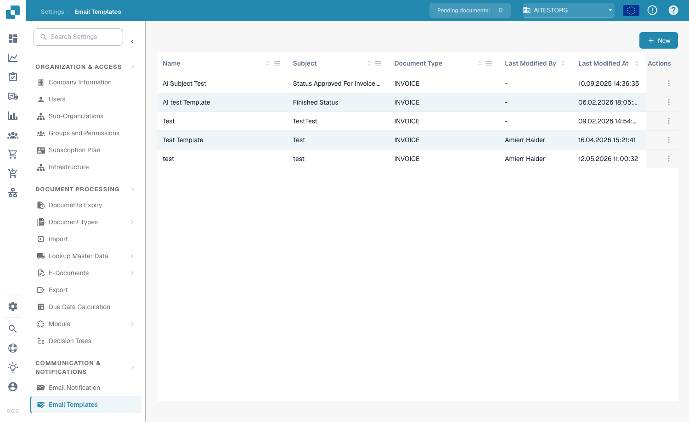
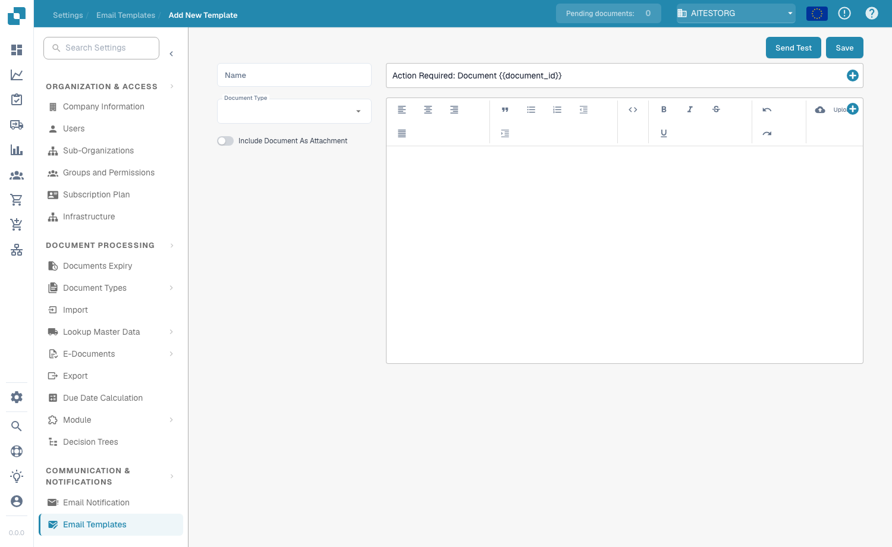
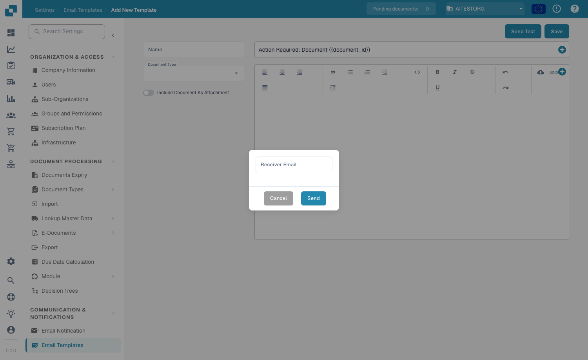

# E-Mail templates

## **Overview**

Email Templates let you customize the automated emails that DocBits sends — for example approval reminders or error notifications. A template defines the subject line and body, and can include dynamic fields (e.g. `{{InvoiceNumber}}`), images and rich-text formatting.

## **Accessing Email Templates**

Navigate to **Settings → Communication & Notifications → Email Templates**. The list shows every template with its **Name**, **Subject**, **Document Type**, **Last Modified** date and **Actions** (edit or delete).

<figure><figcaption>
The Email Templates list
</figcaption></figure>

## **Creating a Template**

1. Click **+ New** in the top-right corner.
2. Fill in the fields:
   * **Name** — a descriptive identifier (e.g. "Document Error Notification").
   * **Document Type** — the document type the template applies to (e.g. `INVOICE`).
   * **Include Document As Attachment** — enable this toggle to attach the source document to the email.
   * **Subject** — the email subject line. Click the **+** button next to the field to insert a dynamic field, or type `{{FieldID}}` directly.
3. Design the body in the rich-text editor — format text (bold, italic, lists, alignment), insert images with **Upload**, edit raw HTML with the `<>` button, and use the **+** button to insert dynamic fields.
4. Click **Save**.

<figure><figcaption>
The template editor — name, document type, attachment toggle, subject and rich-text body
</figcaption></figure>

## **Dynamic Fields**

Dynamic fields are replaced with document data when the email is sent. Insert them with the **+** button, or type them manually using double curly braces:

* `{{invoice_id}}` — the invoice number
* `{{supplier_name}}` — the supplier name
* `{{total_amount}}` — the total amount
* `{{status}}` — the current document status

## **Sending a Test Email**

Click **Send Test** in the editor, enter a **Receiver Email** address, and click **Send**. DocBits sends a preview of the template so you can check the layout and verify that the dynamic fields resolve correctly before saving.

<figure><figcaption>
The Send Test dialog
</figcaption></figure>

## **Using Templates in Notifications**

Saved templates can be linked to [**Email Notification**](email-notification/) workflows — for example approval reminders or status-change updates.
