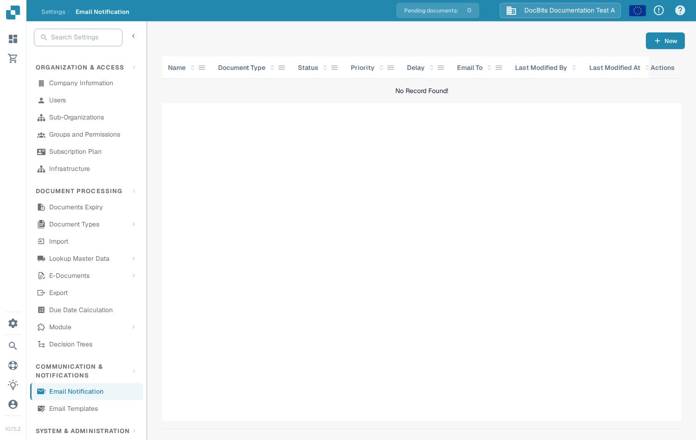
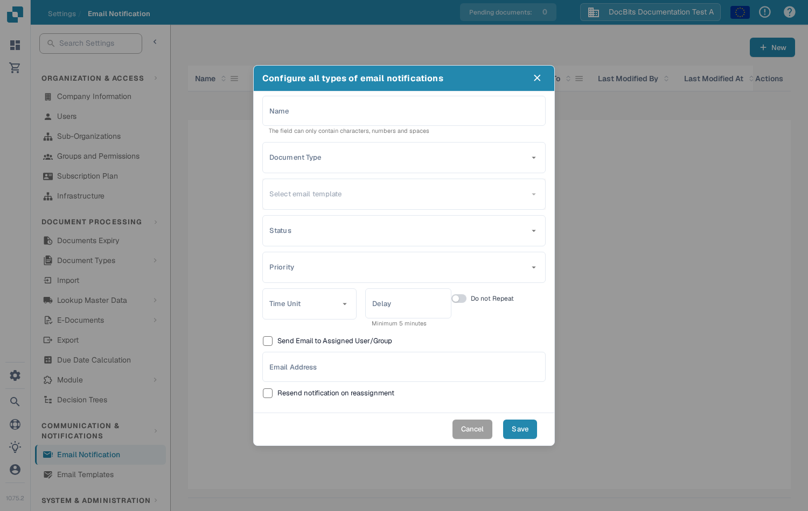
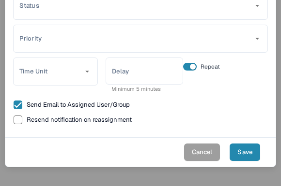

# Configuring Email Notifications

Email notifications can alert recipients when a document reaches a selected status. Before creating a notification, make sure an [email template](https://docs.docbits.com/advanced-functions-and-tools/sql-access/sql-access/email-template) exists for the document type you want to use.

## Open the notification list

In **Settings**, choose **Communication & Notifications → Email Notification**. The list shows existing rules with their document type, status, priority, delay, recipient, and last change. Select **New** to create a rule.

<figure><figcaption>
Select New to configure an email notification.
</figcaption></figure>

## Set up a rule

The **New** dialog contains the following controls:

| Control | What to enter |
| --- | --- |
| **Name** | A name you will recognize in the notification list. Use letters, numbers, and spaces. |
| **Document Type** | The type of document this rule applies to. Choose it before selecting a template. |
| **Select email template** | A template for the chosen document type. The selector is unavailable until matching templates are loaded. |
| **Status** | The document status that triggers the notification. |
| **Priority** | The priority value for this notification rule. |
| **Time Unit** and **Delay** | How long to wait before sending. For minutes, the delay must be at least five; enter a whole number. |
| **Do not Repeat / Repeat** | Switch on **Repeat** if the notification should be sent again while the condition still applies. |
| **Send Email to Assigned User/Group** | Send to the document's assigned recipient instead of a fixed address. This hides **Email Address**. |
| **Email Address** | Enter a valid address when the assigned-recipient option is off. |
| **Resend notification on reassignment** | Send again if the document is assigned to someone else. |

<figure><figcaption>
Choose a document type and its email template, then define the trigger and recipient.
</figcaption></figure>

When **Send Email to Assigned User/Group** is selected, the fixed **Email Address** field disappears. The repeat switch changes its label from **Do not Repeat** to **Repeat**.

<figure><figcaption>
Use the assigned-recipient option when the document owner should receive the email.
</figcaption></figure>

Select **Save** to add the rule to the list, or **Cancel** to discard the draft. If **Select email template** has no choices, create a template for the selected document type first and then return to this dialog.
