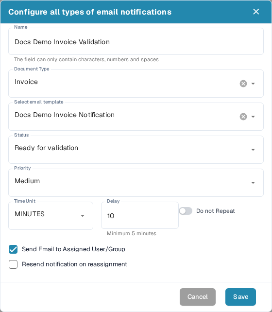
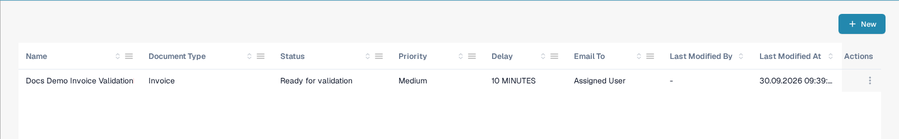
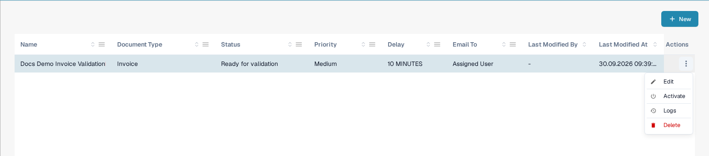

# Managing Notifications

Open **Settings → Email Notification** to see the rules for your organisation. A rule connects a document status to an email template and a recipient. The example below uses a demonstration rule for invoices and remains **inactive** in the DocBits Sandbox.

## Example: an invoice is ready for validation

Before creating a rule, prepare an email template for **Invoice** under **Settings → Email Templates**. In this example, the template is named **Docs Demo Invoice Notification**. The template supplies the email subject and message.

1. Select **+ New** on the **Email Notification** page.
2. Enter **Docs Demo Invoice Validation** as the name, select **Invoice** as the document type, and choose the prepared email template.
3. Choose **Ready for validation** as the status and **Medium** as the priority. Set **Time Unit** to **MINUTES** and **Delay** to **10**. The minimum delay for minutes is five.
4. Select **Send Email to Assigned User/Group**. Turn on **Do not Repeat** if the message should be sent only once. Review the recipient and timing, then select **Save**.

<figure><figcaption>
The saved example rule opened for editing. Its values show when and to whom the notification would be sent.
</figcaption></figure>

The rule now appears in the list. The documentation example was then deactivated, so its **Actions** menu offers **Activate**. Check the name, document type, status, delay, and recipient in your own list before activating a rule.

<figure><figcaption>
The saved example gives you a rule to find and manage in the list.
</figcaption></figure>

## Edit, activate, or delete a rule

Open the row's **Actions** menu. **Edit** opens the rule and its current values. **Activate** enables this inactive example; an active rule offers **Deactivate** instead. **Logs** opens its notification history. **Delete** removes the rule after confirmation. Check recipients and timing before activating or changing a rule.

<figure><figcaption>
The available actions depend on whether the rule is active.
</figcaption></figure>

If the list says **No Record Found!**, create a rule first. If the **Document Type** or email template list is empty, configure an active document type and a matching template before returning to this form.

For more on the initial setup, see [Configuring Notifications](configuring-notifications.md). If emails do not arrive as expected, see [Troubleshooting](troubleshooting.md).
