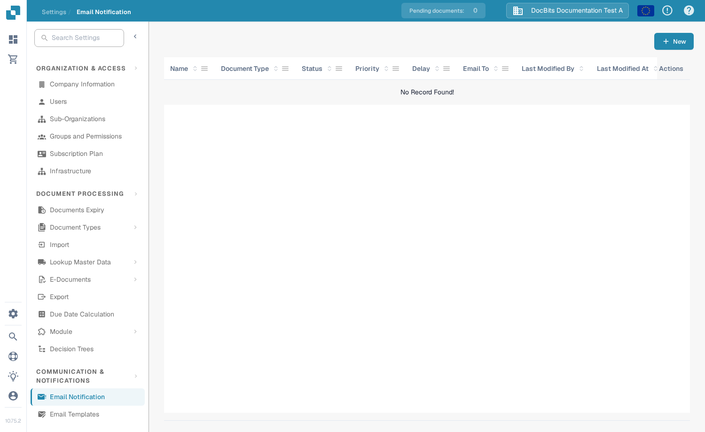
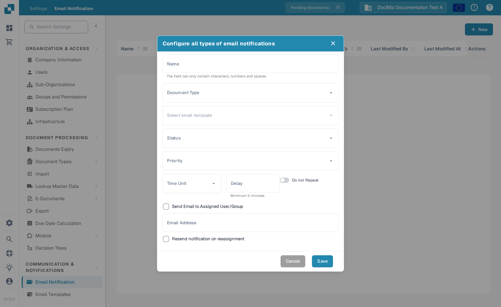

# Managing Notifications

Use **Email Notification** to review notification rules and create a new one. Open **Settings → Global Settings → Email Notification**. The table shows the rule name, document type, status, priority, delay, recipients, last change and available actions. If it says **No Record Found!**, there are no rules to edit yet.

<figure><figcaption>
The notification list in the English sandbox. This test organisation has no saved rules.
</figcaption></figure>

## Create a notification rule

1. Select **+ New** to open the notification form.
2. Enter a **Name**, choose a **Document Type** and an email template. The template determines the email's content.
3. Choose the **Status** for the rule and set its **Priority**.
4. Set **Time Unit** and **Delay** for when the notification should be sent. The form requires a delay of at least five minutes. Select **Do not Repeat** if the notification should not be repeated.
5. Choose whether to send it to the assigned user or group, add an **Email Address** if needed, and decide whether reassignment should resend the notification.
6. Review the recipients and timing before selecting **Save**. Select **Cancel** to leave without saving.

<figure><figcaption>
The current New notification form in the English sandbox. No rule was saved for this screenshot.
</figcaption></figure>

## Change an existing rule

Find the rule in the table and use its **Actions** menu to edit it. Check the document type, status, delay and recipients, then save your changes. If the menu offers a disable or delete action, check the rule before using it so that expected emails are not interrupted. The example organisation above has no saved rule, so those actions are not shown in the screenshots.

For more on the initial setup, see [Configuring Notifications](configuring-notifications.md). If emails do not arrive as expected, see [Troubleshooting](troubleshooting.md).
