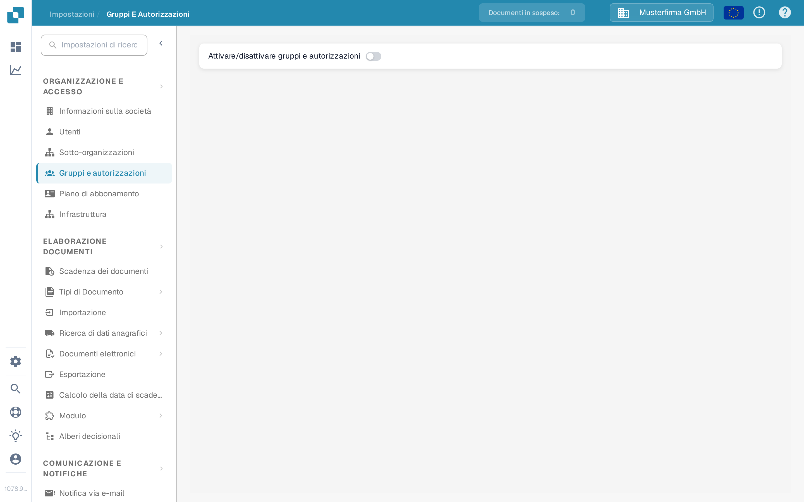

# Gruppi, Utenti e Autorizzazioni

Queste impostazioni rispondono a tre domande diverse: chi può accedere, in quale sotto-organizzazione lavora la persona e cosa può fare il suo gruppo.

| Se devi… | Apri… |
| --- | --- |
| Aggiungere o modificare l'account di una persona | **Impostazioni** → **Utenti**; poi leggi [Utenti](users/README.md). |
| Organizzare l'accesso tra le unità aziendali | **Impostazioni** → **Sotto-organizzazioni**; poi leggi [Sotto-organizzazioni](sub-organizations/README.md). |
| Controllare l'accesso tramite i gruppi | **Impostazioni** → **Gruppi e autorizzazioni**; poi leggi [Gruppi e Autorizzazioni](groups-and-permissions/README.md). |

Nella pagina **Gruppi e autorizzazioni** l'interruttore **Attivare/disattivare gruppi e autorizzazioni** accende o spegne l'uso dei gruppi e dei permessi per tutta l'organizzazione.

<figure><figcaption>Vista attuale della Sandbox italiana con l'organizzazione di esempio Musterfirma GmbH. In questo esempio l'interruttore «Attivare/disattivare gruppi e autorizzazioni» è disattivato; nessun permesso è stato modificato.</figcaption></figure>

Se un utente non riesce a vedere un documento o un'azione, controlla prima il suo account e la sua organizzazione. Poi controlla i permessi del gruppo competente. Con un account di test non amministratore verifica l'accesso effettivo di un utente normale prima di modificare un'organizzazione di produzione.
