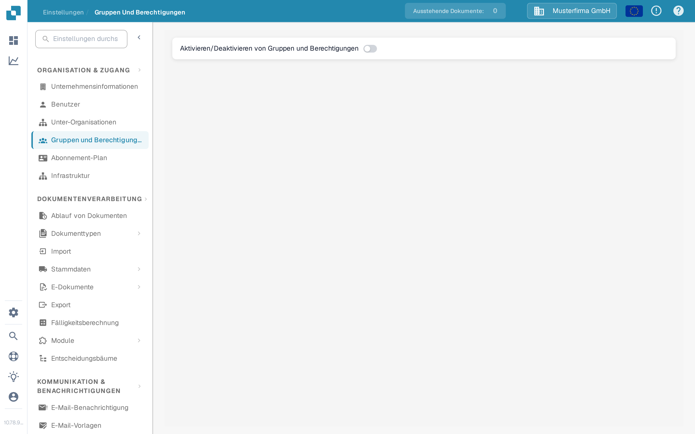

# Gruppen, Benutzer und Berechtigungen

Diese Einstellungen beantworten drei verschiedene Fragen: Wer darf sich anmelden, in welcher Unterorganisation arbeitet die Person, und was darf ihre Gruppe tun.

| Wenn Sie … möchten | Öffnen Sie … |
| --- | --- |
| Das Konto einer Person hinzufügen oder bearbeiten | **Einstellungen** → **Benutzer**; lesen Sie dann [Benutzer](users/README.md). |
| Den Zugriff über Unternehmenseinheiten hinweg organisieren | **Einstellungen** → **Unter-Organisationen**; lesen Sie dann [Unterorganisationen](sub-organizations/README.md). |
| Den Zugriff über Gruppen steuern | **Einstellungen** → **Gruppen und Berechtigungen**; lesen Sie dann [Gruppen und Berechtigungen](groups-and-permissions/README.md). |

<figure><figcaption>Aktuelle deutsche Sandbox-Ansicht mit der Beispielorganisation Musterfirma GmbH. Gruppen und Berechtigungen ist in diesem Beispiel deaktiviert; es wurde keine Berechtigung geändert.</figcaption></figure>

Wenn ein Benutzer ein Dokument oder eine Aktion nicht sehen kann, prüfen Sie zuerst sein Konto und seine Organisation. Prüfen Sie danach die Berechtigungen der zuständigen Gruppe. Bestätigen Sie mit einem nicht-administrativen Testkonto, welchen Zugriff ein normaler Benutzer tatsächlich hat, bevor Sie eine produktive Organisation ändern.
