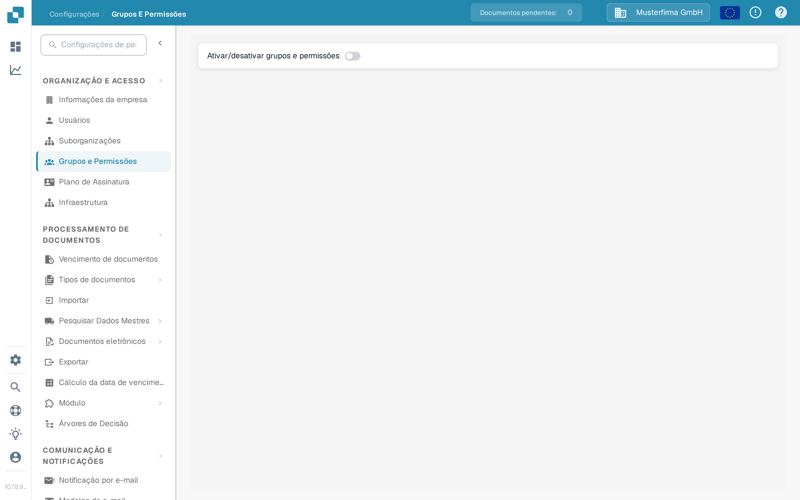

# Grupos, Usuários e Permissões

Estas configurações respondem a três perguntas diferentes: quem pode iniciar sessão, em qual suborganização essa pessoa trabalha e o que o grupo dela pode fazer.

| Se você precisa… | Abra… |
| --- | --- |
| Adicionar ou editar a conta de uma pessoa | **Configurações** → **Usuários**; depois leia [Usuários](users/README.md). |
| Organizar o acesso entre unidades da empresa | **Configurações** → **Suborganizações**; depois leia [Suborganizações](sub-organizations/README.md). |
| Controlar o acesso por grupo | **Configurações** → **Grupos e Permissões**; depois leia [Grupos e Permissões](groups-and-permissions/README.md). |

Na página **Grupos e Permissões**, o controle **Ativar/desativar grupos e permissões** liga ou desliga o uso de grupos e permissões em toda a organização; os detalhes estão na seção [Ativar/Desativar Grupos e Permissões](groups-and-permissions/README.md).

<figure><figcaption>
Vista atual da Sandbox em português com a organização de exemplo Musterfirma GmbH. Neste exemplo, Grupos e Permissões está desativado; nenhuma permissão foi alterada.
</figcaption></figure>

Se um usuário não conseguir ver um documento ou uma ação, verifique primeiro a conta e a organização dele. Depois verifique as permissões do grupo correspondente. Antes de alterar uma organização em produção, use uma conta de teste sem privilégios de administrador para confirmar o acesso que um usuário normal terá realmente.
