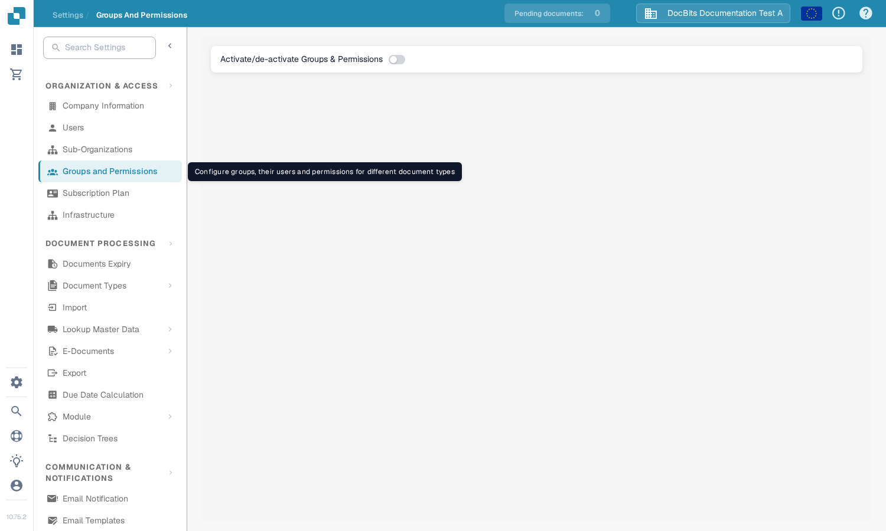

# Groups, Users and Permissions

These settings answer three different questions: who can sign in, which sub-organisation they work in, and what their group may do.

| If you need to… | Open… |
| --- | --- |
| Add or edit a person's account | **Settings** → **Users**; then read [Users](users/README.md). |
| Organise access across company units | **Settings** → **Sub-Organizations**; then read [Sub-Organizations](sub-organizations/README.md). |
| Control access by group | **Settings** → **Groups and Permissions**; then read [Groups and Permissions](groups-and-permissions/README.md). |

<figure><figcaption>Current English Sandbox view for DocBits Documentation Test A. Groups and Permissions is off in this example; no permission was changed.</figcaption></figure>

If a user cannot see a document or action, check their account and organisation first. Then check the relevant group permissions. Use a non-admin test account to confirm the access a normal user will actually have before changing a live organisation.

