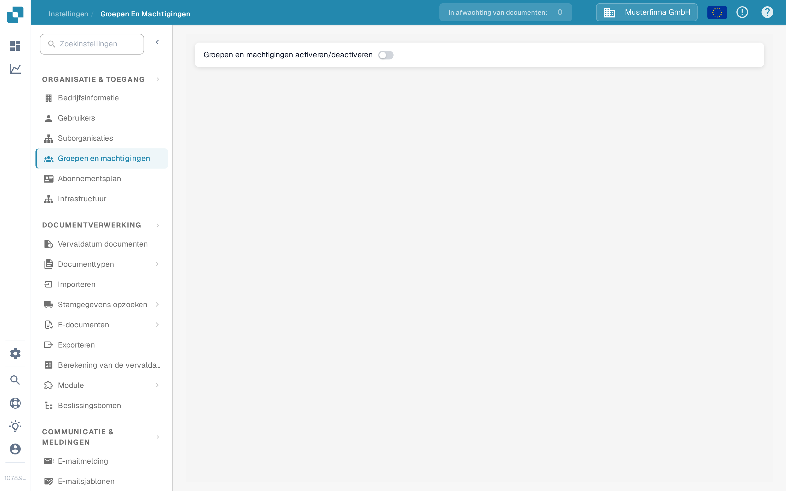

# Groepen, Gebruikers en Machtigingen

Deze instellingen beantwoorden drie verschillende vragen: wie kan er inloggen, in welke suborganisatie werkt die persoon, en wat mag zijn of haar groep doen.

| Als u dit nodig heeft… | Open… |
| --- | --- |
| Een gebruikersaccount toevoegen of bewerken | **Instellingen** → **Gebruikers**; lees daarna [Gebruikers](users/README.md). |
| De toegang over bedrijfseenheden organiseren | **Instellingen** → **Suborganisaties**; lees daarna [Suborganisaties](sub-organizations/README.md). |
| De toegang per groep sturen | **Instellingen** → **Groepen en machtigingen**; lees daarna [Groepen en machtigingen](groups-and-permissions/README.md). |

Bovenaan deze pagina staat de schakelaar **Groepen en machtigingen activeren/deactiveren**. Daarmee zet de systeembeheerder het gebruik van groepen en machtigingen aan of uit; wanneer deze uitstaat, valt het systeem terug op een minder gedetailleerd systeem voor toegangscontrole.

<figure><figcaption>
Huidige Nederlandse Sandbox-weergave met de voorbeeldorganisatie Musterfirma GmbH. Groepen en machtigingen staat in dit voorbeeld uit; er is geen machtiging gewijzigd.
</figcaption></figure>

Als een gebruiker een document of actie niet kan zien, controleer dan eerst zijn of haar account en organisatie. Controleer daarna de machtigingen van de betreffende groep. Gebruik een testaccount zonder beheerdersrechten om te bevestigen welke toegang een gewone gebruiker werkelijk heeft, voordat u een productieve organisatie wijzigt.
