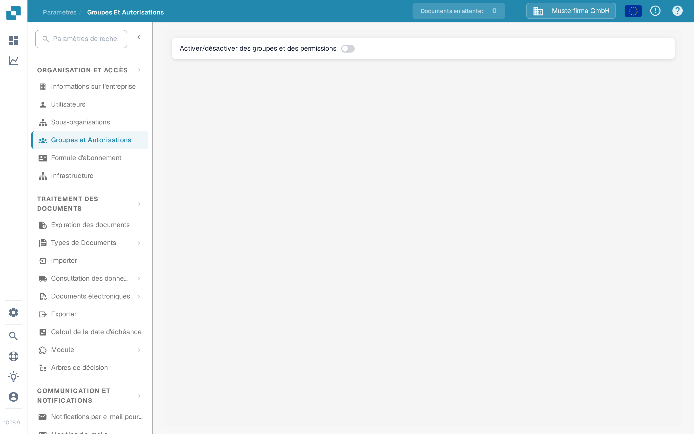

# Groupes, Utilisateurs et Autorisations

Ces paramètres répondent à trois questions différentes : qui peut se connecter, dans quelle sous-organisation la personne travaille, et ce que son groupe a le droit de faire.

| Si vous devez… | Ouvrir… |
| --- | --- |
| Ajouter ou modifier le compte d'une personne | **Paramètres** → **Utilisateurs** ; puis lire [Utilisateurs](users/README.md). |
| Organiser l'accès entre les unités de l'entreprise | **Paramètres** → **Sous-organisations** ; puis lire [Sous-Organisations](sub-organizations/README.md). |
| Contrôler l'accès par groupe | **Paramètres** → **Groupes et Autorisations** ; puis lire [Groupes et Autorisations](groups-and-permissions/README.md). |

<figure><figcaption>
Vue Sandbox actuelle en français pour l'organisation d'exemple Musterfirma GmbH. Groupes et Autorisations est désactivé dans cet exemple ; aucune autorisation n'a été modifiée.
</figcaption></figure>

Si un utilisateur ne voit pas un document ou une action, vérifiez d'abord son compte et son organisation. Vérifiez ensuite les autorisations du groupe concerné. Utilisez un compte de test qui n'est pas administrateur pour confirmer l'accès dont disposera réellement un utilisateur normal avant de modifier une organisation en production.
