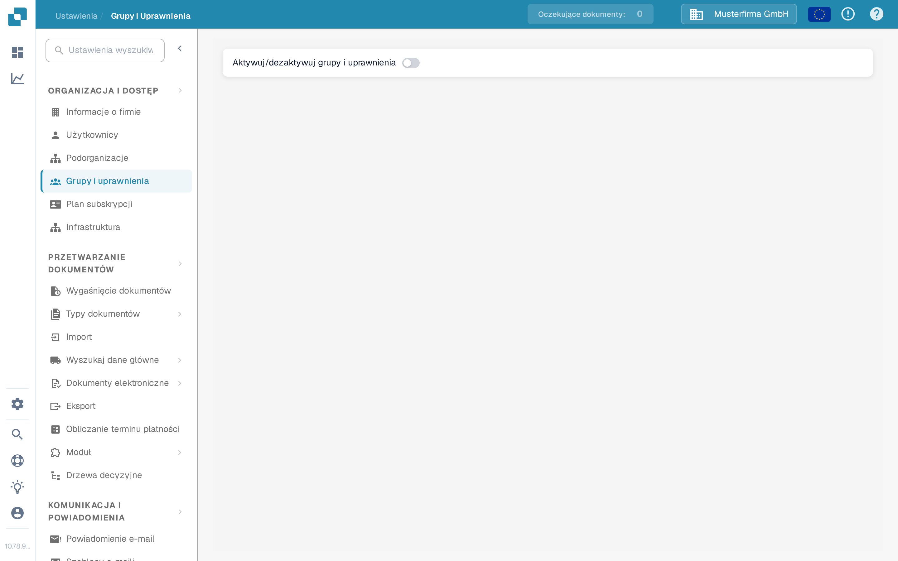

# Grupy, Użytkownicy i Uprawnienia

Te ustawienia odpowiadają na trzy różne pytania: kto może się zalogować, w jakiej podorganizacji pracuje dana osoba i co może robić jej grupa.

| Jeśli chcesz… | Otwórz… |
| --- | --- |
| Dodać lub edytować konto osoby | **Ustawienia** → **Użytkownicy**; następnie przeczytaj [Użytkownicy](users/README.md). |
| Uporządkować dostęp w jednostkach firmy | **Ustawienia** → **Podorganizacje**; następnie przeczytaj [Podorganizacje](sub-organizations/README.md). |
| Sterować dostępem przez grupy | **Ustawienia** → **Grupy i uprawnienia**; następnie przeczytaj [Grupy i uprawnienia](groups-and-permissions/README.md). |

Na stronie **Grupy i uprawnienia** przełącznik **Aktywuj/dezaktywuj grupy i uprawnienia** włącza lub wyłącza korzystanie z grup i uprawnień w całej organizacji; szczegóły opisuje sekcja [Włącz/Wyłącz Grupy i Uprawnienia](groups-and-permissions/README.md).

<figure><figcaption>
Aktualny polski widok Sandboksa z organizacją przykładową Musterfirma GmbH. Grupy i uprawnienia są w tym przykładzie wyłączone; nie zmieniono żadnych uprawnień.
</figcaption></figure>

Jeśli użytkownik nie widzi dokumentu lub akcji, sprawdź najpierw jego konto i organizację. Następnie sprawdź uprawnienia odpowiedniej grupy. Zanim zmienisz organizację produkcyjną, potwierdź na koncie testowym bez uprawnień administratora, jaki dostęp będzie miał zwykły użytkownik.
