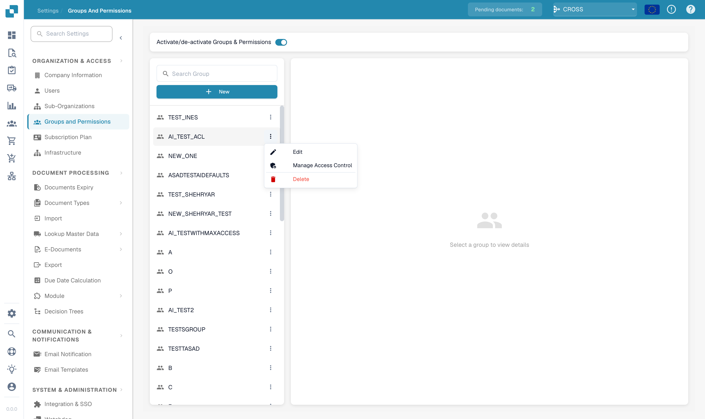
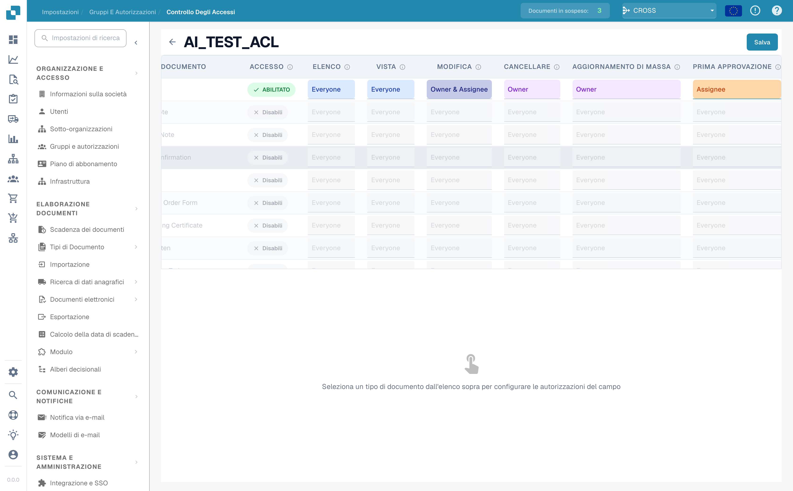
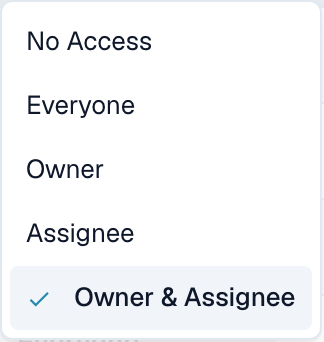
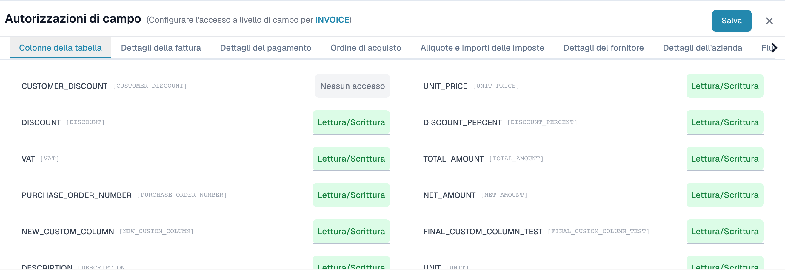

# Access Control

## Overview

Access Control defines, for a single **group** (role), exactly what its members may do — both at the **document-type level** (which document types they see and which actions they may perform) and at the **field level** (which individual fields they may read or edit).

Permissions are always evaluated **per group**. A user inherits the permissions of every group they belong to.


Access Control is only enforced when the **Groups & Permissions** system is switched on (see [Activating Permissions](activating-permissions.md)). **Administrators always bypass Access Control** and can see and do everything, regardless of the settings on this page.


Each group can be configured for:

* **Document Access** — whether the group can use a document type at all.
* **Action Permissions** — which actions (list, view, edit, delete, mass update, approve) the group may perform, and *for which documents*.
* **Field-Level Permissions** — whether each field inside a document type is editable, read-only, or hidden.

## Activation

1. Navigate to **Settings**.
2. Select **Document Processing**.
3. Select **Module.**
4. Activate **Access Control** by enabling the slider.

<figure><figcaption></figcaption></figure>

## Opening a group's Access Control

1. Navigate to **Settings**.
2. Go to **Global Settings.**
3. Select **Groups, Users and Permissions.**
4. Select **Groups and Permissions**.
5. To manage permissions for a group, such as PROCUREMENT\_DIRECTOR, click the three dots on the right side of the screen.
6. Select **Manage Access Control**.

<figure><figcaption>
On the Groups and Permissions page, open a group's <strong>⋮</strong> menu and choose <strong>Manage Access Control</strong>.
</figcaption></figure>

## How a permission is evaluated

When a user tries to do something with a document, DocBits checks, in order:

1. **Is the Groups & Permissions system on, and is the user a non-admin?** If off, or the user is an admin → full access.
2. **Is the document type Enabled for one of the user's groups?** If disabled → the user cannot see or use that document type.
3. **What access scope is set for the action?** (e.g. *Edit = Owner*). The scope is matched against the user's relationship to *this specific document* — are they the owner, the assignee, both, or neither?
4. **What is the field-level permission?** Even when a user may open a document, individual fields can still be hidden or locked.

## Document-type permissions

Each row in the matrix is one document type (Invoice, Credit Note, Purchase Order, …).

The first column is an **Enabled / Disabled** toggle. Disable it and the group cannot use that document type at all — it disappears from their dashboard. Enable it and the seven action columns become editable.

| Action | Controls whether the group can… |
|--------|----------------------------------|
| **List** | See the document type in the dashboard list. |
| **View** | Open a document and view its details. |
| **Edit** | Change field values on a document. |
| **Delete** | Delete a document. |
| **Mass Update** | Apply a bulk update to several documents at once. |
| **First Approval** | Grant the first-level approval. |
| **Second Approval** | Grant the second-level approval. |

<figure><figcaption>
The document-type permission matrix. Here the <strong>Invoice</strong> type is enabled and its actions are set to different access scopes; the other types are disabled.
</figcaption></figure>

### Access scopes

Every action column is a dropdown. The value you pick answers the question *"for which documents may the group do this?"*

| Scope | Who is allowed | Effect on a document |
|-------|----------------|----------------------|
| **No Access** | Nobody in the group. | The action is blocked for everyone in the group — the button is hidden or disabled. |
| **Everyone** | Every member of the group. | Any group member can perform the action on **any** document of this type. |
| **Owner** | Only the user who **created / uploaded** the document. | The action works only on documents the user uploaded themselves. |
| **Assignee** | Only the user (or group) the document is **assigned to**. | The action works only on documents currently assigned to the user or a group they belong to. |
| **Owner & Assignee** | The owner **or** the assignee. | The action works if the user is *either* the uploader *or* the assignee. |


**Owner** and **Assignee** depend on the *relationship between the user and each individual document*, so two members of the same group can have different rights on the same invoice — see the worked example below.


<figure><figcaption>
Each action column offers the same five access scopes.
</figcaption></figure>

## Field-level permissions

Click a document-type row to open the **Field Permissions** panel underneath. Fields are organised into tabs (for example *Table columns*, *Invoice details*, *Payment details*, *Tax rates & Amounts*). Each field has its own access level:

| Level | Effect on the field |
|-------|---------------------|
| **Read/Write** | The field is visible **and** editable. |
| **Read Only** | The field is visible but **cannot be edited** (greyed out). |
| **Approval** | The field can be edited, but the change must go through an **approval workflow** before it is applied. |
| **No Access** | The field is **hidden entirely** — the user never sees it. |


Field-level rules apply to **all** members of the group equally — they do not depend on owner/assignee. Use them to hide or lock sensitive fields (e.g. a discount or a total amount) for an entire group.


<figure><figcaption>
The Field Permissions panel for the Invoice type. <code>CUSTOMER_DISCOUNT</code> is hidden (No Access) while the other fields stay Read/Write.
</figcaption></figure>

## Worked example: what Access Control does to a real invoice

Suppose you create a group **AP_CLERK** for your accounts-payable clerks and configure the **Invoice** document type like this:

**Document-type permissions for Invoice**

| Action | Scope |
|--------|-------|
| Enabled | ✅ On |
| List | Everyone |
| View | Everyone |
| Edit | Owner & Assignee |
| Delete | No Access |
| Mass Update | No Access |
| First Approval | Assignee |
| Second Approval | No Access |

**Field permissions for Invoice**

| Field | Level |
|-------|-------|
| `TOTAL_AMOUNT` | Read Only |
| `CUSTOMER_DISCOUNT` | No Access |
| *(all other fields)* | Read/Write |

Now follow one real document — invoice **INV-4711**, which **Maria uploaded** and which is **assigned to Maria**. Both Maria and her colleague Tom are in the **AP_CLERK** group.

**Maria (owner *and* assignee of INV-4711):**

* ✅ Sees INV-4711 in the dashboard list *(List = Everyone)*.
* ✅ Opens it *(View = Everyone)*.
* ✅ Edits the supplier name and line items *(Edit = Owner & Assignee — she is the owner)*.
* 🔒 Sees `TOTAL_AMOUNT`, but the field is greyed out and she cannot change it *(Read Only)*.
* 🚫 Never sees the `CUSTOMER_DISCOUNT` field at all *(No Access)*.
* 🚫 The **Delete** button is hidden *(Delete = No Access — nobody in the group may delete)*.
* ✅ Can grant the **first approval** *(First Approval = Assignee — she is the assignee)*.

**Tom (same group, but did *not* upload INV-4711 and it is *not* assigned to him):**

* ✅ Sees it in the list and ✅ opens it *(List & View = Everyone)*.
* 🚫 Cannot edit anything — the document opens **read-only** *(Edit = Owner & Assignee — Tom is neither)*.
* 🔒 / 🚫 Sees exactly the same field visibility as Maria: `TOTAL_AMOUNT` locked, `CUSTOMER_DISCOUNT` hidden *(field rules apply to the whole group)*.
* 🚫 Cannot grant the first approval *(First Approval = Assignee — not Tom)*.
* 🚫 Cannot delete *(No Access)*.

**What this example shows**

* **Everyone** opens a document up to all group members; **Owner / Assignee** narrows an action down to the people connected to that specific document.
* **No Access** removes an action (Delete) or hides a field (`CUSTOMER_DISCOUNT`) for the entire group.
* **Read Only** keeps a field visible for reference (`TOTAL_AMOUNT`) but prevents changes.
* Two people in the **same group** can have **different rights on the same invoice**, purely because of who uploaded it and who it is assigned to.
