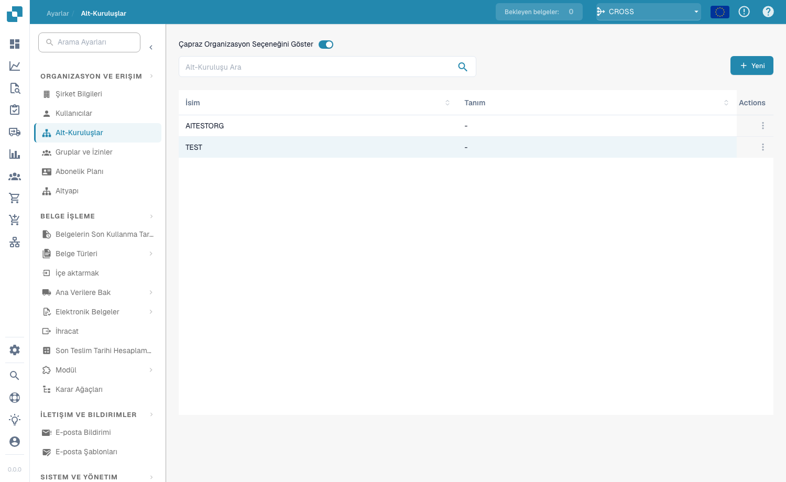
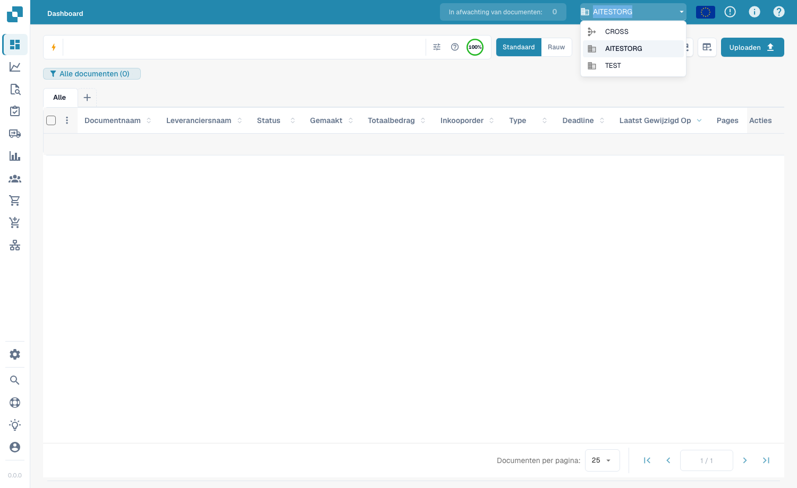

# Suborganisaties

<figure><figcaption>
Pagina Suborganisaties
</figcaption></figure>

Met suborganisaties kunt u een hiërarchische structuur in DocBits opzetten om documenten, gebruikers en workflows over verschillende afdelingen, teams of entiteiten te beheren.

## Belangrijkste voordelen

* **Gestructureerde organisatie**: groepeer gebruikers en documenten per afdeling, locatie of bedrijfsonderdeel.
* **Gedetailleerde rechten**: bepaal welke gebruikers toegang hebben tot de documenten van elke suborganisatie.
* **Aparte workflows**: elke suborganisatie kan eigen regels en configuraties voor documentverwerking hebben.
* **Rapportage**: genereer rapporten en analyses per suborganisatie.

## Lijst met suborganisaties

De tabel toont alle bestaande suborganisaties met:

| Kolom | Beschrijving |
|--------|-------------|
| **Naam** | De naam van de suborganisatie. |
| **Beschrijving** | Een korte beschrijving van het doel van de suborganisatie. |
| **Acties** | Menu met opties om gebruikers te beheren, de suborganisatie te bewerken of te verwijderen. |

Gebruik de **zoekbalk** om snel suborganisaties op naam te vinden.

## Een nieuwe suborganisatie aanmaken

1. Klik op de knop **+ Nieuw** rechtsboven.
2. Voer een **Naam** en optioneel een **Beschrijving** in.
3. Klik op **Opslaan** om de suborganisatie aan te maken.

## Optie "Cross-organisatie weergeven" (Cross)

Wanneer deze optie is ingeschakeld (via de schakelaar boven aan de pagina), kunnen gebruikers documenten uit alle suborganisaties in één gecombineerde weergave bekijken, in plaats van beperkt te zijn tot documenten van slechts één suborganisatie.

### Cross-suborganisaties gebruiken

1. Ga naar het **dashboard**.
2. Selecteer rechtsboven, waar tussen suborganisaties kan worden gewisseld, **Cross**.
3. De pagina wordt opnieuw geladen en toont documenten uit alle suborganisaties.
4. Om terug te keren naar de weergave van één suborganisatie, schakelt u de optie **Cross** uit.

<figure><figcaption>
Cross selecteren in de organisatieschakelaar rechtsboven
</figcaption></figure>

Dit is handig voor beheerders die een centraal overzicht van alle documenten in de organisatie nodig hebben.
