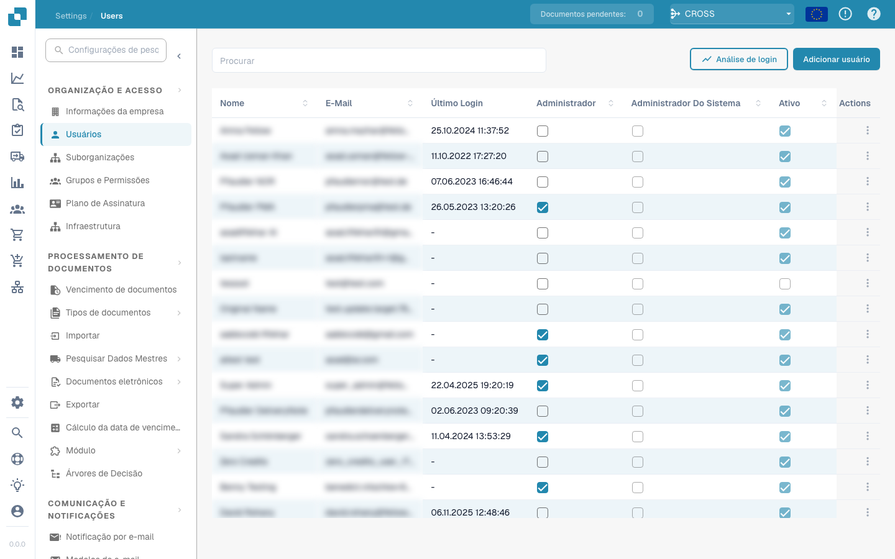

# Usuários

<figure><figcaption>
Página de Gerenciamento de Usuários
</figcaption></figure>

A página de Usuários permite que os administradores gerenciem todas as contas de usuário da sua organização no DocBits. Aqui você pode adicionar novos usuários, atribuir funções e controlar o acesso.

## Lista de Usuários

A tabela de usuários exibe as seguintes colunas:

| Coluna | Descrição |
|--------|-------------|
| **Nome** | O nome completo do usuário. |
| **E-Mail** | O endereço de e-mail do usuário, usado como identificador de login. |
| **Último Login** | Data e hora do login mais recente do usuário. |
| **Admin** | Caixa de seleção que indica se o usuário tem privilégios de administrador. Os Admins podem acessar todas as configurações e gerenciar outros usuários. |
| **System Admin** | Caixa de seleção que indica o único System Admin da organização — a conta que o DocBits utiliza para ações automáticas, realizadas em segundo plano (como importações e exportações automatizadas). Um System Admin sempre tem também privilégios de Admin. Consulte [Privilégios de Administrador](admin-privileges.md#admin-vs-system-admin) para entender a diferença entre Admin e System Admin. |
| **Ativo** | Caixa de seleção que mostra se a conta do usuário está atualmente ativa. Usuários inativos não conseguem fazer login. |
| **Ações** | Menu com opções como editar os dados do usuário, redefinir senhas ou desativar a conta. |

Use a barra de **Pesquisa** no topo para encontrar usuários rapidamente por nome ou ID.

## Análise de Logins

Clique em **Análise de Logins** para visualizar os dados de atividade de login em toda a sua organização, incluindo a frequência e os padrões de login.

Consulte [Análise de Logins](login-analytics.md) para o detalhamento completo.

## Adicionar um Novo Usuário

1. Clique no botão **Adicionar Usuário** no canto superior direito.
2. Preencha as informações obrigatórias:
   * **Nome de usuário**: Um nome exclusivo para o usuário.
   * **Nome** e **Sobrenome**: O nome completo do usuário.
   * **Endereço de E-mail**: Usado para login e notificações.
   * **Senha**: Deve estar de acordo com as políticas de segurança da sua organização.
   * **Função do Usuário**: Atribua a função adequada (Standard User, Admin ou System Admin).
3. Clique em **Salvar** para criar a conta do usuário. O novo usuário receberá uma notificação por e-mail com seus dados de login.

> **Observação:** A função de **System Admin** só pode ser escolhida ao criar um usuário — ela não pode ser adicionada ou removida depois. Cada organização pode ter apenas um System Admin, e escolher essa função concede automaticamente também os direitos de Admin. Consulte [Privilégios de Administrador](admin-privileges.md#admin-vs-system-admin) para saber quando utilizá-la.
