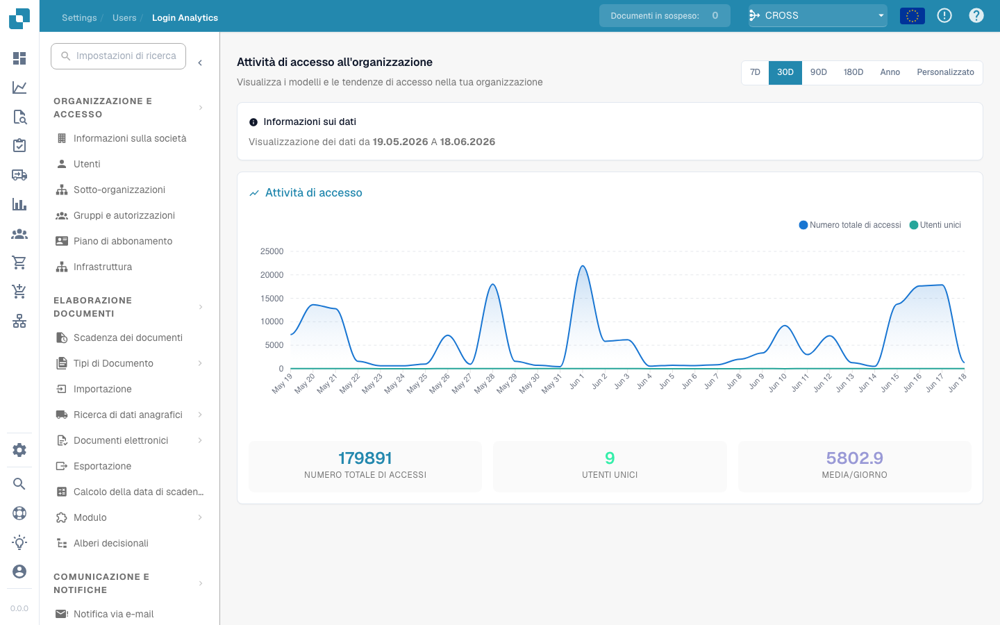

# Analisi degli accessi

**Analisi degli accessi** offre agli amministratori una visione di sola lettura, estesa a tutta l'organizzazione, di *quando* e *con quale frequenza* le persone accedono a DocBits. Risponde a domande come "gli accessi sono in crescita?", "quanti utenti distinti sono stati attivi questo mese?" e "quando si verificano i picchi di utilizzo?" — senza esporre le credenziali o i dati personali dei singoli utenti.

> **Accesso:** Apri **Impostazioni → Organizzazione e Accessi → Utenti** e fai clic sul pulsante **Analisi degli accessi** nell'angolo in alto a destra (`/settings/login-analytics`).

<figure><figcaption>
Attività di accesso dell'organizzazione nel periodo selezionato
</figcaption></figure>

## Intervallo temporale

Scegli il periodo da analizzare con il selettore in alto a destra: **7D**, **30D**, **90D**, **180D**, **Anno** o **Personalizzato** per un intervallo di date libero. Tutto ciò che è presente nella pagina — il grafico e le schede di riepilogo — viene ricalcolato per il periodo scelto.

Il banner **Informazioni sui dati** riepiloga la finestra temporale esatta visualizzata (ad es. *Visualizzazione dei dati dal 19.05.2026 al 18.06.2026*), così è sempre chiaro a quali date si riferiscono i numeri.

## Grafico dell'attività di accesso

Il grafico traccia due serie nel periodo selezionato:

| Serie | Significato |
|--------|-------------|
| **Accessi totali** | Il numero di accessi al giorno, inclusi gli accessi ripetuti dalla stessa persona. |
| **Utenti unici** | Quanti utenti *distinti* hanno effettuato l'accesso quel giorno. |

Passa il mouse su un qualsiasi punto per leggere il valore esatto di quel giorno. I picchi mostrano i giorni con maggiore attività; una linea **Utenti unici** piatta sotto una linea **Accessi totali** frastagliata indica che poche persone hanno effettuato l'accesso molte volte.

## Schede di riepilogo

Sotto il grafico, tre schede riepilogano l'intero periodo selezionato:

| Scheda | Significato |
|------|-------------|
| **Accessi totali** | Tutti gli accessi nel periodo. |
| **Utenti unici** | Utenti distinti che hanno effettuato l'accesso almeno una volta. |
| **Media/Giorno** | Numero medio di accessi al giorno nel periodo. |

## Privacy

L'Analisi degli accessi riporta esclusivamente numeri **aggregati** — conteggi e tendenze per l'organizzazione nel suo complesso. Non elenca i singoli utenti, gli indirizzi email o gli indirizzi IP. Per visualizzare o modificare l'account di una persona specifica, utilizza invece la pagina [Utenti](README.md).
